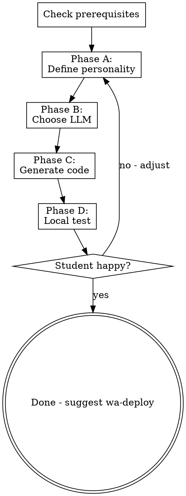

# Build a WhatsApp AI Agent

Guide a non-technical user through building a complete WhatsApp AI agent. The user defines the agent's personality through free conversation in Hebrew, and this skill generates all the code.

**Prerequisites:** Green API credentials (run `wa-setup` first if not configured)

## Interaction Style

Talk to the user in simple Hebrew. They have zero technical background. Never use jargon without explaining it. The principle: **"I do, you decide"** - you perform all technical actions, the user makes decisions about their agent's personality and behavior.

## Flow



## Phase A: Define the Agent (Free Conversation)

Have a natural conversation in Hebrew. Ask one question at a time:

1. **"ספר לי על הסוכן שלך - מה השם שלו ומה הוא עושה?"**
   - Get the agent's name and core purpose

2. **"איך הוא מדבר? רשמי? קליל? מצחיק? תן לי דוגמה"**
   - Understand the tone and style

3. **"על מה הוא יודע לדבר? ומה הוא צריך לסרב לענות?"**
   - Define knowledge boundaries

4. **"יש עוד משהו חשוב שהסוכן צריך לדעת או לעשות?"**
   - Catch anything missed

From the conversation, build a system prompt and show it to the student:

**"הנה מה שהסוכן שלך ידע לעשות. תקרא ותגיד לי אם זה מתאים:"**

Then show the prompt in Hebrew. Iterate until the student approves.

## Phase B: Choose LLM

Explain in simple terms:

**"הסוכן שלך צריך 'מוח' - מודל AI שיחשוב ויענה. יש כמה אפשרויות:"**

Present with AskUserQuestion:
- **OpenAI (GPT-4.1-mini)** - "מומלץ למתחילים. איזון טוב בין מחיר לאיכות. עברית טובה"
- **OpenAI (GPT-4.1-nano)** - "הכי זול. מספיק לשיחות פשוטות"
- **Anthropic (Claude)** - "איכות גבוהה מאוד. יקר יותר"

After choice, check for API key:

**"יש לך מפתח API ל-[provider]? זה כמו סיסמה שמאפשרת לסוכן להשתמש במוח ה-AI"**

If no key:
- **"אני אפתח לך את האתר ואעזור לך להירשם. תצטרך כרטיס אשראי - החיוב הוא לפי שימוש, בדרך כלל כמה סנטים לשיחה"**
- Use computer-use to navigate to platform.openai.com or console.anthropic.com
- **STOP** at password/payment: Let the student handle these
- Help locate and copy the API key
- Save to `.env` in the project directory

## Phase C: Generate Code

1. Check that `.env` exists with Green API credentials (from wa-setup)
2. Read templates from this skill's `templates/` directory
3. Fill placeholders:
   - `{{AGENT_NAME}}` - from Phase A
   - `{{SYSTEM_PROMPT}}` - from Phase A (escape for Python string)
   - `{{LLM_PROVIDER}}` - "openai" or "anthropic"
   - `{{LLM_MODEL}}` - e.g., "gpt-4.1-mini"
   - `{{LLM_PACKAGE}}` - "openai" or "anthropic"
   - `{{MAX_HISTORY}}` - default 20
4. Create project directory (ask student where, default: `~/whatsapp-agent/`)
5. Write all files from templates
6. Install dependencies: `pip install -r requirements.txt`
   - If pip fails, explain: "צריך Python מותקן. בוא נבדוק..."

### Template files location
All templates are in `templates/` directory of this skill. Copy and fill:
- `main.py.template` → `main.py`
- `agent.py.template` → `agent.py`
- `database.py.template` → `database.py`
- `config.py.template` → `config.py`
- `requirements.txt` → `requirements.txt` (copy as-is, but swap openai↔anthropic based on choice)
- `render.yaml.template` → `render.yaml`
- `.env.example` → `.env.example`
- `.gitignore` → `.gitignore`

Merge the existing `.env` (from wa-setup) with new LLM keys into the project's `.env`.

## Phase D: Local Test

1. Start the server:
   ```bash
   cd [project-dir]
   python main.py
   ```

2. In another terminal, simulate a webhook:
   ```bash
   curl -X POST http://localhost:8000/webhook/green-api \
     -H "Content-Type: application/json" \
     -d '{
       "typeWebhook": "incomingMessageReceived",
       "senderData": {"chatId": "972501234567@c.us", "senderName": "Test"},
       "messageData": {"typeMessage": "textMessage", "textMessageData": {"textMessage": "שלום, מה שלומך?"}},
       "idMessage": "test123",
       "timestamp": 1234567890
     }'
   ```

3. Show the response to the student:
   **"הנה מה שהסוכן שלך ענה: [response]. מה דעתך?"**

4. If student wants changes → go back to Phase A to adjust prompt
5. If happy → **"מצוין! הסוכן מוכן. עכשיו צריך להעלות אותו לאינטרנט כדי שיעבוד 24/7. תגיד 'wa-deploy' כשתהיה מוכן"**

## Error Handling

| Problem | Solution |
|---------|----------|
| No `.env` with Green API | Tell student to run wa-setup first |
| Python not installed | Guide installation via computer-use |
| pip install fails | Check Python version, try `pip3`, install venv |
| Server won't start | Check port conflicts, read error message |
| LLM API error | Verify API key, check balance/billing |
| Hebrew encoding issues | Ensure UTF-8 in all files |

## Important Notes

- All communication with the student should be in Hebrew
- Never show raw code to the student unless they ask
- Always explain what you're doing in simple terms
- When something fails, explain the error in human terms, not technical ones
- The generated code handles: message deduplication, ignoring own messages, ignoring group messages, conversation memory via SQLite
