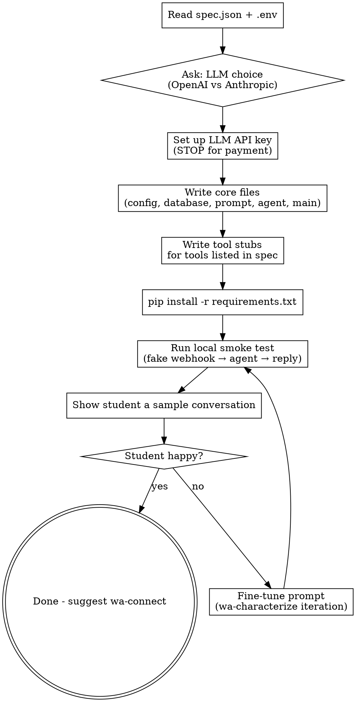

# Build the WhatsApp Agent

Generate a complete, runnable bot from `spec.json`. Enforce a clear architecture so every later skill (`wa-connect`, `wa-deploy`, `wa-maintain`) has predictable files to modify.

**This skill is architecture-first.** Before writing code, it commits to a specific stack and layout, explains the choice to the student in one sentence, and then lets Claude Code generate against that spec.

**Prerequisites:** `wa-characterize` completed (`spec.json` exists in the project directory).

## Interaction Style

Simple Hebrew with the student. Claude Code does the heavy lifting - reads `spec.json`, writes files, runs `pip install`. The student watches and approves at clear checkpoints.

## The Opinionated Stack (Non-Negotiable)

This decision is made once, here. All downstream skills assume it.

| Layer | Choice | Why this and not alternatives |
|---|---|---|
| Web framework | **FastAPI** | Async, native webhook pattern, runs on Render cleanly, students meet it later in the course |
| LLM access | **Direct SDK** (`openai` or `anthropic`) with native tool calling | Agno was considered - Gmail send blocked, memory leak open, docs split. Not worth the risk for non-technical students. MCP was considered - wrong abstraction (MCP is for LLM clients, not webhook servers). Direct SDK wins on simplicity and debuggability. |
| Conversation memory | **SQLite** via a small `database.py` | One file, no server, survives Render disk mount. If load grows → swap to Postgres, same interface. |
| Tool registry | **Explicit Python dict** of tool name → schema + Python function | Zero magic. The student (and future Claude Code sessions) can grep for a tool's name and find it. |
| Scheduling / reminders | **APScheduler** in-process, backed by SQLite jobstore | No separate cron service. Survives restart because jobstore is on disk. |
| Deployment | **Render.com web service** | Defined by `wa-deploy`. |
| Google auth (Gmail/Calendar) | **OAuth refresh token in env var**, single credential covers both | Defined by `wa-connect`. |

**Tell the student this in one sentence:** **"אני בונה את הבוט כך: FastAPI מקבל הודעות מ-Green API, שולח ל-Claude/GPT שמחליט מה לעשות (עונה או קורא לכלי), ומחזיר תשובה. כל שיחה נשמרת ב-SQLite. זה מבנה פשוט ושקוף - אתה יכול לקרוא כל שורה."**

## File Layout (Enforced)

```
project-dir/
├── .env                    # secrets (from wa-setup, wa-connect will append)
├── .env.example            # committed, shows which vars are needed
├── .gitignore              # excludes .env, __pycache__, *.db
├── spec.json               # from wa-characterize, source of truth
├── requirements.txt        # pinned versions
├── render.yaml             # Render service config (wa-deploy uses this)
├── main.py                 # FastAPI app: /webhook/green-api endpoint, health
├── agent.py                # LLM call + tool-calling loop
├── database.py             # SQLite: conversations table, get/append/tail
├── config.py               # loads .env and spec.json, exposes settings
├── prompt.py               # system prompt generator from spec.json
├── tools/
│   ├── __init__.py         # TOOL_REGISTRY dict
│   ├── whatsapp.py         # send_message helper (always needed)
│   ├── reminders.py        # APScheduler wrapper (if selected)
│   ├── google_calendar.py  # (added by wa-connect if selected)
│   ├── gmail.py            # (added by wa-connect if selected)
│   ├── whatsapp_groups.py  # (added by wa-connect if selected)
│   └── human_handoff.py    # (added by wa-connect if selected)
└── data/                   # conversations.db lives here (mounted on Render)
```

**Why this matters:** `wa-connect` and `wa-maintain` both look for `tools/` and `TOOL_REGISTRY`. If the layout drifts, those skills break.

## Flow



## Steps

### 1. Load spec and environment
Read `spec.json` and `.env`. If either is missing, send the student back.

Identify from spec:
- `archetype` → affects audience filter in `main.py`
- `tools` → which files go in `tools/`
- `handoff` → whether `tools/human_handoff.py` is created

### 2. Choose LLM (only if not already set)
If `.env` already has an LLM key from a previous run, skip. Otherwise ask:

**"הסוכן צריך 'מוח' - מודל AI. יש שתי אפשרויות:"**
- **Anthropic Claude (Sonnet 4.5)** - איכות גבוהה, עברית מצוינת. ~$3 למיליון טוקנים קלט.
- **OpenAI (GPT-4.1-mini)** - זול יותר, עברית סבירה. ~$0.4 למיליון טוקנים קלט.

**Default recommendation: Anthropic** for Hebrew quality (aligns with the course's feedback from Roei about Sonnet's Hebrew). Student can override.

Then guide API key creation via browser (STOP at password/payment). Save to `.env` as `ANTHROPIC_API_KEY` or `OPENAI_API_KEY`, and `LLM_MODEL` (e.g. `claude-sonnet-4-5-20250929`).

### 3. Write core files

Write each file from scratch based on `spec.json` and the acceptance criteria below. Do not use file templates — see the "Writing the Code" section below for why. The key properties each file must have:

**`config.py`**
- Loads `.env` via `python-dotenv`
- Loads `spec.json` into a `SPEC` dict
- Exposes: `GREEN_API_URL/INSTANCE/TOKEN`, `LLM_PROVIDER/MODEL`, `API_KEY`, `DATABASE_PATH`, `MAX_HISTORY`
- Fails fast with a clear error if any required env var is missing

**`database.py`**
- SQLite with one table: `conversations(chat_id, role, content, created_at)`
- Functions: `append(chat_id, role, content)`, `tail(chat_id, n=MAX_HISTORY)`, `init_db()`
- Opens connection per-call (no pooling headaches, fine for Render scale)

**`prompt.py`**
- `build_system_prompt(spec) -> str`
- Composes: identity + tone + audience rules + scope rules + knowledge base + tool availability statement
- **Crucial**: embeds the handoff rule ("If the user asks for a human, call `human_handoff` tool with their phone number and name") so the LLM knows when to route

**`agent.py`**
- Single function: `handle_message(chat_id, sender_phone, message_text) -> reply_text`
- Load history via `database.tail()`, build messages list, include system prompt
- Call LLM with tools from `TOOL_REGISTRY`
- Tool-calling loop: if LLM asks for a tool, execute it, feed result back, repeat (max 5 iterations, then force a reply)
- Append user message and final reply to DB
- Return reply text

**`main.py`**
- FastAPI app
- `POST /webhook/green-api` - dedupes by `idMessage` (check DB), filters by `senderData.chatId` suffix (`@g.us` for groups - skip if `answer_groups=false`), enforces whitelist if `archetype=personal_assistant`, calls `agent.handle_message`, sends reply via Green API
- `GET /health` - returns `{status: "ok", version: 1}`
- Ignores own messages (senderId == instance's own JID)

**`tools/__init__.py`**
- `TOOL_REGISTRY: dict[str, ToolDef]` where each entry has `{"schema": <LLM tool schema>, "fn": <python callable>}`
- Starts populated with just `send_whatsapp_reply` (always present, used by the framework itself not the LLM)

**`tools/whatsapp.py`**
- `send_reply(chat_id, text)` - POSTs to Green API
- `send_to_phone(phone_e164, text)` - same, but formats `chatId` correctly

### 4. Write tool stubs
For each tool in `spec.tools`, create a stub file in `tools/` that:
- Imports the tool from the appropriate library (or `raise NotImplementedError` with a clear message directing to `wa-connect`)
- Exposes a tool definition dict: `{"schema": {...}, "fn": <callable>}`
- Is added to `TOOL_REGISTRY` on import

Stubs for unconnected tools are intentional. The agent can *see* the tool exists (the LLM will try to use it), but `wa-connect` fills in the implementation. This makes the handoff between skills explicit.

**Reminders exception**: `tools/reminders.py` is a full implementation if `reminders` in spec. APScheduler is simple enough to include here (no OAuth, no external API).

### 5. Dependencies
`requirements.txt` pinned:
```
fastapi==0.115.4
uvicorn[standard]==0.32.0
python-dotenv==1.0.1
httpx==0.27.2
anthropic==0.39.0          # OR openai==1.54.3 - only one, based on choice
apscheduler==3.10.4
pydantic==2.9.2
```

Run `pip install -r requirements.txt`. If Python/pip missing, guide install via computer-use.

### 6. Local smoke test
Start the server:
```
cd [project-dir]
uvicorn main:app --reload --port 8000
```

Send a fake inbound webhook:
```
curl -X POST http://localhost:8000/webhook/green-api \
  -H "Content-Type: application/json" \
  -d '{
    "typeWebhook": "incomingMessageReceived",
    "idMessage": "smoke-test-1",
    "timestamp": 1712000000,
    "senderData": {"chatId": "972501234567@c.us", "senderName": "סטודנט"},
    "messageData": {"typeMessage": "textMessage", "textMessageData": {"textMessage": "היי"}}
  }'
```

Check the server logs for the reply and that it was sent to Green API (or mocked if the bot's outbound isn't critical yet).

### 7. Show the student

**"זה מה שהבוט ענה לשלום 'היי':"**

Print the reply. Ask: **"זה הסגנון שרצית? יש משהו לדייק?"**

### 8. Iterate (fine-tune loop)
If the student isn't happy:
- Small tweaks (tone, length) → edit `spec.json` directly, regenerate `prompt.py`, rerun smoke test
- Large changes (scope, audience) → send back to `wa-characterize`

Keep the iteration loop tight - don't rewrite files the student hasn't asked about.

### 9. Update state & hand off

Update `.wa-state.json`:
- Append `"build"` to `completed_stages`
- Set `current_stage: "connect"` if `spec.tools` is non-empty, else `"deploy"`
- Update `last_touched_iso`

Then, based on spec:

**If `spec.tools` has any tools:**
**"הקוד מוכן. הבוט מדבר, אבל עדיין לא מחובר לכלים. השלב הבא: לחבר אותו ל[list tools from spec]. רוצה להתחיל עם אחד?"**
- If yes → invoke `wa-connect` via Skill tool
- If "דלג לעלאה" → explain: "אפשר, אבל הבוט יגיד לשואלים שאין לו גישה ליומן. מקובל?" If yes → invoke `wa-deploy`

**If `spec.tools` is empty:**
**"הקוד מוכן. אין כלים חיצוניים - הבוט רק משוחח. השלב הבא: להעלות לאוויר. רוצה להמשיך?"**
- If yes → invoke `wa-deploy` via Skill tool

## Writing the Code

Do not use file templates. Claude Code writes each file from scratch, informed by `spec.json` and the file-layout contract above. Reasons:

- Templates drift out of date; libraries update, best practices evolve
- Claude Code is capable of producing clean FastAPI + SDK code directly when the *contract* (what each file must do) is clear
- Every student's bot is slightly different - hard-coded placeholders obscure this

The contract for each file is documented in the **"Write core files"** section above. Follow those bullet points as acceptance criteria. If a file doesn't satisfy its bullets, it's incomplete.

Generate the final `SYSTEM_PROMPT` by composing naturally-readable Hebrew/English paragraphs from spec sections (identity, tone, audience rules, scope, knowledge, tool availability). The prompt should read like something a human wrote for this specific bot, not like string-interpolated spec fields.

## Error Handling

| Problem | Solution |
|---------|----------|
| No `spec.json` | Run `wa-characterize` first |
| No `.env` | Run `wa-setup` first |
| `pip install` fails | Check Python version (needs 3.11+), try `pip3`, suggest venv |
| `uvicorn` not starting | Check port conflict, print error |
| LLM auth error | Wrong API key or no funds - guide to billing |
| Smoke test: no reply | Check server logs for traceback, usually wrong env var |
| Smoke test: reply in wrong language | Prompt issue - add explicit language instruction to spec and regenerate |
| Student wants to use Agno/Langchain/CrewAI | Politely decline with one sentence: "לקורס הזה אנחנו רוצים קוד שאתה יכול לקרוא כל שורה שלו - פריימוורקים מוסיפים שכבות קסם שקשות לדיבוג. אם תרצה בעתיד, קל להחליף - הארכיטקטורה מודולרית." |

## Architectural Notes (for Claude Code's reference)

- **Why `prompt.py` as a separate file**: the prompt changes every time the spec does. Keeping it isolated means `wa-maintain` can regenerate it without touching logic. Also, students can read it and *understand* their bot - literally print it at `/health?debug=prompt`.
- **Why tool stubs that `raise NotImplementedError`**: early visibility. The LLM will call tools that aren't wired up, the student gets a clear error pointing at `wa-connect`, and we avoid silent fallback misbehavior.
- **Why 5-iteration tool loop cap**: LLMs occasionally loop on tool calls. Cap prevents runaway cost on Render. Log and force a text reply on cap.
- **Why APScheduler in-process and not a Render Cron**: Render Crons are billed separately and awkward for per-user reminders ("remind me in 10 minutes"). In-process with SQLite jobstore survives restarts and costs nothing.
- **Why `idMessage` dedup in DB, not in memory**: Render restarts lose memory. We'd replay the last message on every restart. One extra SQL lookup per webhook is cheap.
- **Why whitelist enforcement in `main.py` not prompt**: non-bypassable. A prompt can be jailbroken - a Python `if sender not in whitelist: return` cannot.
- **Why not emit MCP server from this bot**: maybe later. Not in MVP. `fastapi-mcp` could auto-generate one from existing routes if ever needed.
