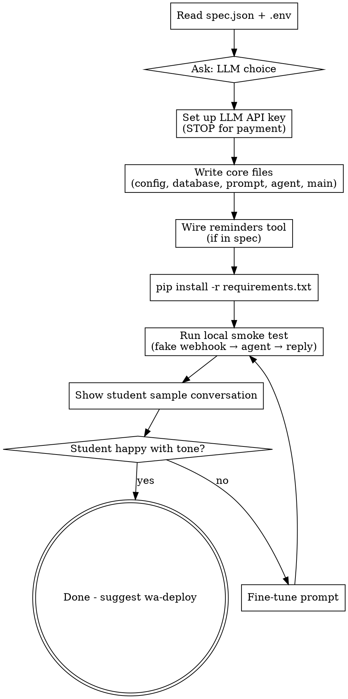

# Build the WhatsApp Agent

Generate a complete, runnable bot from `spec.json`. Enforce a clear architecture so every later skill (`wa-connect`, `wa-deploy`, `wa-maintain`) has predictable files to modify.

**This skill is architecture-first.** Before writing code, it commits to a specific stack and layout, explains the choice to the student in one sentence, and then lets Claude Code generate against that spec.

**Prerequisites:** `wa-characterize` completed (`spec.json` exists in the project directory).

## Interaction Style

Simple Hebrew with the student. Claude Code does the heavy lifting - reads `spec.json`, writes files, runs `pip install`. The student watches and approves at clear checkpoints.

## The Opinionated Stack (Non-Negotiable)

This decision is made once, here. All downstream skills assume it.

| Layer | Choice | Why this and not alternatives |
|---|---|---|
| Web framework | **FastAPI** | Async, native webhook pattern, runs on Render cleanly, students meet it later in the course |
| LLM access | **Direct SDK** (`openai` or `anthropic`) with native tool calling | Agno was considered - Gmail send blocked, memory leak open, docs split. Not worth the risk for non-technical students. MCP was considered - wrong abstraction (MCP is for LLM clients, not webhook servers). Direct SDK wins on simplicity and debuggability. |
| Conversation memory | **SQLite** via a small `database.py` | One file, no server, survives Render disk mount. If load grows → swap to Postgres, same interface. |
| Tool registry | **Explicit Python dict** of tool name → schema + Python function | Zero magic. The student (and future Claude Code sessions) can grep for a tool's name and find it. |
| Scheduling / reminders | **APScheduler** in-process, backed by SQLite jobstore | No separate cron service. Survives restart because jobstore is on disk. |
| Deployment | **Render.com web service** | Defined by `wa-deploy`. |
| Google auth (Gmail/Calendar) | **OAuth refresh token in env var**, single credential covers both | Defined by `wa-connect`. |

**Tell the student this in one sentence:** **"אני בונה את הבוט כך: FastAPI מקבל הודעות מ-Green API, שולח ל-Claude/GPT שמחליט מה לעשות (עונה או קורא לכלי), ומחזיר תשובה. כל שיחה נשמרת ב-SQLite. זה מבנה פשוט ושקוף - אתה יכול לקרוא כל שורה."**

## File Layout (Enforced)

```
project-dir/
├── .env                    # secrets (from wa-setup, wa-connect will append)
├── .env.example            # committed, shows which vars are needed
├── .gitignore              # excludes .env, __pycache__, *.db
├── spec.json               # from wa-characterize, source of truth
├── requirements.txt        # pinned versions
├── render.yaml             # Render service config (wa-deploy uses this)
├── main.py                 # FastAPI app: /webhook/green-api endpoint, health
├── agent.py                # LLM call + tool-calling loop
├── database.py             # SQLite: conversations table, get/append/tail
├── config.py               # loads .env and spec.json, exposes settings
├── prompt.py               # system prompt generator from spec.json
├── tools/
│   ├── __init__.py         # TOOL_REGISTRY dict
│   ├── whatsapp.py         # send_message helper (always needed)
│   ├── reminders.py        # APScheduler wrapper (if selected)
│   ├── google_calendar.py  # (added by wa-connect if selected)
│   ├── gmail.py            # (added by wa-connect if selected)
│   ├── whatsapp_groups.py  # (added by wa-connect if selected)
│   └── human_handoff.py    # (added by wa-connect if selected)
└── data/                   # conversations.db lives here (mounted on Render)
```

**Why this matters:** `wa-connect` and `wa-maintain` both look for `tools/` and `TOOL_REGISTRY`. If the layout drifts, those skills break.

## Critical Ordering Principle

**The bot gets deployed after `wa-build`, before any external tools are connected.**

This is intentional. Reasons:
1. **Fast win**: student sees their bot alive and talking within an hour. Motivation matters.
2. **Debugging isolation**: if something is broken, is it the code? the deploy? the OAuth? Staging the work means each failure is localized.
3. **External tools require redeploy anyway**: every tool added in `wa-connect` triggers a push + redeploy cycle. No value in batching.
4. **Local smoke test is not real validation**: the bot isn't "working" until the student can message it on WhatsApp. That requires Green API webhook → public URL → Render. Deploy is the real test.

So `wa-build` scope is **minimal**:
- Prompt is built
- Conversation memory (SQLite)
- Whitelist / audience filtering
- **Reminders tool wired up** (native APScheduler — no external auth needed, comes "free")
- External tools (Gmail, Calendar, WhatsApp groups) are **not** wired here. They're mentioned in the spec but not added to `TOOL_REGISTRY` yet.

## Flow



## Steps

### 1. Load spec and environment
Read `spec.json` and `.env`. If either is missing, send the student back.

Identify from spec:
- `archetype` → affects audience filter in `main.py`
- `tools` → which files go in `tools/`
- `handoff` → whether `tools/human_handoff.py` is created

### 2. Choose LLM (only if not already set)
If `.env` already has an LLM key from a previous run, skip. Otherwise present the student with a decision matched to their use case.

First explain the concept:
**"הסוכן צריך 'מוח' - מודל AI שיחליט מה לענות ומתי לקרוא לכלי. המחיר נמדד בטוקנים (חלקי מילים) - בוט טיפוסי זה כמה דולרים בחודש, לא יותר."**

Then pick the recommendation based on `spec.archetype`:

#### For **personal_assistant** (low volume, quality matters):

| מודל | חוזקות | חולשות | עלות ל-1000 הודעות |
|---|---|---|---|
| **Claude Haiku 4.5** 🟢 מומלץ | עברית טובה, קריאות כלים מצוינות, מהיר (~3שנ) | - | ~$2-4 |
| Claude Sonnet 4.6 | עברית הכי טובה בשוק, הכי חכם | פי 3 יקר, איטי יותר | ~$6-12 |
| GPT-5.4-mini | זול יותר, תחרותי | עברית טיפה פחות טבעית | ~$2-3 |
| Gemini 2.5 Flash | הכי זול בקטגוריה | עברית סבירה, לא מצוינת | ~$1-2 |

**ברירת מחדל: Claude Haiku 4.5** - `claude-haiku-4-5` - איזון הכי טוב.

#### For **customer_service** (higher volume, brand matters):

| מודל | חוזקות | חולשות | עלות ל-1000 הודעות |
|---|---|---|---|
| **Claude Haiku 4.5** 🟢 מומלץ | איזון מצוין, מהיר, עברית טובה | - | ~$2-4 |
| Claude Sonnet 4.6 | איכות פרימיום | יקר פי 3 | ~$6-12 |
| GPT-5.4 | תחרותי ל-Sonnet | ecosystem preference | ~$5-10 |

**ברירת מחדל: Claude Haiku 4.5** - המודל ששווה את המאמץ להתחיל ממנו. אם תגלה שחסר איכות, קל לשדרג ל-Sonnet 4.6.

#### For **budget-first** (student on a tight budget, low-volume hobby bot):

- **GPT-5.4-nano** - `gpt-5.4-nano` - ~$0.3-1 ל-1000 הודעות. אבל עברית סבירה בלבד.
- **Gemini 2.5 Flash** - גם זול. ראה טבלה.

Present the table via AskUserQuestion with 3-4 options. Default to Claude Haiku 4.5 unless the student explicitly signals budget sensitivity.

**Do NOT recommend these** (explain if student asks):
- **Claude Opus 4.6** - overkill. 4-6 שניות לתשובה = חוויה רעה ב-WhatsApp. משלמים פי 5 מ-Haiku על איכות שהסוכן לא מנצל.
- **Grok / DeepSeek** - עברית חלשה. לא מיועדים לשוק שלנו.
- **GPT-4o / Claude 3.5** - מודלים ישנים (2024/2025), הוחלפו.

Save to `.env`:
```
LLM_PROVIDER=anthropic          # or openai, google
LLM_MODEL=claude-haiku-4-5      # full model ID
ANTHROPIC_API_KEY=...           # or OPENAI_API_KEY, GOOGLE_API_KEY
```

Then guide API key creation via browser (STOP at password/payment).

**Note on prices**: the numbers above are April 2026 snapshots. Prices change. If the student asks for current pricing, check the provider's pricing page directly - don't quote from memory.

### 3. Write core files

Write each file from scratch based on `spec.json` and the acceptance criteria below. Do not use file templates — see the "Writing the Code" section below for why. The key properties each file must have:

**`config.py`**
- Loads `.env` via `python-dotenv`
- Loads `spec.json` into a `SPEC` dict
- Exposes: `GREEN_API_URL/INSTANCE/TOKEN`, `LLM_PROVIDER/MODEL`, `API_KEY`, `DATABASE_PATH`, `MAX_HISTORY`
- Fails fast with a clear error if any required env var is missing

**`database.py`**
- SQLite with one table: `conversations(chat_id, role, content, created_at)`
- Functions: `append(chat_id, role, content)`, `tail(chat_id, n=MAX_HISTORY)`, `init_db()`
- Opens connection per-call (no pooling headaches, fine for Render scale)

**`prompt.py`**
- `build_system_prompt(spec) -> str`
- Composes: identity + tone + audience rules + scope rules + knowledge base + tool availability statement
- **Crucial**: embeds the handoff rule ("If the user asks for a human, call `human_handoff` tool with their phone number and name") so the LLM knows when to route

**`agent.py`**
- Single function: `handle_message(chat_id, sender_phone, message_text) -> reply_text`
- Load history via `database.tail()`, build messages list, include system prompt
- Call LLM with tools from `TOOL_REGISTRY`
- Tool-calling loop: if LLM asks for a tool, execute it, feed result back, repeat (max 5 iterations, then force a reply)
- Append user message and final reply to DB
- Return reply text

**`main.py`**
- FastAPI app
- `POST /webhook/green-api` - dedupes by `idMessage` (check DB), filters by `senderData.chatId` suffix (`@g.us` for groups - skip if `answer_groups=false`), enforces whitelist if `archetype=personal_assistant`, calls `agent.handle_message`, sends reply via Green API
- `GET /health` - returns `{status: "ok", version: 1}`
- Ignores own messages (senderId == instance's own JID)

**`tools/__init__.py`**
- `TOOL_REGISTRY: dict[str, ToolDef]` where each entry has `{"schema": <LLM tool schema>, "fn": <python callable>}`
- Starts **empty** (the framework populates on import; external tools added later by `wa-connect`)

**`tools/whatsapp.py`** (framework-only, not an LLM tool)
- `send_reply(chat_id, text)` - POSTs to Green API
- `send_to_phone(phone_e164, text)` - same, but formats `chatId` correctly
- Used internally by `main.py` and by future tools (e.g. reminders calling `send_to_phone`)

### 4. Wire the reminders tool (only if `"reminders"` in spec.tools)

Reminders are the **only tool wired in `wa-build`**. Why: they use APScheduler in-process, no external auth, no extra credentials. They work the moment the server starts.

External tools (Gmail, Calendar, WhatsApp groups, human handoff, Outlook) are **not** wired here. They go through `wa-connect` after deploy. If spec lists them:
- Do **not** create `tools/google_calendar.py` yet
- Do **not** mention them in the system prompt yet
- Do **not** add them to `TOOL_REGISTRY`

If `"reminders"` is in `spec.tools`, write `tools/reminders.py` with:
- `create_reminder(chat_id, remind_at_iso, message)` — schedules an APScheduler job
- `list_reminders(chat_id)` — returns pending reminders for a chat
- `cancel_reminder(reminder_id)` — removes a job
- SQLAlchemy jobstore pointed at the same SQLite file as `DATABASE_PATH` (survives restart)
- Register in `TOOL_REGISTRY` on import
- The system prompt mentions reminders are available

**Why this minimalism matters**: the student will see a reply to their "היי" within minutes of deploy. If external tools were half-wired, the LLM would try to call them and fail with cryptic errors. Better to expose the LLM to only what's real.

### 5. Dependencies
`requirements.txt` pinned (update pins to current stable versions — check PyPI, don't paste stale versions):
```
fastapi
uvicorn[standard]
python-dotenv
httpx
apscheduler
pydantic

# Exactly one of these, based on LLM_PROVIDER:
anthropic          # if using Claude (Haiku 4.5 / Sonnet 4.6)
# openai           # if using GPT
# google-genai     # if using Gemini
```

Claude Code should pin to current stable versions at generation time. Don't ship unpinned to production, but also don't freeze to a 6-month-old version.

Run `pip install -r requirements.txt`. If Python/pip missing, guide install via computer-use.

### 6. Local smoke test
Start the server:
```
cd [project-dir]
uvicorn main:app --reload --port 8000
```

Send a fake inbound webhook:
```
curl -X POST http://localhost:8000/webhook/green-api \
  -H "Content-Type: application/json" \
  -d '{
    "typeWebhook": "incomingMessageReceived",
    "idMessage": "smoke-test-1",
    "timestamp": 1712000000,
    "senderData": {"chatId": "972501234567@c.us", "senderName": "סטודנט"},
    "messageData": {"typeMessage": "textMessage", "textMessageData": {"textMessage": "היי"}}
  }'
```

Check the server logs for the reply and that it was sent to Green API (or mocked if the bot's outbound isn't critical yet).

### 7. Show the student

**"זה מה שהבוט ענה לשלום 'היי':"**

Print the reply. Ask: **"זה הסגנון שרצית? יש משהו לדייק?"**

### 8. Iterate (fine-tune loop)
If the student isn't happy:
- Small tweaks (tone, length) → edit `spec.json` directly, regenerate `prompt.py`, rerun smoke test
- Large changes (scope, audience) → send back to `wa-characterize`

Keep the iteration loop tight - don't rewrite files the student hasn't asked about.

### 9. Update state & hand off

Update `.wa-state.json`:
- Append `"build"` to `completed_stages`
- Set `current_stage: "deploy"` (always — external tools come after deploy)
- Update `last_touched_iso`

Then, regardless of what's in `spec.tools`:

**"הקוד מוכן. הבוט מדבר איתך מקומית ומכיר את עצמו. השלב הבא: להעלות אותו לאוויר כדי שתוכל לדבר איתו בוואטסאפ אמיתי. אחרי זה נחבר את הכלים (יומן/מייל/וכו') אחד-אחד. רוצה להמשיך?"**

- If yes → invoke `wa-deploy` via Skill tool
- If "תן לי רגע" → **"סגור. `/wa` כשתחזור."**

**Important**: even if `spec.tools` includes Gmail/Calendar/groups, the student **first deploys**, then comes back through `/wa` to `wa-connect` to add each tool. Don't offer to skip ahead — it's bad for debugging.

## Writing the Code

Do not use file templates. Claude Code writes each file from scratch, informed by `spec.json` and the file-layout contract above. Reasons:

- Templates drift out of date; libraries update, best practices evolve
- Claude Code is capable of producing clean FastAPI + SDK code directly when the *contract* (what each file must do) is clear
- Every student's bot is slightly different - hard-coded placeholders obscure this

The contract for each file is documented in the **"Write core files"** section above. Follow those bullet points as acceptance criteria. If a file doesn't satisfy its bullets, it's incomplete.

Generate the final `SYSTEM_PROMPT` by composing naturally-readable Hebrew/English paragraphs from spec sections (identity, tone, audience rules, scope, knowledge, tool availability). The prompt should read like something a human wrote for this specific bot, not like string-interpolated spec fields.

## Error Handling

| Problem | Solution |
|---------|----------|
| No `spec.json` | Run `wa-characterize` first |
| No `.env` | Run `wa-setup` first |
| `pip install` fails | Check Python version (needs 3.11+), try `pip3`, suggest venv |
| `uvicorn` not starting | Check port conflict, print error |
| LLM auth error | Wrong API key or no funds - guide to billing |
| Smoke test: no reply | Check server logs for traceback, usually wrong env var |
| Smoke test: reply in wrong language | Prompt issue - add explicit language instruction to spec and regenerate |
| Student wants to use Agno/Langchain/CrewAI | Politely decline with one sentence: "לקורס הזה אנחנו רוצים קוד שאתה יכול לקרוא כל שורה שלו - פריימוורקים מוסיפים שכבות קסם שקשות לדיבוג. אם תרצה בעתיד, קל להחליף - הארכיטקטורה מודולרית." |

## Architectural Notes (for Claude Code's reference)

- **Why `prompt.py` as a separate file**: the prompt changes every time the spec does. Keeping it isolated means `wa-maintain` can regenerate it without touching logic. Also, students can read it and *understand* their bot - literally print it at `/health?debug=prompt`.
- **Why tool stubs that `raise NotImplementedError`**: early visibility. The LLM will call tools that aren't wired up, the student gets a clear error pointing at `wa-connect`, and we avoid silent fallback misbehavior.
- **Why 5-iteration tool loop cap**: LLMs occasionally loop on tool calls. Cap prevents runaway cost on Render. Log and force a text reply on cap.
- **Why APScheduler in-process and not a Render Cron**: Render Crons are billed separately and awkward for per-user reminders ("remind me in 10 minutes"). In-process with SQLite jobstore survives restarts and costs nothing.
- **Why `idMessage` dedup in DB, not in memory**: Render restarts lose memory. We'd replay the last message on every restart. One extra SQL lookup per webhook is cheap.
- **Why whitelist enforcement in `main.py` not prompt**: non-bypassable. A prompt can be jailbroken - a Python `if sender not in whitelist: return` cannot.
- **Why not emit MCP server from this bot**: maybe later. Not in MVP. `fastapi-mcp` could auto-generate one from existing routes if ever needed.
