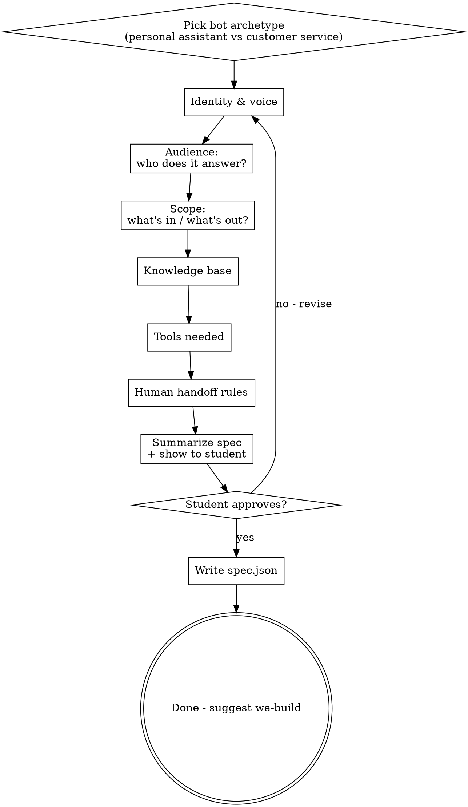

# Characterize the WhatsApp Agent

Define precisely what the agent does, who it answers, and what tools it needs - before a single line of code is written.

**This skill does not write agent code.** It extracts a specification. The output is a `spec.json` file that `wa-build` reads.

**Prerequisites:** `wa-setup` completed (`.env` with Green API credentials exists).

## Interaction Style

Simple Hebrew. Ask one question at a time. Wait for the answer. Summarize back what you understood before moving on. The student is making product decisions, not technical ones.

## Flow



## The Two Archetypes

Everything downstream splits on this. Ask first:

**"איזה בוט אנחנו מאפיינים - עוזר אישי לעצמך, או בוט שירות לקוחות?"**

The defaults for every subsequent question differ:

|  | Personal Assistant | Customer Service |
|---|---|---|
| Audience | Whitelist (you + spouse + assistant) | Public (anyone who messages) |
| Knowledge | Thin (delegates to tools) | Thick (business info embedded in prompt) |
| Tools | Many (calendar, email, groups, reminders) | Usually one (human handoff) |
| Group messages | Often reads groups for context | Ignores groups |
| Human handoff | N/A (you are the human) | Required feature |

Use these as defaults, then let the student override.

## The Questions (Ask One at a Time)

### Q1. Identity & voice
**"בוא נתחיל בזהות. מה השם של הבוט? איך הוא ידבר - רשמי, חברי, מצחיק? תן לי דוגמה קצרה איך אתה רוצה שיענה להודעה 'היי'."**

Record: `name`, `tone_description`, `greeting_example`.

### Q2. Audience - who does it answer?
**Critical for personal assistants.** Re-read Speaker 1 at 13:27 in the source transcript: "*אחת השאלות המאוד, מאוד חשובות שהוא ישאל זה לאיזה מספרים הוא עונה.*"

For **personal assistant**:
**"הבוט הזה יהיה מחובר ליומן שלך, למייל שלך. אנחנו לא רוצים שיענה לכל מי שכותב. לאיזה מספרים הוא כן עונה? תן לי שמות ומספרי טלפון - אני, אשתי, עוזרת, וכו'."**

Record as a whitelist: `authorized_contacts: [{name, phone_e164}, ...]`

For **customer service**:
**"הבוט יענה לכולם חוץ מקבוצות. נכון?"**

Record: `answer_groups: false`, `answer_public: true`, `blocklist: []` (optional future).

### Q3. Scope - what's in, what's out?
**"תן לי שלושה נושאים שהבוט יענה עליהם, ושלושה שהוא יסרב. הרעיון הוא שאם מישהו ישאל על משהו מחוץ לתחום, הבוט יגיד בנימוס שזה לא התפקיד שלו."**

Record: `in_scope: [...]`, `out_of_scope: [...]`, `out_of_scope_response` (how to decline politely).

### Q4. Knowledge base

For **personal assistant**:
Skip this question if the student's tools (calendar, mail) cover it. Otherwise: **"יש דברים שכדאי שהבוט ידע מראש עליך - למשל כתובת העסק, שעות שבהן אתה לא זמין?"**

Record as `static_knowledge` (short paragraphs).

For **customer service** — offer a skeleton, don't start from a blank page:

**"נכתוב את מאגר הידע. במקום להתחיל מאפס, אני אשאל אותך סעיף-סעיף. ענה על מה שרלוונטי, דלג על מה שלא:"**

Ask each, wait for answer, summarize back:

1. **שעות פעילות**: "מתי העסק פתוח? למשל 'א׳-ה׳ 9-18, ו׳ 9-13, שבת סגור'"
2. **מיקום**: "כתובת פיזית אם רלוונטי, או 'אונליין בלבד'"
3. **שירותים/מוצרים**: "3-5 דברים עיקריים שהעסק מציע"
4. **מחירים**: "טווחי מחיר אם אתה מוכן לפרסם, או 'המחיר מתואם אישית' אם לא"
5. **מדיניות**: "החזרים, ביטולים, שילוח, אחריות - מה שרלוונטי לעסק שלך"
6. **שאלות נפוצות**: "3-5 שאלות שלקוחות שואלים אותך כל הזמן, עם התשובות שלך"

Record as `kb_sections: {hours, location, offerings, pricing, policies, faq}`.

**Important**: the student may ramble or give too much. Summarize back every 3-4 sentences: **"אז אני מבין ש: [סיכום]. נכון?"** Keep `kb_sections` tight and factual - the prompt grows fast.

### Q5. Tools
Explain the concept first: **"הבוט יכול 'לעשות דברים', לא רק לדבר. כל 'עושה דברים' הוא כלי. בוא נחליט אילו כלים הוא צריך."**

Show the menu with concrete WhatsApp examples — this makes the choice much easier than abstract capability descriptions:

- **📅 Google Calendar** - *"מה יש לי מחר?" / "תקבע לי פגישה עם יוני ביום חמישי ב-10" / "תזיז את הפגישה של 14:00 ל-15:00"*
- **✉️ Gmail** - *"יש מיילים חדשים?" / "חפש מיילים מיוני על פרויקט X" / "קרא לי את המייל האחרון"*
- **💬 WhatsApp groups** - *"מה היה בקבוצת המשפחה היום?" / "סכם לי את הקבוצה של הצוות"*
- **⏰ Reminders** - *"תזכיר לי בעוד שעה להוציא כביסה" / "תזכיר לי מחר ב-9 להתקשר לאמא"*
- **👤 Human handoff** - *"אני רוצה לדבר עם בן אדם"* - הבוט מעביר פרטים לבעל העסק (בדרך כלל לבוט שירות לקוחות)

**"אילו מהכלים האלה הבוט צריך? אני אעזור לחבר אותם אחר כך - עכשיו רק מסמנים."**

Record: `tools: ["google_calendar", "gmail", "whatsapp_groups", "reminders", "human_handoff"]` (subset).

For each selected tool, ask a follow-up:
- **google_calendar** → "לאיזה יומן - אחד אישי, יומן עבודה, שניהם?"
- **gmail** → "הוא יכול רק לקרוא, או גם לשלוח? (ברירת מחדל: רק לקרוא - בטוח יותר)"
- **whatsapp_groups** → "אילו קבוצות? תן לי שמות - נזהה אותן אחר כך ב-wa-connect"
- **reminders** → no follow-up
- **human_handoff** → ask Q6 now

Record per-tool config under `tools_config`.

### Q6. Human handoff (if selected)
Re-read Speaker 1 at 15:59 in the transcript - it's **"מעבר לנציג אנושי"** not **"הסלמה"**.

**"כשלקוח רוצה לדבר עם נציג אנושי, מה קורה? יש כמה אפשרויות:"**

1. הבוט שולח התראה אישית אליך בוואטסאפ (עם קישור לשיחה עם הלקוח)
2. הבוט שואל את הלקוח טלפון ומוסר לך אותו (עוקף את בעיית לולאת "בעל העסק עונה מהמספר של הבוט")
3. שילוב - התראה + מספר של הלקוח

**Strong default: option 2 or 3.** Explain the loop problem explicitly: **"אם תדבר ללקוח מהמספר של הבוט, הבוט יענה במקומך. לכן הכי טוב שהבוט יעביר לך את הטלפון של הלקוח, ואתה תתקשר/תכתוב מהמספר האישי שלך."**

Record: `handoff: {trigger_phrases: [...], manager_phone: "...", manager_name: "...", mode: "phone_number_relay"}`.

### Q7. Extras (optional)
Ask these only if time permits:
- **Response length** - short (1-2 sentences), medium, long?
- **Language** - Hebrew only? Reply in the language sent?
- **Off-hours behavior** - does the bot reply at 3am, or defer?
- **Holiday mode** - how do they want to handle pesach/rosh hashana?

## Summarize & Approve

After collecting all answers, say:

**"זה מה שקלטתי. תקרא, תגיד לי מה לשנות:"**

Then print a **Hebrew human-readable summary** of the spec - not JSON. Example:

```
שם הבוט: רוני
סוג: עוזר אישי
מדבר: חברי ועם הומור קל
עונה ל: אשר (0501234567), מיטל (0527654321)
יודע לדבר על: יומן, מייל, תזכורות
מסרב: כל השאר בנימוס
כלים: יומן גוגל, Gmail (קריאה בלבד), תזכורות
```

Iterate until the student says yes.

## Write spec.json

Only after approval, write `spec.json` to the project directory (same dir as `.env`):

```json
{
  "version": 1,
  "archetype": "personal_assistant | customer_service",
  "identity": {
    "name": "...",
    "tone_description": "...",
    "greeting_example": "..."
  },
  "audience": {
    "answer_groups": false,
    "mode": "whitelist | public",
    "authorized_contacts": [{"name": "...", "phone_e164": "972..."}],
    "blocklist": []
  },
  "scope": {
    "in_scope": ["..."],
    "out_of_scope": ["..."],
    "out_of_scope_response": "..."
  },
  "knowledge": {
    "static_knowledge": "...",
    "kb_sections": { "hours": "...", "location": "...", "offerings": "...", "pricing": "...", "policies": "...", "faq": "..." }
  },
  "tools": ["google_calendar", "gmail"],
  "tools_config": {
    "google_calendar": {"calendars": ["primary"]},
    "gmail": {"mode": "read_only"}
  },
  "handoff": null | {
    "trigger_phrases": ["נציג אנושי", "לדבר עם בן אדם"],
    "manager_phone": "972...",
    "manager_name": "...",
    "mode": "phone_number_relay | notification | both"
  },
  "extras": {
    "response_length": "short | medium | long",
    "language_mode": "hebrew_only | match_sender",
    "off_hours_mode": "always_reply | business_hours_only"
  }
}
```

Fields not answered are set to sensible defaults - document the default in a comment nearby.

## Update state & hand off

Update `.wa-state.json`:
- Append `"characterize"` to `completed_stages`
- Set `current_stage: "build"`
- Set `bot_name` from `spec.identity.name`
- Confirm `archetype` matches spec.archetype (update if mismatch)
- Update `last_touched_iso`

Then say:

**"האפיון מוכן. יש לנו spec.json שמתאר בדיוק מה הבוט יודע לעשות. השלב הבא: לבנות את הקוד. רוצה להמשיך עכשיו?"**

- **If yes** → invoke `wa-build` via Skill tool
- **If "תן לי רגע"** → **"מעולה. תגיד `/wa` כשתחזור."**

## Architectural Notes (for Claude Code's reference)

- **Why a spec file and not just a long conversation**: the student will iterate (fine-tune, add tools, change audience). A spec makes those iterations cheap - re-run `wa-build` with an updated spec instead of regenerating from scratch.
- **Why "whitelist mode" for personal assistants is enforced at the code level, not the prompt level**: prompts can be jailbroken; a hard check on sender phone in `main.py` cannot. The spec drives both.
- **Why the tools list is decided here and not in `wa-connect`**: the prompt that `wa-build` generates must *describe* the tools to the LLM. If we decide tools later, we'd have to regenerate the prompt. Easier to decide once.
- **`out_of_scope` vs `blocklist`**: `out_of_scope` is about topics (bot refuses); `blocklist` is about senders (bot doesn't see them). Students confuse these - ask the right question.
- **`trigger_phrases` for handoff**: also detected semantically by the LLM in the prompt, but explicit phrases give deterministic behavior for the common cases.

## Error Handling

| Problem | Solution |
|---------|----------|
| Student can't articulate the bot's purpose | Ask for a concrete example of a conversation they want to have |
| Student wants 20 tools | Negotiate down to 2-3 for MVP. Promise: "נוסיף עוד אחרי שזה עובד" |
| Knowledge base becoming enormous | Cap at ~2000 words. Offer: "נשים את הקצר בפרומפט; אם תרצה מאגר ידע אמיתי, זה עתידי" |
| Student skipping audience decision ("כולם") | Push back for personal assistant - explicitly list contacts. Loop bugs live here. |
| No `.env` file exists | Skill precondition failed - send student back to `wa-setup` |
