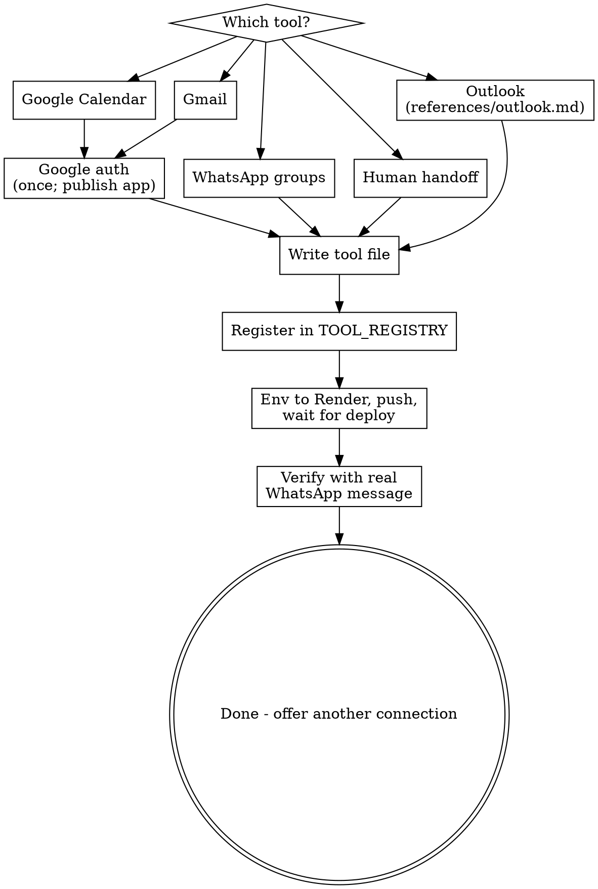

# Connect a Tool to the Agent

Give the live agent a new capability. Handles auth, writes the tool implementation into `tools/<tool>.py`, registers it in `TOOL_REGISTRY`, pushes to GitHub, waits for Render to redeploy, and verifies end-to-end with a real WhatsApp message.

**This skill is a router.** It asks which tool, runs the matching sub-flow, then pushes + redeploys. Each sub-flow shares the same pattern: *auth → credentials → implementation → register → push → redeploy → verify*.

**Prerequisites:**
- `wa-deploy` completed (bot is live on Render, `.wa-state.json` has `render.url` and `render.service_id`)
- Student can talk to the bot in real WhatsApp already

**This skill runs ONCE per tool.** If the spec lists three external tools, the student runs `wa-connect` three times. This is by design — each tool has its own OAuth/credentials/verification cycle, and batching them makes debugging impossible.

## Plugin files (read once per session)

- `PLUGIN_ROOT` = `${CLAUDE_SKILL_DIR}/../..` · helper `WA_OPS` = `PLUGIN_ROOT/scripts/wa_ops.py` (`python3` on macOS/Linux, `py -3` on Windows; run from the bot's project directory).
- Facts: `PLUGIN_ROOT/knowledge/facts.md` — the `F-GOOGLE-…` facts (Auth Platform screens, 7-day Testing expiry, publishing, scopes, `invalid_grant`, oauthlib), **F-GREENAPI-PLANS, F-GREENAPI-METHODS**, the `F-MS-…` facts / **F-MSAL** (Outlook). Google's and Microsoft's consoles change constantly: follow `knowledge/freshness-protocol.md` §3 before every console step, and record drift when a screen moved.
- Outlook sub-flow lives in `references/outlook.md` (next to this file — `${CLAUDE_SKILL_DIR}/references/outlook.md`); read it only when Outlook is chosen.

## Interaction Style

Simple Hebrew with the student. Claude Code drives the integration - browser for OAuth, terminal for code. The student clicks "approve" in Google, pastes a value when asked, and watches the verification succeed.

## The Connections

| Tool | Auth type | External service | Difficulty for student |
|---|---|---|---|
| **google_calendar** | Google OAuth 2.0 (refresh token) | Google Cloud project | Medium - one-time OAuth consent |
| **gmail** | Google OAuth 2.0 (same refresh token as calendar!) | Same Google Cloud project | Easy if calendar already done |
| **whatsapp_groups** | Green API credentials (already in `.env`) | Green API | Trivial - no new auth (mind the free plan's chat limit) |
| **human_handoff** | Green API (already in `.env`) | Green API | Trivial |
| **outlook_calendar** 🔶 | Microsoft OAuth + **rotating refresh tokens** | Entra App Registration + the bot's durable DB (`wa-persistence`) | **Advanced** |
| **outlook_mail** 🔶 | Same Microsoft OAuth as outlook_calendar | Same Entra app | **Advanced** |

🔶 = advanced. Needs durable storage for a token that changes on every use. Default to Google if the student is new.

**Note on reminders**: the reminders tool is wired in `wa-build`, not here. It's native to the bot (APScheduler in-process, no external auth). It already works when the student hits `wa-connect`. If the student asks about reminders here, redirect: "התזכורות כבר עובדות מאז שהבוט עלה - נסה 'תזכיר לי בעוד דקה לבדוק'." If `tools/reminders.py` is missing, follow `wa-build` step 4 — don't write a second implementation here.

## Architecture Decisions (fixed for all sub-flows)

These match `wa-build`'s opinionated stack. Deviations break other skills.

1. **Google integrations use `google-api-python-client`** - official, stable, low-surface.
2. **Microsoft integrations use `msal` + `httpx`** (not `msgraph-sdk`) - lower abstraction, students can read it, fits the course's "no framework magic" principle.
3. **One Google OAuth client for Gmail + Calendar + any future Google service** - minimizes the student's OAuth consent screen exposure. Same pattern for Microsoft: one Entra app covers Mail + Calendar.
4. **Google refresh token stored as `GOOGLE_REFRESH_TOKEN`** in `.env` and on Render - long-lived **once the app is published** (F-GOOGLE-PUBLISH).
5. **Microsoft tokens stored as an MSAL token cache in the bot's own database** - they rotate every use, so env vars don't work (F-MSAL). Requires durable storage (`wa-persistence`).
6. **Tool schemas follow Anthropic/OpenAI native tool-calling format** - no framework wrapper.
7. **Every tool registers itself on import in `tools/__init__.py`** - one import line per connection.
8. **WhatsApp groups tool reads Green API `getChatHistory`** - no message-by-message polling, just fetch on demand.
9. **Every tool that acts "for the current user" takes `chat_id` and is listed in `FRAMEWORK_INJECTED_CHAT_ID`** (wa-build) - the LLM never chooses who.
10. **Never mix Google and Microsoft for the same user** in production - two tools both named "calendar" confuses the LLM. If a student needs both (rare), the tool names must disambiguate: `list_google_events` and `list_outlook_events`.
11. **Tools return compact data** (ids, titles, times, a short snippet) - never whole API objects; they cost tokens and confuse the model.
12. **Secrets never pass through the transcript when avoidable** - scripts write tokens straight into `.env`; `WA_OPS render env-set KEY` copies them to Render by name.

## Flow


```dot
digraph wa_connect {
    rankdir=TB;
    "Which tool?" [shape=diamond];
    "Google Calendar" [shape=box];
    "Gmail" [shape=box];
    "WhatsApp groups" [shape=box];
    "Human handoff" [shape=box];
    "Outlook\n(references/outlook.md)" [shape=box];
    "Google auth\n(once; publish app)" [shape=box];
    "Write tool file" [shape=box];
    "Register in TOOL_REGISTRY" [shape=box];
    "Env to Render, push,\nwait for deploy" [shape=box];
    "Verify with real\nWhatsApp message" [shape=box];
    "Done - offer another connection" [shape=doublecircle];

    "Which tool?" -> "Google Calendar";
    "Which tool?" -> "Gmail";
    "Which tool?" -> "WhatsApp groups";
    "Which tool?" -> "Human handoff";
    "Which tool?" -> "Outlook\n(references/outlook.md)";
    "Google Calendar" -> "Google auth\n(once; publish app)";
    "Gmail" -> "Google auth\n(once; publish app)";
    "Google auth\n(once; publish app)" -> "Write tool file";
    "WhatsApp groups" -> "Write tool file";
    "Human handoff" -> "Write tool file";
    "Outlook\n(references/outlook.md)" -> "Write tool file";
    "Write tool file" -> "Register in TOOL_REGISTRY";
    "Register in TOOL_REGISTRY" -> "Env to Render, push,\nwait for deploy";
    "Env to Render, push,\nwait for deploy" -> "Verify with real\nWhatsApp message";
    "Verify with real\nWhatsApp message" -> "Done - offer another connection";
}
```

## Step 0: Route

Ask the student:

**"איזה כלי לחבר עכשיו? (נעשה אחד בכל פעם)"**

Present the menu from the spec's `tools` list, skipping the ones in `.wa-state.json` → `connected_tools` (and `reminders`, which wa-build already wired).

**If the student picks Outlook/Microsoft** - before routing, say this explicitly:

**"שים לב - חיבור ל-Outlook יותר מורכב מגוגל. למה? הטוקן של מיקרוסופט מתחלף בכל שימוש, אז אי אפשר לשמור אותו ב-`.env` כמו בגוגל - צריך לשמור אותו במסד נתונים אמיתי. אם יש לך גם חשבון גוגל, ההמלצה שלי היא להתחבר אליו במקום. אם אתה חייב Outlook (כי ככה מתנהלת העבודה שלך) - יאללה, נעבור יחד שלב אחר שלב, יהיה בסדר."**

Wait for confirmation, then read and follow `references/outlook.md`.

Jump to the matching sub-flow below.

---

## Sub-flow A: Google Calendar or Gmail

(These share the same Google auth. If the other one was already set up **with the scopes this one needs**, skip to step A4. Adding Gmail after Calendar adds scopes → run A2.11 + A3 again.)

### A1. Explain once
**"יומן/Gmail של Google דורשים הרשאה חד-פעמית - בעצם אתה אומר לגוגל 'אני מאשר לבוט הזה לקרוא את היומן שלי'. זה מתבצע בדפדפן, ואחרי שאישרת פעם אחת, הבוט מקבל מפתח ארוך-טווח ושומר אותו אצלו. אתה יכול לבטל את ההרשאה כל רגע דרך הגדרות Google."**

### A2. Google project + OAuth setup (Google Auth Platform)

Check `WA_OPS env check GOOGLE_CLIENT_ID GOOGLE_REFRESH_TOKEN`. If both exist and `.wa-state.json` → `google.publishing_status == "in_production"`, skip to A4 (or A2.11 if new scopes are needed).

Otherwise — **important**: Google moved OAuth configuration from "APIs & Services → OAuth consent screen" to **Google Auth Platform** (F-GOOGLE-AUTH-PLATFORM). Old tutorials (including older versions of this skill) will confuse the student. Check the fact's freshness before starting.

**A2.1. Create or pick a project**
- Open https://console.cloud.google.com
- **STOP for login**: student signs in with the Google account that owns the calendar/mail the bot will access (not a different account — OAuth only works for this one)
- Create a new project: top bar → project dropdown → "New Project"
  - Name: `whatsapp-agent-[bot_slug]` (English letters only)
  - No organization (for personal bots)

**A2.2. Enable the APIs**
- Left sidebar → "APIs & Services" → "Library"
- Search "Gmail API" → Enable
- Search "Google Calendar API" → Enable
- (Enable both even if the student only wants one now. Enabling is free and saves a round-trip later.)

**A2.3. Open Google Auth Platform (the home for OAuth config)**
- Navigate to https://console.cloud.google.com/auth/overview (or sidebar → "Google Auth Platform")
- Sections on the left: **Overview**, **Branding**, **Audience**, **Clients**, **Data Access**, **Verification Center**
- If it shows "Get started", that wizard covers Branding + Audience in one go — same fields as below.

**A2.4. Branding**
- App name: `[bot_name] WhatsApp Agent`
- User support email: student's email
- Developer contact information → email: student's email
- Save

**A2.5. Audience — External, then PUBLISH (this is the most-missed step)**
- User type: **External**
- **Publishing status → click "Publish app" → confirm → status becomes "In production".**

Why (F-GOOGLE-TESTING-EXPIRY, F-GOOGLE-PUBLISH): an app left in **Testing** gets refresh tokens that **expire after 7 days** — the bot reads the calendar for a week and then silently stops (`invalid_grant`). Publishing a personal app does **not** require Google's verification: the student just clicks through an "unverified app" warning once, and the app can be used by up to 100 people over its lifetime. Test users aren't needed once the app is in production.

Say it in one breath: **"גוגל נותנת שתי אפשרויות: 'בדיקה', שבה החיבור מתנתק אחרי 7 ימים, או 'פרסום', שבה הוא קבוע. נלחץ על Publish app - זה לא מפרסם כלום לאף אחד, זה רק אומר לגוגל שהחיבור קבוע. נראה מסך אזהרה פעם אחת - זה תקין, זו האפליקציה שלך."**

If the student's account is a Google Workspace account whose admin blocks unverified apps, publishing won't help — they'll need their admin, or a personal Gmail account.

Record: `WA_OPS state set google.publishing_status=in_production`.

**A2.6. Clients**
- Click "Create client" (or "+ Create Client" button)
- **Application type**: ⚠️ **BIG TRAP HERE**
  - Google's default is **"Web application"**. **DO NOT PICK THIS.**
  - Scroll down and pick **"Desktop app"**. This is what our `InstalledAppFlow` script uses.
  - Name: `[bot_slug]-desktop`
- Click "Create"

**"תבחר Desktop app. זו לא ברירת המחדל — גלול למטה ברשימה. אם תבחר Web application בטעות, תהליך ה-OAuth ישבור עם redirect_uri_mismatch."**

**A2.7. If the student already created a Web client** (happens often):
- Instead of deleting and recreating, you can rescue it:
  - Click the existing Web client → "Authorized redirect URIs" section
  - Click "Add URI" → `http://localhost:8765/` (WITH trailing slash)
  - Save
- This is less clean than Desktop app (the port is fixed at 8765), but it works and saves 2 minutes of rework.
- Document both paths; let the student pick.

**A2.8. Download the client JSON**
- In Clients, click the download icon next to your client
- Save as `google_client_secret.json` in the project directory

**A2.9. Sanity-check the JSON before running OAuth**

```
<venv python> -c "import json;print(list(json.load(open('google_client_secret.json'))))"
```

- `['installed']` → ✅ Desktop app, proceed
- `['web']` → Web app. Works only if `http://localhost:8765/` was added in A2.7.

**A2.10. gitignore it**
Make sure `.gitignore` has `google_client_secret.json` (wa-build put it there; add it if missing).

**"שמרתי את קובץ ה-JSON. עכשיו נעשה את תהליך ההרשאה."**

**A2.11. Data Access (declare the scopes)**
- Data Access → **Add or remove scopes** → add exactly the scopes from the table below for what the spec enables, → Update → Save.
- Declaring them keeps the consent screen consistent with what the script asks for.

| What the bot does | Scope (F-GOOGLE-SCOPES) |
|---|---|
| Read/create/delete calendar events | `https://www.googleapis.com/auth/calendar.events` |
| Read mail (`gmail.mode: read_only`) | `https://www.googleapis.com/auth/gmail.readonly` |
| Read + mark as read (`read_modify`) | `https://www.googleapis.com/auth/gmail.modify` (instead of readonly) |
| Send mail (`send` enabled) | add `https://www.googleapis.com/auth/gmail.send` |

### A3. OAuth flow (get refresh token)
Add `google-api-python-client`, `google-auth` and `google-auth-oauthlib` to `requirements.txt` (current versions — F-GOOGLE-OAUTHLIB; oauthlib needs Python ≥3.10) and install them in the venv.

Write `scripts/google_auth.py` with the pattern below. It writes the results **straight into `.env`** and prints no secrets. Key flags:

- `access_type="offline"` — required or Google returns no refresh token
- `prompt="consent"` — forces re-consent even if the student previously authorized this app (without this, returning users often get `creds.refresh_token = None`)
- `port=0` for a Desktop client (any free port works — no more "address already in use"); fixed `8765` only for a rescued Web client
- **No `run_console()`** — Google removed the copy-paste flow and `google-auth-oauthlib` 1.x removed the method (F-GOOGLE-OAUTHLIB)

```python
import json, os
from pathlib import Path
from dotenv import dotenv_values, set_key
from google_auth_oauthlib.flow import InstalledAppFlow

SCOPES = [
    "https://www.googleapis.com/auth/calendar.events",
    "https://www.googleapis.com/auth/gmail.readonly",
    # per A2.11: gmail.modify instead of readonly for mark-as-read; + gmail.send to send
]

secret_file = Path("google_client_secret.json")
if secret_file.exists():
    client_type = next(iter(json.loads(secret_file.read_text())))  # "installed" | "web"
    flow = InstalledAppFlow.from_client_secrets_file(str(secret_file), SCOPES)
else:
    # Re-runs (new scopes, re-consent after publishing, invalid_grant) work without the JSON:
    # rebuild a Desktop-client config from the values saved in .env.
    env = dotenv_values(".env")
    if not env.get("GOOGLE_CLIENT_ID") or not env.get("GOOGLE_CLIENT_SECRET"):
        raise SystemExit("No google_client_secret.json and no GOOGLE_CLIENT_ID/SECRET in .env — download the client JSON (A2.8).")
    client_type = "installed"
    flow = InstalledAppFlow.from_client_config({"installed": {
        "client_id": env["GOOGLE_CLIENT_ID"], "client_secret": env["GOOGLE_CLIENT_SECRET"],
        "auth_uri": "https://accounts.google.com/o/oauth2/auth", "token_uri": "https://oauth2.googleapis.com/token",
        "redirect_uris": ["http://localhost"]}}, SCOPES)
creds = flow.run_local_server(
    port=0 if client_type == "installed" else 8765,
    open_browser=True,   # if no browser opens, the URL is printed — open it on THIS computer
    access_type="offline",
    prompt="consent",
)

if not creds.refresh_token:
    raise SystemExit(
        "No refresh_token returned. Go to https://myaccount.google.com/permissions, "
        "remove the app, and run this script again."
    )

set_key(".env", "GOOGLE_CLIENT_ID", flow.client_config["client_id"])
set_key(".env", "GOOGLE_CLIENT_SECRET", flow.client_config["client_secret"])
set_key(".env", "GOOGLE_REFRESH_TOKEN", creds.refresh_token)
print("Saved GOOGLE_CLIENT_ID / GOOGLE_CLIENT_SECRET / GOOGLE_REFRESH_TOKEN to .env")
```

**STOP** when the browser opens: **"עכשיו גוגל שואלת אותך אם לאשר. יופיע מסך אדום 'Google hasn't verified this app' - זה נורמלי, זו האפליקציה שלך. לחץ 'Advanced' (בפינה שמאל תחתית) → 'Go to [app] (unsafe)'. אחר כך תאשר את ההרשאות."** (Exact wording and button labels: F-GOOGLE-UNVERIFIED-SCREEN — the title is sometimes "This app isn't verified".)

**If the browser doesn't open by itself**: the script prints a long URL — the student opens it **in a browser on the same computer** (the redirect comes back to `localhost`). There is no copy-paste-the-code fallback anymore; and there's no device-code flow for Gmail/Calendar (F-GOOGLE-OAUTHLIB).

Then:
- Keep `google_client_secret.json` where it is — it's git-ignored, and re-runs (new scopes, re-consent) need it. (If it's ever lost, the script rebuilds the config from `.env` — that only works for a Desktop client.)
- `WA_OPS state set google.authorized_at="<now ISO>" google.scopes="<comma-separated scopes>"`
- Don't run the consent script in a loop: each run issues a new refresh token, and above ~100 per account+client Google silently invalidates the oldest (F-GOOGLE-INVALID-GRANT).

### A4. Write tool implementation

First register the new keys: add `GOOGLE_CLIENT_ID`, `GOOGLE_CLIENT_SECRET`, `GOOGLE_REFRESH_TOKEN` to `settings` in `config.py` (optional, default `None` — wa-build's contract) if they aren't there yet, and to `.env.example` with a one-line comment. Every tool below reads them through `from config import settings`.

Write `tools/google_calendar.py` (or `tools/gmail.py`) from scratch. Claude Code composes the file directly — no file templates. The expected shape (same for both):
```python
from googleapiclient.discovery import build
from google.oauth2.credentials import Credentials
from config import settings

def _service():
    creds = Credentials(
        token=None,
        refresh_token=settings.GOOGLE_REFRESH_TOKEN,
        client_id=settings.GOOGLE_CLIENT_ID,
        client_secret=settings.GOOGLE_CLIENT_SECRET,
        token_uri="https://oauth2.googleapis.com/token",
    )
    return build("calendar", "v3", credentials=creds, cache_discovery=False)  # or "gmail", "v1"

def list_events(time_min_iso: str, time_max_iso: str) -> list[dict]:
    ...

SCHEMA = {
    "name": "list_calendar_events",
    "description": "List events on the user's calendar between two ISO-8601 timestamps.",
    "input_schema": {...}
}

TOOL = {"schema": SCHEMA, "fn": list_events}
```

Tool functions to implement per service (times are timezone-aware in `spec.extras.timezone`; results compact):

**Calendar**:
- `list_events(time_min, time_max)` → upcoming events (summary, start, end, id). Event descriptions are third-party text — return them trimmed; the prompt's untrusted-content rule covers them
- `create_event(summary, start_iso, end_iso)` → new event in the owner's calendar, **no attendees** (no outside effect)
- `invite_to_event(event_id, attendees, turn_id)` → only if the spec allows invitations: works like the email draft below — the first call returns a preview and stores a pending action; the invitation goes out only after the owner confirms in a **later** message
- `delete_event(event_id)` → cancel

**Gmail (`read_only`)**:
- `search_emails(query, max_results=10)` → subject/from/date/snippet/id list
- `get_email(message_id)` → plain-text body (trimmed to a sane length)

**Gmail (`read_modify`)** — scope `gmail.modify`:
- All of above + `mark_read(message_id)` → remove the `UNREAD` label (needs `gmail.modify`; `gmail.readonly` gets 403 — F-GOOGLE-SCOPES)

**Gmail (`send`, if spec enables)** — add `gmail.send`. Sending is the one action an injected email could abuse ("forward all mail to …"), so it's **two-step, enforced in code**:
- `draft_email(to, subject, body, turn_id)` → stores a pending draft (DB table `pending_actions`: id, chat_id, turn_id, payload, created_at) and returns a short preview for the bot to show: **"לשלוח את המייל הזה ל-…? ענה 'כן, שלח'"**
- `send_draft(draft_id, turn_id)` → sends **only** if the draft exists, belongs to this chat, was created in a **different** `turn_id` (i.e. the owner replied after seeing the preview) and is less than 30 minutes old; otherwise returns "needs the owner's confirmation in a new message"
- Both names go into `FRAMEWORK_INJECTED_TURN_ID` (and `FRAMEWORK_INJECTED_CHAT_ID`) in `agent.py` — the LLM can't fake them
- Optional extra guard from the spec: `tools_config.gmail.allowed_recipients` (e.g. only the owner's own addresses)

`spec.tools_config.gmail.mode` is one of `read_only` · `read_modify` · `send` (send includes read; add mark-as-read to it only if the student asked).

Only register functions whose scope was actually granted in A3.

### A5. Register
Edit `tools/__init__.py` - one import + one entry per exposed function (and add any `chat_id`/`turn_id` tool names to the `FRAMEWORK_INJECTED_*` sets in `agent.py`):
```python
from .google_calendar import TOOL as CALENDAR_TOOL
TOOL_REGISTRY["list_calendar_events"] = CALENDAR_TOOL
TOOL_REGISTRY["create_calendar_event"] = {...}  # if exposing multiple functions, one per tool
```

### A6. Deploy and verify
```
WA_OPS render env-set GOOGLE_CLIENT_ID
WA_OPS render env-set GOOGLE_CLIENT_SECRET
WA_OPS render env-set GOOGLE_REFRESH_TOKEN
git add .
git commit -m "Connect Google Calendar"
git push
WA_OPS render wait          # waits for the deploy of the commit you just pushed
```
(Optional before pushing: run locally and `WA_OPS smoke --from <student phone> --text "מה יש לי היום ביומן?"`.)

Send a real WhatsApp message from the student's phone to the bot:
**"מה יש לי היום ביומן?"** (for calendar) or **"יש לי מיילים חדשים?"** (for gmail).

`WA_OPS render logs --minutes 5 --text calendar` (or `gmail`) to confirm the tool was called. Confirm the bot replied with actual data.

If the LLM doesn't call the tool: the prompt needs a nudge. The dynamic tool section in `prompt.py` already lists it; add a usage hint to the tool's `description` (e.g. "Use whenever the user asks about schedule, meetings, availability"), push, retry.

---

## Sub-flow B: WhatsApp Groups

### B1. Identify target groups
**"לאילו קבוצות הבוט צריך גישה? תן לי שמות. צריך להבין שהבוט צריך להיות חבר בקבוצה - הוא לא יכול לקרוא קבוצות שהוא לא בהן."**

Get a list of group names from the student.

**Plan check (F-GREENAPI-PLANS)**: on the free Developer plan every group counts toward the monthly chat limit, and reading history (`getChatHistory`) has a monthly quota. With more than one group, or daily summaries, the student needs Business. Say it before wiring, not after the bot starts failing.

### B2. Get chat IDs
Add the bot to each group first if it isn't already:
**"תוסיף את המספר של הבוט לקבוצה '[name]' כחבר רגיל. ברגע שהוא חבר, הוא יוכל לקרוא."**

Then list the bot's groups:
```
WA_OPS green chats --groups
```
Match the student's names to `id`s ending in `@g.us` (the helper already prefers `newChatId` when Green API reports a changed id — F-GREENAPI-METHODS).

Record `group_ids` in the project - add to `spec.json`:
```json
"tools_config": {
  "whatsapp_groups": {
    "allowed_groups": [
      {"name": "משפחה", "chat_id": "123456789@g.us"}
    ]
  }
}
```

### B3. Write tool
`tools/whatsapp_groups.py`:
```python
import httpx
from config import settings, SPEC

def list_group_history(group_name: str, last_n: int = 50) -> list[dict]:
    chat_id = _resolve_group_name(group_name)          # only groups in allowed_groups
    url = f"{settings.GREEN_API_URL}/waInstance{settings.GREEN_API_INSTANCE}/getChatHistory/{settings.GREEN_API_TOKEN}"
    r = httpx.post(url, json={"chatId": chat_id, "count": min(last_n, 100)}, timeout=30)
    r.raise_for_status()
    return [{"from": m.get("senderName"), "text": _text_of(m), "ts": m.get("timestamp")}
            for m in reversed(r.json())]               # API returns newest first
```

- `_resolve_group_name` reads `spec.json` → `allowed_groups` and **refuses any group not listed** — the LLM must not be able to read arbitrary chats.
- `_text_of(m)` takes `textMessage`, or the text/caption of extended/quoted/media messages (F-GREENAPI-MESSAGE-TYPES); skip messages without text.
- History can lag up to ~2 minutes behind the group (F-GREENAPI-METHODS).
- Group messages are written by other people — the prompt's untrusted-content rule applies; the tool only returns text, it never acts on it.

**Why name resolution**: the LLM talks in names ("קבוצת משפחה"), the API wants IDs. One place to translate.

### B4. Register, deploy and verify
Register in `TOOL_REGISTRY`, commit, `git push`, `WA_OPS render wait`. Test: **"מה היה בקבוצת המשפחה?"**

---

## Sub-flow C: Reminders

**"תזכורות לא דורשות שום חיבור חיצוני - הבוט מנהל אותן אצלו."**

Already wired by `wa-build` (step 4). If the student asks here, test it live: **"תזכיר לי בעוד דקה לצאת לשתות קפה."** If it doesn't arrive, route to `wa-maintain` (reminders row) — common causes are the free server sleeping (wa-deploy "Sleep, memory & reminders") and timezone-naive times.

---

## Sub-flow D: Human Handoff

### D1. Confirm mode from spec
Read `spec.handoff.mode`: one of `phone_number_relay`, `notification`, or `both`. If not set, ask now (wa-characterize Q6).

Save the manager's number: `WA_OPS env set HANDOFF_MANAGER_PHONE 972…` (digits, country code, no `+`), and register `HANDOFF_MANAGER_PHONE` in `config.py` `settings` (optional, default `None`) and `.env.example`.

### D2. Write tool
`tools/human_handoff.py` — the tool name is **`request_human_handoff`** (that exact name is what `prompt.py` looks for to add the handoff rule):
```python
from tools.whatsapp import send_to_phone
from config import settings

def request_human_handoff(chat_id: str, reason: str, customer_name: str = "") -> str:
    customer_phone = chat_id.split("@", 1)[0]
    msg = (f"🆘 לקוח רוצה נציג אנושי\nשם: {customer_name or 'לא ידוע'}\nטלפון: {customer_phone}\n"
           f"סיבה: {reason}\n\nצור איתו קשר מהמספר שלך (לא מהבוט).")
    send_to_phone(settings.HANDOFF_MANAGER_PHONE, msg)
    return "העברתי את הפרטים לנציג אנושי. הוא יחזור אליך בהקדם מהמספר האישי שלו."
```

- `chat_id` is **injected by the framework**: add `"request_human_handoff"` to `FRAMEWORK_INJECTED_CHAT_ID` in `agent.py`. The LLM supplies only `reason` (and the name if the customer gave it).
- The returned string is what the LLM surfaces to the customer.

### D3. Register, deploy and verify
```
WA_OPS render env-set HANDOFF_MANAGER_PHONE
git add .
git commit -m "Human handoff"
git push
WA_OPS render wait
```
Test from a non-manager phone: **"אני רוצה לדבר עם נציג אנושי."**

Confirm the manager got the notification with the customer's details. The customer's reply should reflect the message returned from the tool.

---

## Sub-flow E: Outlook (Microsoft 365) — Advanced

Read and follow `references/outlook.md` (`${CLAUDE_SKILL_DIR}/references/outlook.md`). It requires durable storage first (`wa-persistence`) and stores the rotating Microsoft token cache in the bot's own database.

---

## After Any Sub-flow - Update state & hand off

```
WA_OPS state append connected_tools <tool_name>
```
Then set the stage:
- More external tools in `spec.tools` not yet in `connected_tools` → keep `current_stage: "connect"`
- Otherwise → `WA_OPS state set current_stage=maintain` (the bot is already live — there is nothing left to deploy)

(Don't touch `plugin_version` here — it records the version the bot's code was built or upgraded with, and only `wa-build` and the Upgrade audit set it.)

Then:

**"הכלי [X] מחובר ועובד."**

Check remaining tools = `spec.tools - connected_tools - ["reminders"]`:

**If remaining tools exist:**
**"נשארו [list]. רוצה לחבר עוד אחד עכשיו?"**
- If yes → re-enter this skill (route via Step 0 to the next sub-flow)
- If "מספיק לי כרגע" → **"סגור. הבוט חי עם מה שחיברנו. כשתרצה להמשיך - `/wa`."**

**If all tools connected:**
**"כל הכלים מחוברים והסוכן חי עם כולם. מכאן כל שינוי עובר דרך תחזוקה - `/wa` כשתצטרך."**

If a console screen didn't match these instructions, it's in `drift_log` — offer the upstream report once (freshness protocol §5).

## Error Handling

| Problem | Solution |
|---------|----------|
| Google "unverified app" warning scares student | Explain: this is their own app, not someone else's. Advanced → Go to … (unsafe) (F-GOOGLE-UNVERIFIED-SCREEN). |
| Bot read the calendar/mail for ~a week, then stopped (`invalid_grant`) | App was left in **Testing** (F-GOOGLE-TESTING-EXPIRY). Audience → Publish app, re-run A3, `render env-set GOOGLE_REFRESH_TOKEN`, deploy. |
| `invalid_grant` on an app that is already published | Revoked, password changed, unused 6 months, or >100 tokens issued (F-GOOGLE-INVALID-GRANT). Re-run A3 once. |
| `Error 400: redirect_uri_mismatch` | Student picked "Web application" instead of "Desktop app". Create a Desktop client, or add `http://localhost:8765/` (WITH trailing slash) to the Web client (A2.7). |
| `Error 403: access_denied` at consent screen | App still in Testing without the student as a test user → publish it (A2.5); or a Workspace admin blocks unverified apps → admin or personal account. |
| JSON downloaded has `"web"` key, not `"installed"` | Wrong client type created. Either re-create as Desktop, or keep Web + add the localhost redirect URI (A2.7). |
| Refresh token comes back as `None` | Stale earlier authorization — remove the app at https://myaccount.google.com/permissions and re-run A3. |
| `AttributeError: … run_console` | Old code; the method no longer exists (F-GOOGLE-OAUTHLIB). Use the A3 script. |
| Browser doesn't auto-open | Open the printed URL in a browser **on the same computer**. |
| Firewall/antivirus blocks the localhost redirect | Allow it for a minute, or run the script on another (personal) computer and copy the three `.env` values over. |
| Gmail 403 on mark-as-read | Scope is `gmail.readonly` — needs `gmail.modify` (A2.11 + A3), or drop `mark_read`. |
| Gmail 403 on send | `gmail.send` wasn't granted — add it in A2.11, re-run A3. |
| Bot "sent" nothing after the student said yes | `send_draft` refused: same `turn_id` (no separate confirmation), draft expired (30 min), or a different chat — by design |
| `FileNotFoundError: google_client_secret.json` on a re-run | Old script — use the A3 version (falls back to `.env`), or download the JSON again (A2.8) |
| `ImportError`/`AttributeError: settings has no GOOGLE_…` | The key wasn't registered in `config.py` — add it (A4 first paragraph) |
| Group `getChatHistory` returns empty | Bot isn't a member yet, or messages haven't synced (can lag ~2 min). |
| Group tool fails with a quota/limit error (HTTP 466) | Free Developer plan limits (F-GREENAPI-PLANS) → Business. |
| Manager never receives handoff notification | `HANDOFF_MANAGER_PHONE` missing on Render or wrong format (972…, no +) |
| LLM never invokes the tool | Tool missing from `TOOL_REGISTRY`, or its description doesn't say when to use it — fix, push, retry |
| A console screen looks different | Follow the screen; record drift (freshness protocol §4). |

## Architectural Notes (for Claude Code's reference)

- **Why Google Calendar + Gmail share auth**: one OAuth app, one consent screen, one refresh token covering multiple scopes. Reduces student friction from N flows to 1.
- **Why we publish the Google app instead of using test users**: Testing-mode tokens die after 7 days (F-GOOGLE-TESTING-EXPIRY). A personal "In production" app needs no verification, only a one-time warning click — and the bot keeps working.
- **Why we don't use a Google service account**: service accounts can't access a personal Gmail or Calendar. Domain-wide delegation exists but requires a Google Workspace admin - out of scope for a personal assistant.
- **Why `_resolve_group_name` lives in the tool file, not in the LLM**: LLMs are bad at consistent string → ID mapping, and the allow-list must be enforced in code.
- **Why the handoff tool returns a string to the LLM**: the LLM's reply to the customer should reflect that a human is coming. A synchronous tool return lets the LLM compose a natural message instead of a canned "handed off" reply.
- **Why outgoing webhooks stay off for handoff**: when the bot sends the notification *to the manager*, Green API would otherwise webhook back to the bot. `wa-setup` disabled them; `WA_OPS green settings` confirms it if handoff misbehaves.
- **MCP is not used in any sub-flow.** MCP is for Claude Code / Claude Desktop clients, not for a FastAPI webhook. Direct SDK is simpler and faster here.
- **Each sub-flow is idempotent.** Running `wa-connect` again for an already-connected tool should detect it (`connected_tools`) and offer to reconfigure instead of duplicating entries.
