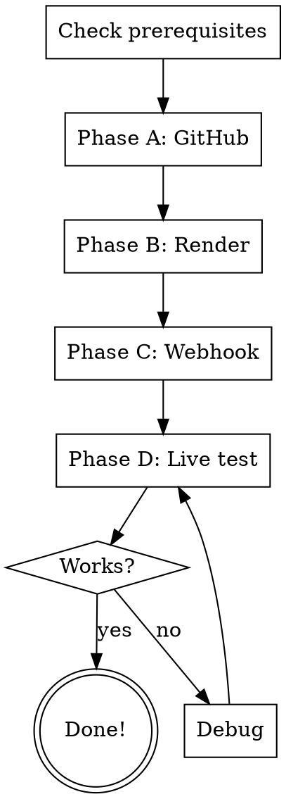

# Deploy WhatsApp Agent to Render

Put the student's WhatsApp agent online so it runs 24/7. Handles GitHub, Render, webhook connection, and live verification.

**Prerequisites:** wa-agent must have been run first (project directory with code exists).

## Interaction Style

Simple Hebrew. Principle: **"I do, you decide"** - Claude performs actions, stops for account creation/payments/passwords.

## Flow



## Prerequisites Check

1. Verify project directory exists with: main.py, agent.py, database.py, config.py, requirements.txt
2. Verify `.env` has Green API credentials
3. Verify local test passed (or run a quick one)

**"בוא נבדוק שהכל מוכן לפני שמעלים..."**

## Phase A: GitHub

**"כדי להעלות את הסוכן לאינטרנט, אנחנו צריכים קודם לשמור את הקוד ב-GitHub - מעין 'ענן' לקוד."**

### Check `gh` CLI
```bash
gh --version
```
If not installed: `brew install gh` (Mac) or guide through browser.

### Check GitHub Account
```bash
gh auth status
```
If not logged in:

**STOP**: "יש לך חשבון GitHub? אם לא, אני אפתח את הדפדפן ואעזור לך להירשם. זה חינם."

- If no account: open github.com, guide registration via browser
- If has account: `gh auth login` or guide via browser

### Create Repo and Push
```bash
cd [project-directory]
git init
git add .
git commit -m "Initial commit - WhatsApp AI agent"
gh repo create [agent-name]-whatsapp --public --source=. --push
```

Or via browser if gh CLI not available.

**"הקוד עכשיו ב-GitHub. עכשיו נעלה אותו ל-Render."**

## Phase B: Render

**"Render זה השירות שירוציץ את הסוכן שלך 24 שעות ביממה. בוא נגדיר אותו."**

1. Open https://render.com via browser
2. **STOP** at login/register: "צריך חשבון Render. תירשם - אפשר עם חשבון GitHub שיצרנו"
3. After login:
   - Click "New +" → "Web Service"
   - Connect GitHub repository
   - Select the agent's repo
4. Configure:
   - Name: `[agent-name]-whatsapp`
   - Runtime: Python
   - Build Command: `pip install -r requirements.txt`
   - Start Command: `uvicorn main:app --host 0.0.0.0 --port $PORT`
5. Environment Variables - add all from `.env`:
   - GREEN_API_URL, GREEN_API_INSTANCE, GREEN_API_TOKEN
   - OPENAI_API_KEY (or ANTHROPIC_API_KEY)
   - LLM_MODEL
   - SYSTEM_PROMPT
   - MAX_HISTORY
   - DATABASE_PATH = `/data/conversations.db`

6. **STOP for disk**: "Render יכול לשמור את זיכרון השיחות של הסוכן. זה עולה $0.25 לחודש. בלי זה, הסוכן 'ישכח' שיחות כשהשירות מתאתחל. מה אתה מעדיף?"
   - If yes: Add Disk → name: data, mount path: /data, size: 1 GB
   - If no: Set DATABASE_PATH to `./conversations.db` (will reset on redeploy)

7. Click "Create Web Service"
8. Wait for deploy to complete (2-5 minutes)
9. Note the URL: `https://[service-name].onrender.com`

**"הסוכן עלה לאוויר! הכתובת שלו: [URL]"**

## Phase C: Connect Webhook

**"עכשיו צריך לחבר את Green API לסוכן, כדי שהודעות שנשלחות ב-WhatsApp יגיעו אליו."**

1. Open Green API dashboard in browser
2. Go to instance settings → Webhooks
3. Set webhook URL: `https://[render-url]/webhook/green-api`
4. Enable notification types:
   - `incomingMessageReceived` = ON
   - All others = OFF (for now)
5. Save settings

Or via API:
```bash
curl -X POST "https://[API_URL]/waInstance[ID]/setSettings/[TOKEN]" \
  -H "Content-Type: application/json" \
  -d '{
    "webhookUrl": "https://[render-url]/webhook/green-api",
    "incomingWebhook": "yes",
    "outgoingMessageWebhook": "no",
    "outgoingAPIMessageWebhook": "no"
  }'
```

## Phase D: Live Test

**"הרגע הגדול! תשלח הודעה מהטלפון שלך למספר ה-WhatsApp שחיברת ל-Green API."**

1. Student sends a message from their phone
2. Wait 10-30 seconds
3. Agent should respond

If it works:
**"מזל טוב! הסוכן שלך חי! כל מי שישלח הודעה למספר הזה יקבל תשובה מהסוכן."**

If not:
- Check Render logs: service dashboard → Logs
- Check health endpoint: `curl https://[render-url]/health`
- Check webhook config in Green API
- See error handling table below

## Error Handling

| Problem | Solution |
|---------|----------|
| Deploy failed on Render | Check build logs, usually missing dependency |
| Service crashes on start | Check Render logs, likely env var missing |
| Health returns OK but no response | Webhook URL not configured, or wrong URL |
| Agent responds very slowly (>30s) | Render free tier spins down after inactivity. First request takes ~30s to wake up |
| "Internal Server Error" | Check Render logs for Python traceback |
| Green API not sending webhooks | Check webhook settings, ensure incomingWebhook is enabled |
| GitHub push denied | Check `gh auth status`, may need to re-login |
| "Module not found" on Render | Missing from requirements.txt |

## After Deployment

**"הסוכן שלך רץ! כמה דברים לדעת:"**
- Render free tier: service sleeps after 15 min of inactivity (first response slow)
- Paid plan ($7/month): always on, faster responses
- To update the agent later: say "wa-maintain" or "תעדכן את הסוכן"
