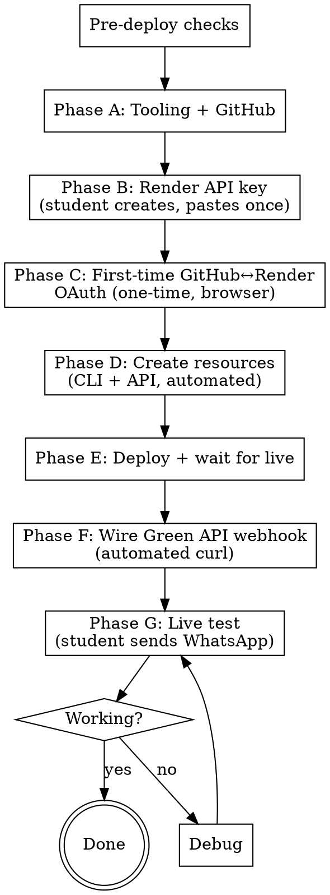

# Deploy the WhatsApp Agent to Render

Put the built agent online — **automated**. The student provides a Render API key; Claude Code runs every other step via CLI and REST API. Total manual interventions: (1) create the API key once, (2) connect GitHub↔Render once, (3) approve payment if upgrading to a paid tier.

**This skill does not write application code.** It orchestrates infrastructure via the `render` CLI and Render REST API, plus `gh` for GitHub.

**Prerequisites:**
- `wa-build` completed (bot talks locally, spec is frozen)
- Green API credentials in `.env` (from `wa-setup`)
- LLM API key in `.env` (from `wa-build`)

## Interaction Style

Simple Hebrew. Principle: **"I do, you decide"**. The student sees progress updates as Claude Code runs each command, but rarely needs to click anything.

## Tools This Skill Uses

| Tool | Install check | Purpose |
|---|---|---|
| `render` CLI (v2.15+) | `render --version` | Create service, trigger deploys, stream logs |
| Render REST API | `curl` (preinstalled) | Attach disks, create Postgres (CLI doesn't cover these) |
| `gh` CLI | `gh --version` | Push to GitHub |
| `jq` | `jq --version` | Parse API JSON responses |

If any are missing, install at the top of Phase A (`brew install render gh jq` on Mac).

## Deployment Matrix (Derived from Spec)

| Component in spec | Render resource |
|---|---|
| Always | Web Service (Python) |
| Always | Persistent Disk at `/data`, 1GB ($0.25/mo) — for SQLite conversations + reminders jobstore |
| `outlook_calendar` or `outlook_mail` in `spec.tools` | Postgres Free (for `user_tokens` rotation table) |
| `spec.archetype == "customer_service"` | Starter tier ($7/mo) — no cold starts |
| `spec.archetype == "personal_assistant"` | Free tier is enough |

## Flow


```dot
digraph wa_deploy {
    rankdir=TB;
    "Pre-deploy checks" [shape=box];
    "Phase A: Tooling + GitHub" [shape=box];
    "Phase B: Render API key\n(student creates, pastes once)" [shape=box];
    "Phase C: First-time GitHub↔Render\nOAuth (one-time, browser)" [shape=box];
    "Phase D: Create resources\n(CLI + API, automated)" [shape=box];
    "Phase E: Deploy + wait for live" [shape=box];
    "Phase F: Wire Green API webhook\n(automated curl)" [shape=box];
    "Phase G: Live test\n(student sends WhatsApp)" [shape=box];
    "Working?" [shape=diamond];
    "Debug" [shape=box];
    "Done" [shape=doublecircle];

    "Pre-deploy checks" -> "Phase A: Tooling + GitHub";
    "Phase A: Tooling + GitHub" -> "Phase B: Render API key\n(student creates, pastes once)";
    "Phase B: Render API key\n(student creates, pastes once)" -> "Phase C: First-time GitHub↔Render\nOAuth (one-time, browser)";
    "Phase C: First-time GitHub↔Render\nOAuth (one-time, browser)" -> "Phase D: Create resources\n(CLI + API, automated)";
    "Phase D: Create resources\n(CLI + API, automated)" -> "Phase E: Deploy + wait for live";
    "Phase E: Deploy + wait for live" -> "Phase F: Wire Green API webhook\n(automated curl)";
    "Phase F: Wire Green API webhook\n(automated curl)" -> "Phase G: Live test\n(student sends WhatsApp)";
    "Phase G: Live test\n(student sends WhatsApp)" -> "Working?";
    "Working?" -> "Done" [label="yes"];
    "Working?" -> "Debug" [label="no"];
    "Debug" -> "Phase G: Live test\n(student sends WhatsApp)";
}
```

## Pre-deploy Checks

Verify locally before running any external command:

1. Code layout matches `wa-build` spec: `main.py`, `agent.py`, `database.py`, `config.py`, `prompt.py`, `tools/__init__.py`, `tools/whatsapp.py`, `tools/reminders.py` (if reminders in spec), `requirements.txt`, `.env`, `.env.example`, `.gitignore`
2. Smoke test passes locally (same fake-webhook curl from `wa-build`)
3. `.gitignore` excludes: `.env`, `*.db`, `__pycache__`, `google_client_secret.json`
4. **`.wa-state.json`** exists and `current_stage == "deploy"`

Fail fast if any are missing.

## Phase A: Tooling + GitHub

Install and authenticate the CLIs the student needs:

```bash
# Check what's missing
command -v render >/dev/null || brew install render
command -v gh >/dev/null || brew install gh
command -v jq >/dev/null || brew install jq
```

**GitHub auth**:
```bash
gh auth status
```
If not logged in: `gh auth login` (guides via browser — **STOP** and let the student complete).

**Push the code**:
```bash
cd [project-dir]
git init 2>/dev/null || true
git add .
git commit -m "Initial commit — [bot_name] WhatsApp agent" || git commit --allow-empty -m "Redeploy"
gh repo create [bot_name]-whatsapp --private --source=. --push 2>/dev/null || git push
```

Use `--private`. Not because the code is sensitive — it isn't, secrets are in `.env` which is gitignored — but because nothing good comes from strangers forking a student's half-polished prompt.

**Sanity check**: verify `.env` is NOT in the pushed repo. If it is, `.gitignore` is broken — fix and force-push before continuing.

## Phase B: Render API Key (one-time, student action)

**"ב-Render צריך ליצור מפתח API פעם אחת. זה מאפשר לי ליצור שירותים ולפרוס בלי שתצטרך להיכנס לדשבורד בכל פעם."**

1. **STOP**: open https://dashboard.render.com/u/settings#api-keys in the browser (or tell the student: Render Dashboard → Account Settings → API Keys)
2. **STOP**: student clicks "Create API Key", names it `whatsapp-agent`, copies the value
3. Student pastes the key. Claude Code saves it to `.env`:
   ```
   RENDER_API_KEY=rnd_...
   ```
4. Also export for the current shell:
   ```bash
   export RENDER_API_KEY="$(grep '^RENDER_API_KEY=' .env | cut -d= -f2)"
   ```

**Why API key and not `render login`**: `render login` opens a browser, stores a token that silently expires. API keys don't expire, work headlessly, and survive shell restarts. Always prefer API keys for automated scripts.

## Phase C: GitHub ↔ Render (one-time, browser, if needed)

**This is the only truly manual step.** Render needs authorization to read the student's GitHub repos. If the student has used Render before with this GitHub account, skip. Otherwise:

1. Try a dry-run: `render services create --name test-connection --type web_service --repo https://github.com/[user]/[bot]-whatsapp --branch main --runtime python --build-command 'echo test' --start-command 'echo test' --plan free --dry-run 2>&1`
2. If the output mentions "repo not authorized" or similar: **STOP** and guide the student:
   - Open https://dashboard.render.com/settings#git-providers
   - Click "Connect GitHub"
   - Approve for the specific repo or all repos
   - Return and say "done"
3. Retry step 1 until it succeeds.

**Why this happens**: Render workspaces each authorize their own set of GitHub repos. First service from a new account needs this handshake. Subsequent services don't.

## Phase D: Create Resources (automated)

Every command in this phase runs via CLI or curl — no browser.

### D1. Decide the plan
Read `spec.archetype`:
- `personal_assistant` → `--plan free` (but **STOP** to warn about cold-start behavior)
- `customer_service` → `--plan starter` (**STOP** for payment approval: "זה $7 לחודש - אוקיי?")

### D2. Decide the region
Ask once, remember in `.wa-state.json` as `render_region`:
- Israel timezone → `frankfurt` (recommended, ~50ms latency)
- Everywhere else → `oregon` (default)

### D3. Create the web service

Claude Code reads env vars from `.env` and constructs the command. **Every LLM/Green API/spec-derived env var must be passed via `--env-var`**:

```bash
# Load env vars into current shell so we can pass them explicitly
set -a; source .env; set +a

SVC_OUTPUT=$(render services create \
  --name "${BOT_NAME}-whatsapp" \
  --type web_service \
  --repo "https://github.com/${GH_USER}/${BOT_NAME}-whatsapp" \
  --branch main \
  --runtime python \
  --region "${RENDER_REGION:-frankfurt}" \
  --plan "${RENDER_PLAN:-free}" \
  --build-command "pip install -r requirements.txt" \
  --start-command 'uvicorn main:app --host 0.0.0.0 --port $PORT' \
  --env-var "GREEN_API_URL=$GREEN_API_URL" \
  --env-var "GREEN_API_INSTANCE=$GREEN_API_INSTANCE" \
  --env-var "GREEN_API_TOKEN=$GREEN_API_TOKEN" \
  --env-var "LLM_PROVIDER=$LLM_PROVIDER" \
  --env-var "LLM_MODEL=$LLM_MODEL" \
  --env-var "ANTHROPIC_API_KEY=${ANTHROPIC_API_KEY:-}" \
  --env-var "OPENAI_API_KEY=${OPENAI_API_KEY:-}" \
  --env-var "GOOGLE_API_KEY=${GOOGLE_API_KEY:-}" \
  --env-var "DATABASE_PATH=/data/conversations.db" \
  --env-var "MAX_HISTORY=${MAX_HISTORY:-20}" \
  --output json)

SVC_ID=$(echo "$SVC_OUTPUT" | jq -r .id)
SVC_URL=$(echo "$SVC_OUTPUT" | jq -r .serviceDetails.url)
```

Only pass env vars that have values — empty ones cause Render errors. Skip any block that's not relevant to the spec (e.g. no `GOOGLE_API_KEY` if Google isn't selected — but it will be added later in `wa-connect` via `render env set`).

### D4. Attach the persistent disk (REST API — CLI doesn't support disks)

```bash
curl -fsS -X POST "https://api.render.com/v1/disks" \
  -H "Authorization: Bearer $RENDER_API_KEY" \
  -H "Content-Type: application/json" \
  -d "$(jq -n --arg sid "$SVC_ID" '{
    serviceId: $sid,
    name: "data",
    mountPath: "/data",
    sizeGB: 1
  }')"
```

If `--plan free`: this will fail, because free tier doesn't support disks.
- **Option A** (recommended): **STOP** and offer the student to upgrade: "Disk נדרש כדי שהבוט יזכור שיחות בין restarts. זה 25 סנט לחודש של disk + עוד $7 ל-Starter. יאללה?"
- **Option B** (no disk, stateless): change `DATABASE_PATH` to `./conversations.db` (ephemeral) and warn: "הבוט ישכח שיחות בכל פעם שה-Render מתאתחל."

### D5. Create Postgres (only if spec has Outlook tools)

Check `spec.tools` for `outlook_calendar` or `outlook_mail`. If present:

```bash
PG_OUTPUT=$(curl -fsS -X POST "https://api.render.com/v1/postgres" \
  -H "Authorization: Bearer $RENDER_API_KEY" \
  -H "Content-Type: application/json" \
  -d "$(jq -n --arg name "${BOT_NAME}-tokens" --arg region "${RENDER_REGION}" '{
    name: $name,
    region: $region,
    plan: "free",
    version: 16
  }')")

# Wait for it to be ready (up to 2 min)
PG_ID=$(echo "$PG_OUTPUT" | jq -r .id)
# Poll GET /v1/postgres/{id} until status == "available"

# Fetch connection string
PG_CONN=$(curl -fsS "https://api.render.com/v1/postgres/$PG_ID/connection-info" \
  -H "Authorization: Bearer $RENDER_API_KEY" | jq -r .externalConnectionString)

# Add to the web service env
curl -fsS -X PUT "https://api.render.com/v1/services/$SVC_ID/env-vars" \
  -H "Authorization: Bearer $RENDER_API_KEY" \
  -H "Content-Type: application/json" \
  -d "[{\"key\":\"DATABASE_URL_PG\",\"value\":\"$PG_CONN\"}]"
```

Then create the `user_tokens` table — run `scripts/init_pg.py` from the project locally, pointing at `DATABASE_URL_PG`. (This script is written during `wa-connect` E2 when Outlook is being wired; if Outlook is planned but not yet connected, skip this and let `wa-connect` handle it when the time comes.)

## Phase E: Deploy + Wait for Live

```bash
render deploys create "$SVC_ID" --wait
```

`--wait` blocks until the deploy finishes. Stream logs in a parallel process if the student wants to watch:
```bash
render logs --resources "$SVC_ID" --tail &
LOGS_PID=$!
# (after render deploys create finishes:)
kill $LOGS_PID 2>/dev/null
```

After success: verify the health endpoint.
```bash
curl -fsS "${SVC_URL}/health"
```
Expected: `{"status":"ok"}`. If not, jump to the Debug Playbook below.

Save the URL to `.wa-state.json` as `render_url`.

## Phase F: Wire Green API Webhook (automated)

This is the step that makes the bot actually receive messages. `wa-setup` step 8 enabled `incomingWebhook: yes` but left the URL blank. Now we fill it:

```bash
curl -fsS -X POST "${GREEN_API_URL}/waInstance${GREEN_API_INSTANCE}/setSettings/${GREEN_API_TOKEN}" \
  -H "Content-Type: application/json" \
  -d "$(jq -n --arg url "${SVC_URL}/webhook/green-api" '{
    webhookUrl: $url,
    incomingWebhook: "yes",
    outgoingMessageWebhook: "no",
    outgoingAPIMessageWebhook: "no"
  }')"
```

Expected response: `{"saveSettings": true}`.

Verify it stuck:
```bash
curl -fsS "${GREEN_API_URL}/waInstance${GREEN_API_INSTANCE}/getSettings/${GREEN_API_TOKEN}" | jq '.webhookUrl, .incomingWebhook'
```

Should print the Render URL and `"yes"`.

## Phase G: Live End-to-End Test

**"הרגע שחיכית לו. תשלח עכשיו הודעה לבוט מהטלפון האישי שלך."**

1. Student sends `היי` from their personal phone to the bot's number
2. Free tier: wait ~30s for cold start; paid tier: <3s
3. Bot should reply in the style defined by `spec.identity`

Watch `render logs --resources "$SVC_ID" --tail` in parallel. Expected log sequence:
- `POST /webhook/green-api` (incoming message)
- LLM call latency log line
- `sendMessage` to Green API (outgoing reply)

For **personal_assistant**: test the whitelist — ask a friend to message the bot, confirm it ignores them silently (log should show the rejection).

For **customer_service** with handoff: test the handoff trigger — send "אני רוצה לדבר עם נציג אנושי", confirm the manager's phone receives the relay.

## Working? → Update state & hand off

Update `.wa-state.json`:
- Append `"deploy"` to `completed_stages`
- Set `render_url` to `$SVC_URL`
- Set `render_service_id` to `$SVC_ID` (for future redeploys)
- Set `render_postgres_id` if created
- Update `last_touched_iso`
- **Set `current_stage`**:
  - If `spec.tools` has external tools (anything other than `reminders`) not in `connected_tools` → `"connect"`
  - Otherwise → `"maintain"`

Then:

**"🎉 הסוכן עלה לאוויר. שלחת הודעה וקיבלת תשובה בוואטסאפ. זה אמיתי."**

Check remaining external tools = `spec.tools - connected_tools - ["reminders"]`.

**If external tools remain**:
**"יופי. עכשיו כשהבוט חי, נחבר לו את הכלים אחד-אחד: [list]. כל חיבור: OAuth או credentials → קוד → push → Render עושה redeploy אוטומטי → בדיקה בוואטסאפ. מוכן להתחיל?"**

- Yes → invoke `wa-connect`
- Later → `/wa` when back

**If no external tools**:
**"אין עוד כלים לחבר לפי האפיון. הבוט מוכן. אם תרצה לשנות משהו - `/wa` ואני אעביר אותך ל-maintain."**

Share these facts regardless:
- **Render URL**: `[render_url]` — שמור אותו
- **Free tier sleep**: קולד סטארט ~30 שניות אחרי 15 דקות שקט. Starter ($7/mo) פותר
- **Green API**: חודשי אם במסלול בתשלום, חינמי ל-Developer instance
- **LLM**: תלוי בתעבורה. בדוק billing שבועית בהתחלה.

## Debug Playbook

Diagnose in this order. Don't skip.

### 1. Is the service alive?
```bash
curl -fsS "${SVC_URL}/health"
```
If not 200 → service is down. Get logs:
```bash
render logs --resources "$SVC_ID" --tail --num 100
```
Common causes:
- Env var missing → `render env list --resources "$SVC_ID"` and compare to `.env`
- Crash on startup → read the Python traceback in logs, fix, `git push`
- Free tier sleeping → fine, wake it with a test message
- OOM → upgrade to Starter

### 2. Is Green API delivering webhooks?
```bash
curl -fsS "${GREEN_API_URL}/waInstance${GREEN_API_INSTANCE}/getSettings/${GREEN_API_TOKEN}" | jq
```
Check `webhookUrl` matches `$SVC_URL`. If wrong (e.g., service was recreated), re-run Phase F.

### 3. Is the LLM happy?
Filter logs:
```bash
render logs --resources "$SVC_ID" --tail --num 200 | grep -i "anthropic\|openai\|google"
```
- `AuthenticationError` → `render env set <SVC_ID> ANTHROPIC_API_KEY=<new_key>`, service auto-restarts
- `RateLimitError` → out of funds; top up at provider's billing page

### 4. A specific tool failing?
Search logs for the tool name. For each external tool, the error typically points back to a `wa-connect` step that needs re-running.

### 5. Message received but bot didn't reply?
- Check `senderData.senderId` filter in `main.py` — maybe accidentally dropping real messages
- Check outbound Green API credentials work: retry the smoke test from `wa-setup` step 9

## Common Issues

| Problem | Solution |
|---------|----------|
| `render services create` fails with "repo not authorized" | Phase C wasn't done. Go to dashboard.render.com/settings#git-providers, connect GitHub. |
| `render services create` fails with "not logged in" | `RENDER_API_KEY` not exported in current shell. `export RENDER_API_KEY="..."` from `.env`. |
| Deploy stuck on "Building" >5 min | `pip install` resolving conflicts. Read build logs. |
| Service loops Live → Crashed → Live | Startup error. Check logs for the Python traceback. |
| First message works, second doesn't | `idMessage` dedup false positive, or SQLite locked. Check disk mount. |
| Free tier: bot misses messages during sleep | Known — Green API retries 3× over 15min. Upgrade to paid tier if consistent. |
| Microsoft token expired | `wa-connect` E9 (token keeper) not set up. Re-run OAuth via `wa-connect`. |
| Webhook test returns 404 | `main.py` route path mismatch. Check and align. |
| Attach disk fails with "plan does not support disks" | On Free tier. Upgrade or skip disk (ephemeral DB). |
| `render` CLI complains about workspace | `render workspace list` then `render workspace set <id>` to pick the right one. |

## Architectural Notes (for Claude Code's reference)

- **Why API key over `render login`**: tokens from `render login` expire silently; API keys don't. Scripts break unpredictably on expired tokens. API key = one user action, works forever.
- **Why `--private` GitHub repo**: nothing in the repo is secret (`.env` is gitignored), but unnecessary exposure of a student's in-progress prompt has no upside.
- **Why disk at `/data`, not `./data`**: Render's app filesystem is ephemeral on free, read-only on paid. Only mounted disks persist.
- **Why `DATABASE_PATH` is absolute**: app's CWD on Render is not stable across redeploys.
- **Why webhook URL lives in Green API, not env var**: Green API is the source of truth for the connection. Render URL rarely changes; if it does, updating Green API once is trivial.
- **Why Frankfurt for Israeli users**: ~50ms vs ~150ms from Oregon. Imperceptible for a single message, but token refresh to Google/Microsoft clusters in Europe benefits.
- **Why no `render.yaml` blueprint**: CLI direct commands are easier to reason about than YAML for non-technical students. If we ever add team/multi-env support, switch to blueprint.
- **Why `render_service_id` in `.wa-state.json`**: `wa-connect` and `wa-maintain` need it for `render env set` and `render deploys create`. Without it, they'd have to re-look-up the service by name every time.
- **Idempotency**: running `wa-deploy` a second time on the same project should detect the existing `render_service_id` and go to maintenance mode instead of creating a duplicate service.
