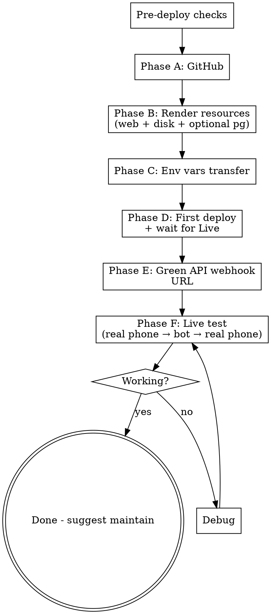

# Deploy the WhatsApp Agent to Render

Put the built agent online so it runs 24/7. Handles GitHub, Render web service, persistent storage, Green API webhook wiring, and live verification.

**This skill does not write application code.** It orchestrates infrastructure - git, Render configuration, env var transfer, webhook setup.

**Prerequisites:** `wa-build` completed. `wa-connect` optional but recommended before deploy for any non-trivial bot.

## Interaction Style

Simple Hebrew. Principle: **"I do, you decide"** - Claude drives the git commands, the Render UI (via browser), and the Green API settings. The student approves account creation, payment, and anything destructive.

## Pre-deploy Checks (Run in Order)

Before touching any external service, verify locally:

1. **Code layout matches `wa-build` spec** - `main.py`, `agent.py`, `database.py`, `config.py`, `prompt.py`, `tools/__init__.py`, `requirements.txt`, `render.yaml`, `.env`, `.env.example`, `.gitignore`
2. **Smoke test passes locally** - same fake-webhook curl from `wa-build` step 6
3. **`.gitignore` excludes**: `.env`, `*.db`, `__pycache__`, `google_client_secret.json`
4. **All tool stubs are implemented** (no `NotImplementedError` in `tools/*.py`) - or, if some tools are not needed in prod yet, they're removed from `TOOL_REGISTRY`

If any check fails, stop and fix before proceeding.

## Deployment Matrix (Derived from Spec)

The exact Render configuration depends on what the bot uses:

| Component in spec | Render resource needed |
|---|---|
| Always | Web Service (Python) |
| SQLite conversations + reminders | Disk mount at `/data` (1GB, $0.25/mo) |
| Microsoft/Outlook tools | Postgres (free tier) for `user_tokens` table |
| Otherwise | No Postgres |

Decide these before starting — confirm with the student at Phase B.

## Flow


```dot
digraph wa_deploy {
    rankdir=TB;
    "Pre-deploy checks" [shape=box];
    "Phase A: GitHub" [shape=box];
    "Phase B: Render resources\n(web + disk + optional pg)" [shape=box];
    "Phase C: Env vars transfer" [shape=box];
    "Phase D: First deploy\n+ wait for Live" [shape=box];
    "Phase E: Green API webhook\nURL" [shape=box];
    "Phase F: Live test\n(real phone → bot → real phone)" [shape=box];
    "Working?" [shape=diamond];
    "Debug" [shape=box];
    "Done - suggest maintain" [shape=doublecircle];

    "Pre-deploy checks" -> "Phase A: GitHub";
    "Phase A: GitHub" -> "Phase B: Render resources\n(web + disk + optional pg)";
    "Phase B: Render resources\n(web + disk + optional pg)" -> "Phase C: Env vars transfer";
    "Phase C: Env vars transfer" -> "Phase D: First deploy\n+ wait for Live";
    "Phase D: First deploy\n+ wait for Live" -> "Phase E: Green API webhook\nURL";
    "Phase E: Green API webhook\nURL" -> "Phase F: Live test\n(real phone → bot → real phone)";
    "Phase F: Live test\n(real phone → bot → real phone)" -> "Working?";
    "Working?" -> "Done - suggest maintain" [label="yes"];
    "Working?" -> "Debug" [label="no"];
    "Debug" -> "Phase F: Live test\n(real phone → bot → real phone)";
}
```

## Phase A: GitHub

**"כדי להעלות את הסוכן לאוויר, הקוד צריך להיות ב-GitHub. זה כמו Drive לקוד - גם גיבוי וגם Render מושך משם."**

1. Verify `gh` CLI: `gh --version` → if missing, `brew install gh` (Mac) or browser fallback
2. Verify auth: `gh auth status` → if not logged in, `gh auth login` (guides via browser)
3. `cd [project-dir] && git init && git add . && git commit -m "Initial commit - [bot_name] WhatsApp agent"`
4. `gh repo create [bot_name]-whatsapp --private --source=. --push`
   - **Use `--private`** by default - the code references secrets indirectly. Student can make it public later if they want.

**Sanity check**: browse to the repo in the student's GitHub account and confirm `.env` is NOT present (if it is, `.gitignore` was wrong - fix and force-push before continuing).

## Phase B: Render Resources

Open https://render.com.

**STOP for sign-up**: "תירשם ל-Render - חינם, אפשר עם חשבון GitHub."

### B1. Create Postgres (only if Outlook is in spec)
Check `spec.tools` - if it contains `outlook_calendar` or `outlook_mail`:
- New → PostgreSQL → Free tier
- Name: `[bot_name]-tokens`
- Region: closest to student's timezone (Frankfurt for Israel)
- Wait ~1 min for it to provision
- Copy **External Database URL** → will become `DATABASE_URL_PG` env var
- Run the `user_tokens` table creation (via Render's built-in `psql` shell or from local machine)

### B2. Create Web Service
- New → Web Service → Connect GitHub repository → select `[bot_name]-whatsapp`
- Config:
  - **Name**: `[bot_name]-whatsapp`
  - **Region**: same as Postgres
  - **Branch**: `main`
  - **Runtime**: Python
  - **Build Command**: `pip install -r requirements.txt`
  - **Start Command**: `uvicorn main:app --host 0.0.0.0 --port $PORT`
  - **Instance Type**:
    - **Free** — fine for personal assistant (sleeps after 15 min of inactivity, ~30s cold start on next message)
    - **Starter ($7/mo)** — mandatory for customer service bot (no cold starts)
    - Recommend by `spec.archetype`

### B3. Add persistent Disk
- Inside the service → Disks → Add Disk
- Name: `data`
- Mount Path: `/data`
- Size: **1 GB** ($0.25/mo)

**"זה 25 סנט לחודש. בלי זה, כל פעם שהסוכן מתאתחל הוא שוכח את כל השיחות הקודמות. אתה רוצה שישמור?"**

If the student declines, change `DATABASE_PATH` to `./conversations.db` and warn them that history resets on redeploy.

## Phase C: Environment Variables Transfer

Inside the service → Environment → Add Environment Variable (for each row):

| Variable | Value source | Notes |
|---|---|---|
| `GREEN_API_URL` | `.env` | |
| `GREEN_API_INSTANCE` | `.env` | |
| `GREEN_API_TOKEN` | `.env` | |
| `LLM_PROVIDER` | `anthropic` or `openai` | |
| `LLM_MODEL` | e.g. `claude-sonnet-4-5-20250929` | |
| `ANTHROPIC_API_KEY` or `OPENAI_API_KEY` | `.env` | Whichever provider |
| `DATABASE_PATH` | `/data/conversations.db` | Matches disk mount |
| `MAX_HISTORY` | `20` (or from spec) | |
| `SYSTEM_PROMPT` | Output of `prompt.py` | Or leave unset if code reads `spec.json` directly — **pick one pattern and stick with it** |
| `GOOGLE_CLIENT_ID` | `.env` | Only if Google tools |
| `GOOGLE_CLIENT_SECRET` | `.env` | Only if Google tools |
| `GOOGLE_REFRESH_TOKEN` | `.env` | Only if Google tools |
| `MS_CLIENT_ID` | `.env` | Only if Microsoft tools |
| `MS_CLIENT_SECRET` | `.env` | Only if Microsoft tools |
| `MS_TENANT_ID` | `common` or `.env` | Only if Microsoft tools |
| `DATABASE_URL_PG` | From Phase B1 | Only if Microsoft tools |
| `HANDOFF_MANAGER_PHONE` | From spec | Only if `handoff` in spec |

**Critical**: the student's `.env` is the source of truth. **Never type values from memory** - read from `.env` and copy verbatim. Typos here cause the bot to authenticate wrong later and the errors are cryptic.

After adding env vars, click **Save Changes**. Render automatically redeploys.

## Phase D: First Deploy

Click **Manual Deploy → Deploy latest commit** (belt-and-suspenders).

Watch the logs in real-time:
- Build phase: `pip install` progress
- Deploy phase: `Starting uvicorn...`
- Health phase: `GET /health → 200`

Wait for the status to show **Live** (green). Note the URL: `https://[service-name].onrender.com`.

If build fails:
- `ModuleNotFoundError` → missing package in `requirements.txt`
- `SyntaxError` → broken Python in a generated file; fix and push
- Exit code on start → check env vars first (missing variable)

**Test the health endpoint from the student's browser**: `https://[url]/health` → should return `{"status": "ok"}`.

## Phase E: Connect Green API to the Render URL

Now wire the incoming webhook to the deployed service.

### E1. Set webhook URL
In Green API dashboard → instance → Settings → Webhooks:
- **Webhook URL**: `https://[render-url]/webhook/green-api`
- Confirm `incomingWebhook: yes` (already set in `wa-setup` - sanity-check)
- Save

Or via API:
```
POST https://[API_URL]/waInstance[ID]/setSettings/[TOKEN]
{
  "webhookUrl": "https://[render-url]/webhook/green-api",
  "incomingWebhook": "yes",
  "outgoingMessageWebhook": "no",
  "outgoingAPIMessageWebhook": "no"
}
```

### E2. Force a test notification
Send a test payload from Green API's "Test" button (or send a real message from the student's personal phone). Check Render logs - should see:
```
POST /webhook/green-api 200
```

## Phase F: Live End-to-End Test

**"הרגע שחיכית לו. תשלח עכשיו הודעה לבוט מהטלפון האישי שלך."**

1. Student sends `היי` from their personal phone to the bot's number
2. Free tier: wait ~30s for cold start; paid tier: <3s
3. Bot should reply in the style defined by spec

For personal assistant: test the whitelist too - ask a friend to send a message, verify the bot ignores them silently.

For customer service with handoff: test the handoff trigger: send "אני רוצה לדבר עם נציג אנושי", confirm the manager's phone receives the relay message.

## Working? → Update state & hand off

Update `.wa-state.json`:
- Append `"deploy"` to `completed_stages`
- Set `current_stage: "maintain"` (deploy is done; anything further is maintenance)
- Set `render_url` to the deployed service URL
- Update `last_touched_iso`

Then:

**"🎉 הסוכן עלה לאוויר. כל מי שישלח הודעה למספר [X] יקבל תשובה 24/7."**

Share these facts with the student:
- **Render URL**: `[render_url]` — save it, צריך אותו לדיבוג בעתיד
- **Free tier sleep**: במסלול חינמי, ההודעה הראשונה אחרי 15 דקות שקט לוקחת ~30 שניות. Starter ($7/mo) פותר את זה.
- **Green API renewal**: חודשי אם במסלול בתשלום. חינמי (Developer) - ללא חיוב.
- **LLM cost**: תלוי בתעבורה. בדוק ב-`[provider]/billing` שבועית בהתחלה.

**"מכאן כל שינוי — הוספת כלי, שינוי אופי, תקלה — נעשה דרך `wa-maintain`. תגיד `/wa` ואני אנתב אותך לשם בכל פעם שתרצה."**

## Debug Playbook (for Not Working)

Diagnose in this exact order:

1. **Health endpoint**: `curl https://[url]/health` → if not 200, Render service itself is broken. Check Render logs.
2. **Webhook delivery**: Green API dashboard → instance → Webhook Test → does Green API show a 2xx response from Render? If no, webhook URL is wrong.
3. **Application logs**: Render → service → Logs. Filter by "ERROR" or "Traceback". Most common:
   - `anthropic.AuthenticationError` → wrong API key in env
   - `sqlite3.OperationalError: unable to open database file` → disk not mounted or `DATABASE_PATH` wrong
   - `httpx.ConnectError` → Green API unreachable from Render (check instance is authorized)
4. **Tool-specific failures**: LLM calls a tool, it fails, reply is generic. Look for the tool name in logs.
5. **Message format**: if bot receives but replies empty, check webhook payload shape matches what `main.py` expects.

## Common Issues

| Problem | Solution |
|---------|----------|
| Deploy stuck on "Building" >5 min | Usually `pip install` resolving conflicts. Check build logs. |
| Service loops "Live → Crashed → Live" | Env var missing, app raises on startup. Check logs for which. |
| First message works, second doesn't | `idMessage` dedup false positive, or SQLite locked. Check disk mount. |
| Free tier: bot misses messages during sleep | Known issue - Green API retries up to 3 times over 15 min. If missed consistently, upgrade to paid tier. |
| Microsoft token expires after 2 weeks | The token keeper job from `wa-connect` E9 wasn't added. Add it or manually re-run OAuth. |
| Starting Green API webhook test returns 404 | `main.py` route path doesn't match `/webhook/green-api`. Check and align. |
| Logs show messages being received but no reply sent | Green API outbound credentials wrong, or `senderData.senderId` filter accidentally drops all. |

## Architectural Notes (for Claude Code's reference)

- **Why `--private` GitHub repo**: the bot's code contains tool names and prompts tuned to the student's business. Not usually sensitive, but privacy is the safer default.
- **Why disk at `/data`** (not `./data`): Render's root filesystem is read-only on paid plans and ephemeral on free. Mounted disks are the only persistent storage.
- **Why `DATABASE_PATH` is a full path**, not `./conversations.db`: app's CWD on Render is not stable across redeploys; absolute path under `/data` is.
- **Why webhook URL goes in Green API's DB, not Render env var**: Green API is the source of truth for the connection. Changing Render URL (e.g., custom domain later) requires updating Green API, not vice versa.
- **Why the Render region matters**: Israel → Frankfurt (eu-central). ~50ms latency vs ~150ms from Oregon. For a bot, imperceptible, but token refresh calls to Google/Microsoft cluster in Europe.
- **Why `HANDOFF_MANAGER_PHONE` is an env var**, not in `spec.json`: spec is source-of-truth for logic; phone number is infra (different per environment if student ever has staging). Keep `spec.json` pure-product, env vars for infra.
- **Why we don't set up `render.yaml` blueprint deploy**: students understand "click buttons in dashboard" better than YAML. `render.yaml` is generated anyway (for future reference) but not used as the primary path.
