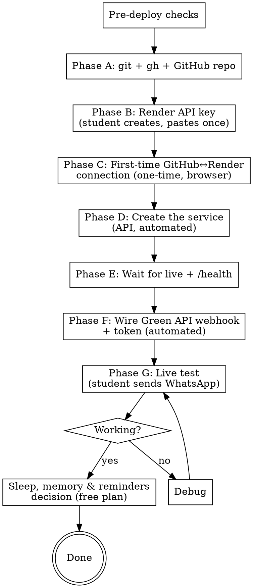

# Deploy the WhatsApp Agent to Render

Put the built agent online — **automated**. The student provides a Render API key; Claude Code runs every other step through the plugin's helper (`wa_ops.py`) and `git`/`gh`. Total manual interventions: (1) create the API key once, (2) connect GitHub↔Render once, (3) approve payment if choosing a paid plan.

**This skill does not write application code.** It orchestrates infrastructure via the Render REST API (through `WA_OPS`) plus `git`/`gh` for GitHub.

**Prerequisites:**
- `wa-build` completed (bot talks locally, spec is frozen)
- Green API credentials, LLM key and `WEBHOOK_TOKEN` in `.env` (from `wa-setup` / `wa-build`)

## Plugin files (read once per session)

- `PLUGIN_ROOT` = `${CLAUDE_SKILL_DIR}/../..` · helper `WA_OPS` = `PLUGIN_ROOT/scripts/wa_ops.py` (`python3` on macOS/Linux, `py -3` on Windows; run from the bot's project directory). It replaces the Render CLI, `jq` and `curl`: same commands in Bash, zsh, Git Bash and PowerShell; secrets are read from `.env` by name and never printed.
- Facts: `PLUGIN_ROOT/knowledge/facts.md` — the `F-RENDER-…` facts (free-tier behaviour, plans, Git connection path, API shapes, Python version), **F-GREENAPI-WEBHOOK-AUTH, F-GREENAPI-WEBHOOK-DELIVERY**, **F-GREENAPI-SETTINGS-DELAY**. Render's dashboard changes often: before sending the student to any Render screen follow `knowledge/freshness-protocol.md` §3, and record drift if it moved.
- Platform specifics (installing git/gh on Windows, restarting the app): `PLUGIN_ROOT/knowledge/platform.md`.

## Interaction Style

Simple Hebrew. Principle: **"I do, you decide"**. The student sees progress updates as Claude Code runs each command, but rarely needs to click anything.

## Tools This Skill Uses

| Tool | Check | Purpose |
|---|---|---|
| `WA_OPS` (plugin helper) | `WA_OPS doctor` | Render API (service, env vars, deploys, logs, disk), Green API webhook, health checks |
| `git` | `git --version` | Commit the code |
| `gh` (GitHub CLI) | `gh --version`, `gh auth status` | Create the private repo and push |

If `git` or `gh` is missing, install it **with the student's OK** (Phase A). Nothing else is needed — no Render CLI, no `jq`, no Homebrew on Windows.

## Deployment Matrix (Derived from Spec)

| Situation | Render setup |
|---|---|
| Always | Web Service (Python), region `frankfurt` for Israel (F-RENDER-REGIONS), health check `/health` |
| `customer_service` | **Starter** ($7/month, F-RENDER-PLANS) — never sleeps, no cold start for customers |
| `personal_assistant` | **Free** is fine to start — but it sleeps after 15 idle minutes and **wipes its files every time** (F-RENDER-FREE-LIMITS): memory needs `wa-persistence` (Supabase, free), and reminders need a decision (see "Sleep and reminders") |
| `persistence_choice == "disk_planned"` | Starter + 1 GB disk at `/data` (~$0.25/month, F-RENDER-PLANS) — attached at creation |
| Outlook in `spec.tools` | Nothing extra here — Outlook's tokens live in the bot's own database (wa-connect E / wa-persistence). Don't create a free Render Postgres for them: it is deleted after ~44 days (F-RENDER-POSTGRES-FREE) |

## Flow


```dot
digraph wa_deploy {
    rankdir=TB;
    "Pre-deploy checks" [shape=box];
    "Phase A: git + gh + GitHub repo" [shape=box];
    "Phase B: Render API key\n(student creates, pastes once)" [shape=box];
    "Phase C: First-time GitHub↔Render\nconnection (one-time, browser)" [shape=box];
    "Phase D: Create the service\n(API, automated)" [shape=box];
    "Phase E: Wait for live + /health" [shape=box];
    "Phase F: Wire Green API webhook\n+ token (automated)" [shape=box];
    "Phase G: Live test\n(student sends WhatsApp)" [shape=box];
    "Working?" [shape=diamond];
    "Debug" [shape=box];
    "Sleep, memory & reminders\ndecision (free plan)" [shape=box];
    "Done" [shape=doublecircle];

    "Pre-deploy checks" -> "Phase A: git + gh + GitHub repo";
    "Phase A: git + gh + GitHub repo" -> "Phase B: Render API key\n(student creates, pastes once)";
    "Phase B: Render API key\n(student creates, pastes once)" -> "Phase C: First-time GitHub↔Render\nconnection (one-time, browser)";
    "Phase C: First-time GitHub↔Render\nconnection (one-time, browser)" -> "Phase D: Create the service\n(API, automated)";
    "Phase D: Create the service\n(API, automated)" -> "Phase E: Wait for live + /health";
    "Phase E: Wait for live + /health" -> "Phase F: Wire Green API webhook\n+ token (automated)";
    "Phase F: Wire Green API webhook\n+ token (automated)" -> "Phase G: Live test\n(student sends WhatsApp)";
    "Phase G: Live test\n(student sends WhatsApp)" -> "Working?";
    "Working?" -> "Sleep, memory & reminders\ndecision (free plan)" [label="yes"];
    "Working?" -> "Debug" [label="no"];
    "Debug" -> "Phase G: Live test\n(student sends WhatsApp)";
    "Sleep, memory & reminders\ndecision (free plan)" -> "Done";
}
```

## Pre-deploy Checks

Verify locally before running any external command:

1. Code layout matches `wa-build`: `main.py`, `agent.py`, `database.py`, `config.py`, `prompt.py`, `tools/__init__.py`, `tools/whatsapp.py`, `tools/reminders.py` (if reminders in spec), `requirements.txt`, `.python-version`, `.env`, `.env.example`, `.gitignore`
2. Smoke test passes locally (`WA_OPS smoke --from <student phone>` from `wa-build` step 6)
3. `.gitignore` excludes: `.env`, `.venv/`, `*.db`, `data/`, `__pycache__/`, `google_client_secret.json`, `.wa-state*.json`
4. `.python-version` exists (`3.12`) and there is no `runtime.txt` (F-RENDER-PYTHON-VERSION)
5. `WA_OPS env check WEBHOOK_TOKEN GREEN_API_URL GREEN_API_INSTANCE GREEN_API_TOKEN LLM_PROVIDER LLM_MODEL` → all present
6. `WA_OPS state get` → `current_stage == "deploy"`. **Idempotency:** if `render.service_id` is already set, a service exists — don't create a second one; jump to Phase E (or route to `wa-maintain` for a redeploy)

Fail fast if any are missing.

## Phase A: git, gh and the GitHub repo

`WA_OPS doctor` shows whether `git` and `gh` exist and whether `gh` is logged in.

**Install what's missing — only with the student's OK** (`knowledge/platform.md`):
- macOS: `brew install git gh` (or `xcode-select --install` for git; `gh` .pkg from https://cli.github.com if there's no Homebrew)
- Windows: `winget install -e --id Git.Git` and `winget install -e --id GitHub.cli` — then **restart the app** (PATH is read at launch): **"התקנתי את הכלים. סגור את האפליקציה ופתח מחדש, ואז תכתוב `/wa` — נמשיך בדיוק מכאן."** `.wa-state.json` makes the resume seamless.

**GitHub auth**:
```
gh auth status
```
If not logged in: `gh auth login --web` — **STOP** and let the student complete it in the browser (it shows a one-time code to paste). Then let git use that login for pushes:
```
gh auth setup-git
```

**Git identity** (a fresh computer has none, and `git commit` then fails with "Please tell me who you are"). If `git config user.email` prints nothing, set it **for this repo only**, using GitHub's private no-reply address so the student's email isn't published:
```
gh api user --jq ".login"
gh api user --jq ".id"
git config user.name "<login>"
git config user.email "<id>+<login>@users.noreply.github.com"
```
(Run the two `git config` lines after `git init`.)

**Names**: the repo and the Render service use `bot_slug` from `.wa-state.json` (an ASCII name like `roni-bot`, set in wa-characterize). GitHub repo names can't contain Hebrew — never use `bot_name` there. If `bot_slug` is missing (older state), make one now with the student (`WA_OPS state set bot_slug=<slug>`).

**Push the code** (same commands on every OS, one per line — Windows PowerShell 5.1 doesn't accept `&&`):
```
git init
git add .
git commit -m "Initial commit — <bot_slug> WhatsApp agent"
gh repo create <bot_slug>-whatsapp --private --source=. --push
```
If the repo already exists (resumed session): `git add .`, then `git commit -m "Update"` (skip if there's nothing to commit), then `git push`.

Use `--private`. Not because the code is sensitive — it isn't, secrets are in `.env` which is gitignored — but because nothing good comes from strangers forking a student's half-polished prompt.

**Sanity check**: `git ls-files .env .wa-state.json` must print nothing. If it prints a file, `.gitignore` was broken — `git rm --cached <file>`, fix `.gitignore`, commit, push, **and treat the pushed secrets as leaked** (rotate the Green API token, LLM key and `WEBHOOK_TOKEN`) before continuing.

## Phase B: Render API Key (one-time, student action)

**"ב-Render צריך ליצור מפתח API פעם אחת. זה מאפשר לי ליצור שירותים ולפרוס בלי שתצטרך להיכנס לדשבורד בכל פעם."**

1. **STOP**: open the API-keys page (F-RENDER-API-KEY — currently https://dashboard.render.com/u/settings?add-api-key). If the student has no Render account yet, they sign up first (GitHub sign-in is easiest).
2. **STOP**: student clicks "Create API Key", names it `whatsapp-agent`, copies the value
3. **"תעתיק את המפתח (בלי להדביק אותו כאן) ותגיד לי 'העתקתי'."** Save it straight from the clipboard and test it:
   ```
   WA_OPS env set RENDER_API_KEY --from-clipboard
   WA_OPS render owners
   ```
   (If the student already pasted it into the chat: `WA_OPS env set RENDER_API_KEY <value>`.)
   `owners` lists the student's workspaces. If there is more than one, ask which to use and pass `--owner <id>` in Phase D (the helper refuses to guess).

**Why API key and not `render login`**: an API key works headlessly, doesn't silently expire, and is the same on every OS. It's one student action, then everything is automated.

## Phase C: GitHub ↔ Render (one-time, browser, if needed)

**This is the only truly manual step.** Render needs authorization to read the student's GitHub repos. If the student has used Render with this GitHub account before, skip. Otherwise service creation in Phase D fails with an error about the repo / Git credentials — the helper's `hint` says so explicitly.

**Handle lazily**: don't pre-check. Just proceed to Phase D. If it fails with the repo/credentials hint:

1. **STOP** and guide the student (F-RENDER-GIT-CONNECT — check freshness first, this screen moves):
   - Render → **Account Settings → Account Security → Git Deployment Credentials → Add credential → GitHub** (currently https://dashboard.render.com/u/settings#account-security)
   - Approve Render's GitHub app for this repo (or all repos). To change access later: https://github.com/apps/render/installations/new
   - Return and say "done"
2. Retry Phase D — it should now succeed.

**"Render צריך אישור חד-פעמי לקרוא את הקוד שלך מ-GitHub. תלחץ על הכפתור, תאשר, ותגיד לי 'סיימתי'."**

**Why not pre-check**: there's no clean "repo already authorized?" query. The "fail once, fix, retry" flow is simpler for a one-time cost.

## Phase D: Create the Service (automated)

### D1. Decide the plan
Read `spec.archetype` and `persistence_choice`:
- `personal_assistant` → `--plan free` — **STOP** to say plainly what free means (F-RENDER-FREE-LIMITS): **"השרת החינמי נרדם אחרי 15 דקות בלי הודעות. ההודעה הראשונה אחרי שינה לוקחת בערך דקה לענות, ובכל פעם שהוא נרדם הקבצים שלו נמחקים — לכן מיד אחרי ההעלאה נחבר לו זיכרון חינמי (Supabase)."**
- `customer_service`, or `persistence_choice == "disk_planned"` → `--plan starter` — **STOP** for payment approval: **"זה $7 לחודש (ועוד בערך 25 סנט לדיסק אם יש) - אוקיי?"** Render may ask for a card first; the helper's `hint` says so (HTTP 402).

### D2. Decide the region
Israel → `frankfurt` (default, F-RENDER-REGIONS). Elsewhere → `oregon`/`virginia`. Saved automatically to `.wa-state.json` (`render.region`).

### D3. Create the web service

```
WA_OPS render create-service \
  --name <bot_slug>-whatsapp \
  --repo https://github.com/<gh user>/<bot_slug>-whatsapp \
  --plan free --region frankfurt \
  --env-keys GREEN_API_URL,GREEN_API_INSTANCE,GREEN_API_TOKEN,LLM_PROVIDER,LLM_MODEL,LLM_EFFORT,ANTHROPIC_API_KEY,OPENAI_API_KEY,GOOGLE_API_KEY,WEBHOOK_TOKEN,MAX_HISTORY \
  --env DATABASE_PATH=./data/conversations.db
```

(PowerShell: same command on one line, or with backticks instead of `\`.)

- `--env-keys` copies those keys **from `.env` by name** — values never appear in the command or the output; empty/missing keys are skipped. **Never** include `APP_ENV` (it switches on local debug mode) or `RENDER_API_KEY`.
- Starter with a disk: add `--plan starter --disk-gb 1 --disk-mount /data` and use `--env DATABASE_PATH=/data/conversations.db` (the disk is attached at creation; mount-path rules in F-RENDER-PLANS). Then record it: `WA_OPS state set persistence_choice=disk persistence_details.mount_path=/data persistence_details.size_gb=1`.
- Free: keep `DATABASE_PATH=./data/conversations.db` for now — `wa-persistence` replaces it with `DATABASE_URL` right after this skill.
- The helper builds the documented request (F-RENDER-API-SHAPES: `autoDeployTrigger: "commit"`, health check path, build/start commands, `python` runtime) and saves `render.service_id`, `render.url`, `render.dashboard_url`, `render.owner_id`, `render.plan`, `render.region` into `.wa-state.json`. It prints `deploy_id` of the first deploy.

### Changing env vars later (all skills)

```
WA_OPS render env-set <KEY>                 # value read from .env
WA_OPS render env-set <KEY> --value <v>     # non-secret value
WA_OPS render env-del <KEY>
WA_OPS render deploy --wait                  # env changes apply on the next deploy
```

These use Render's **per-key** endpoints. Never use the collection `PUT /env-vars` — it **replaces every variable on the service** with whatever list you send, and its GET is paginated (20 by default), so a read-modify-write can silently drop keys (F-RENDER-API-SHAPES). v2 of this course did exactly that; the helper makes it impossible.

## Phase E: Wait for First Deploy (poll, don't trigger)

Service creation **already started** the first deploy. Don't trigger another one. Wait for it:

```
WA_OPS render wait --deploy <deploy_id from D3>
```

It polls every 15s (up to 15 minutes) until a final status: `live`, or `build_failed` / `update_failed` / `pre_deploy_failed` / `canceled` / `deactivated` (F-RENDER-API-SHAPES). On failure it attaches the last ~60 log lines (build logs for a build failure) — read them before guessing. Most common causes are in **Common Issues** below.

After `live`, check health (this also proves the free instance can wake):
```
WA_OPS health
```
Expected: `{"ok": true, "body": {"status": "ok", "db": "ok"}}`. A free service can take about a minute to answer the first time (F-RENDER-COLD-START) — the helper keeps trying for 150 seconds.

## Phase F: Wire Green API Webhook (automated)

This is the step that makes the bot actually receive messages — and makes sure **only Green API** can talk to it. `wa-setup` enabled incoming messages but left the URL empty. Now:

```
WA_OPS green configure --webhook-url <render url>/webhook/green-api --webhook-token-from-env WEBHOOK_TOKEN
```

It sets `webhookUrl`, sends `WEBHOOK_TOKEN` as `webhookUrlToken` (Green API then adds `Authorization: Bearer <token>` to every webhook — F-GREENAPI-WEBHOOK-AUTH), re-applies the standard settings (incoming on, outgoing off, LID mode off), and polls `getSettings` until the change is visible.

`setSettings` restarts the instance and can take **up to 5 minutes** to show (F-GREENAPI-SETTINGS-DELAY). If the helper returns `verified: false`, wait a minute and run `WA_OPS green settings` — don't resend in a loop.

From now on Green API's HTTP queue is off (messages go to the server), so `green wait-incoming` from wa-setup no longer applies.

## Phase G: Live End-to-End Test

**"הרגע שחיכית לו. תשלח עכשיו הודעה לבוט מהטלפון האישי שלך."**

1. Student sends `היי` from their personal phone to the bot's number
2. Free tier asleep: about a minute (Green API retries every 60s — F-GREENAPI-WEBHOOK-DELIVERY); awake or paid: a few seconds
3. Bot should reply in the style defined by `spec.identity`

Read the logs while waiting:
```
WA_OPS render logs --minutes 10
```
Expected sequence:
- `POST /webhook/green-api` (incoming message, 200)
- LLM call log line
- `sendMessage` to Green API (outgoing reply)

A `401` on `/webhook/green-api` means the token in Green API and on Render differ — re-run Phase F after `WA_OPS render env-set WEBHOOK_TOKEN` + `render deploy --wait`.

For **personal_assistant**: test the whitelist — ask a friend to message the bot, confirm it ignores them silently (the log shows the rejection and the reason). Remember the free Green API plan's chat limit (F-GREENAPI-PLANS) — one test friend is enough.

For **customer_service** with handoff: handoff is wired in `wa-connect`; test it there.

## Sleep, memory & reminders (free plan only)

Say it once, plainly, then let the student choose — record the choice (`WA_OPS state set render.keep_awake=<value>`):

**"עוד החלטה אחת על השרת החינמי. הוא נרדם אחרי רבע שעה בלי הודעות. זה אומר שני דברים: (1) הוא שוכח הכל כשהוא נרדם — את זה נפתור עכשיו עם Supabase. (2) תזכורת שקבעת למחר בבוקר תגיע רק כשהבוט יתעורר — כלומר כשמישהו יכתוב לו. יש שלוש דרכים להתמודד:"**

1. **שרת בתשלום (Starter, $7 לחודש)** — לא נרדם; התזכורות מגיעות בזמן. *המומלץ אם התזכורות חשובות לך.* → `keep_awake=paid_plan` (upgrade: Render dashboard → service → Settings → Instance Type → Starter; then `WA_OPS render status` to sync `render.plan` into the state file).
2. **"פינג" חינמי מבחוץ** — שירות חיצוני (למשל cron-job.org או UptimeRobot, בחינם) שפונה לכתובת `<render url>/health` כל 10 דקות, כדי שהשרת לא יירדם. עובד ברוב המקרים, אבל זה לא פיצ'ר רשמי של Render (F-RENDER-KEEPALIVE), ושרת אחד שתמיד ער מנצל כמעט את כל 750 השעות החינמיות בחודש. בונוס: `/health` נוגע במסד הנתונים, אז גם Supabase לא נכנס להשהיה (F-SUPABASE-FREE-PAUSE). → `keep_awake=external_ping`. The student creates the monitor themselves (an account on a third-party site) — guide them, don't sign up for them. **Never** point it at `/robots.txt` (doesn't wake the service).
3. **להשאיר ככה** → `keep_awake=none`. Say the version that's true for this bot:
   - durable memory already in place (`persistence_choice` is `supabase`, `render_pg` or `disk`): **"תזכורות לא הולכות לאיבוד - הבוט שולח אותן ברגע שהוא מתעורר, עם הערה שזה באיחור - אבל הן לא מדויקות בזמן."**
   - no durable memory yet: **"בלי זיכרון קבוע, תזכורת שנקבעה נמחקת כשהשרת נרדם. לכן הצעד הבא הוא לחבר זיכרון (Supabase) - ואז התזכורות רק יאחרו, לא ייעלמו."**

Skip this section for Starter services.

## Working? → Update state & hand off

```
WA_OPS state stage-done deploy <next>
```
where `<next>` is:
- `"connect"` if `spec.tools` has external tools (anything other than `reminders`) not in `connected_tools`
- otherwise `"maintain"`

(The helper already saved `render.*` in D3.) If `reminders` is in `spec.tools`: `WA_OPS state append connected_tools reminders`.

Then:

**"🎉 הסוכן עלה לאוויר. שלחת הודעה וקיבלת תשובה בוואטסאפ. זה אמיתי."**

**No durable memory yet → persistence first.** If `persistence_choice` is not one of `disk`, `supabase`, `render_pg` (i.e. it's `ephemeral`, `external_db_planned` or unset), the bot currently forgets everything on every idle spin-down. Before tools:
**"לפני שנחבר כלים — בוא ניתן לבוט זיכרון קבוע, אחרת הוא ישכח את השיחות כל פעם שהשרת נרדם. זה חינמי ולוקח כרבע שעה. נמשיך?"**
- Yes → invoke `wa-persistence`
- Later → continue below, and `/wa` will offer it again

Check remaining external tools = `spec.tools - connected_tools - ["reminders"]`.

**If external tools remain**:
**"יופי. עכשיו כשהבוט חי, נחבר לו את הכלים אחד-אחד: [list]. כל חיבור: OAuth או credentials → קוד → push → Render עושה redeploy אוטומטי → בדיקה בוואטסאפ. מוכן להתחיל?"**

- Yes → invoke `wa-connect`
- Later → `/wa` when back

**If no external tools**:
**"אין עוד כלים לחבר לפי האפיון. הבוט מוכן. אם תרצה לשנות משהו - `/wa` ואני אעביר אותך ל-maintain."**

Share these facts regardless:
- **Render URL**: `[render.url]` — שמור אותו
- **Free tier sleep**: קולד סטארט של בערך דקה אחרי 15 דקות שקט (F-RENDER-COLD-START). Starter ($7/mo) פותר
- **Green API**: חודשי אם במסלול בתשלום, חינמי ל-Developer (עד 3 צ'אטים בחודש)
- **LLM**: תלוי בתעבורה. בדוק billing שבועית בהתחלה.

If anything on a Render/GitHub screen didn't match these instructions, it's in `drift_log` — offer the upstream report once (freshness protocol §5).

## Debug Playbook

Diagnose in this order. Don't skip.

### 1. Is the service alive?
```
WA_OPS health
WA_OPS render status
```
If not healthy → service is down. Get logs:
```
WA_OPS render logs --minutes 30
WA_OPS render logs --type build      # if the latest deploy failed to build
```
Common causes:
- Env var missing → `WA_OPS render env-keys` and compare to `.env` (`WA_OPS env keys`)
- Crash on startup → read the Python traceback in logs, fix, `git push`
- Free tier sleeping → fine, `WA_OPS health` waits for it to wake
- OOM → upgrade to Starter

### 2. Is Green API delivering webhooks?
```
WA_OPS green settings
WA_OPS green state
```
Check `webhookUrl` matches `<render.url>/webhook/green-api`, `incomingWebhook` is `yes`, `webhookUrlToken` is `[set]`, and the state is `authorized`. If the URL is wrong (e.g., service was recreated), re-run Phase F.

### 3. Is the webhook authenticated?
Logs show `401` on `/webhook/green-api` → `WEBHOOK_TOKEN` differs between Green API and Render. `WA_OPS render env-set WEBHOOK_TOKEN`, `WA_OPS render deploy --wait`, then Phase F again.

### 4. Is the LLM happy?
```
WA_OPS render logs --text anthropic
WA_OPS llm check --ping
```
- `401 authentication_error` → key wrong, revoked or **expired** (F-ANTHROPIC-ERRORS) → new key with Expiration = Never, `WA_OPS env set ANTHROPIC_API_KEY …`, `render env-set ANTHROPIC_API_KEY`, `render deploy --wait`
- `402 billing_error` → out of credit; top up at the provider's billing page
- `429` → rate limit; usually transient

### 5. A specific tool failing?
`WA_OPS render logs --text <tool name>`. For each external tool, the error typically points back to a `wa-connect` step that needs re-running.

### 6. Message received but bot didn't reply?
- The log line for the rejection says why (whitelist, group, non-text, dedupe)
- Check outbound Green API works: `WA_OPS green send <student phone> "בדיקה"`

## Common Issues

| Problem | Solution |
|---------|----------|
| Build fails with `maturin failed` / `pydantic_core` / `Read-only file system (os error 30)` | Render is using its default Python 3.14 (F-RENDER-PYTHON-VERSION). Commit `.python-version` containing `3.12` to the repo root, push. |
| Pinned Python via `runtime.txt` but it's ignored | Render doesn't read `runtime.txt`. Use `.python-version`; delete `runtime.txt`. |
| `create-service` error about the repo / Git credentials | Phase C wasn't done (F-RENDER-GIT-CONNECT). |
| `create-service` → 402 | Paid plan without a card on Render. Student adds a payment method, retry. |
| `create-service` → "several workspaces" | `WA_OPS render owners`, ask the student, pass `--owner`. |
| Deploy stuck on "Building" >5 min | `pip install` resolving conflicts. `WA_OPS render logs --type build`. |
| Service loops Live → Crashed → Live | Startup error. Check logs for the Python traceback. |
| `/health` OK but every webhook → 401 | Token mismatch — Debug step 3. |
| First message works, second doesn't | `idMessage` dedup false positive, or SQLite locked. Check `DATABASE_PATH`. |
| Bot forgets conversations after a quiet hour | Free instance wiped its files on spin-down (F-RENDER-FREE-LIMITS) → `wa-persistence`. |
| Free tier: messages answered ~1 minute late | Cold start + Green API's 60-second retry (F-GREENAPI-WEBHOOK-DELIVERY). Normal; Starter or keep-awake fixes it. |
| Reminder arrived late with "(באיחור…)" | Server was asleep at the reminder time — see "Sleep, memory & reminders". |
| Microsoft token expired | Re-run OAuth via `wa-connect` Sub-flow E. |
| Webhook test returns 404 | `main.py` route path mismatch. Check and align. |
| Changed an env var but nothing changed | Env changes apply on the next deploy: `WA_OPS render deploy --wait`. |
| Green API `getSettings` doesn't show the new URL yet | Up to 5 minutes after `setSettings` (F-GREENAPI-SETTINGS-DELAY). |
| Service crashes after env var change with `Network is unreachable` and an IPv6 address | Student put Supabase **Direct** URL as `DATABASE_URL`. Use the **Session pooler** URL (F-SUPABASE-IPV4). See `wa-persistence` B2. |
| Service crashes after DB migration with `FATAL: Tenant or user not found` | Pooler host or username wrong — copy the string from Supabase's **Connect** button, don't build it (F-SUPABASE-POOLER-HOST). |
| Old env var `DATABASE_PATH` lingers after the Postgres migration | `WA_OPS render env-del DATABASE_PATH`, then `render deploy --wait`. |
| APScheduler jobstore fails with "unknown driver" after the Postgres migration | SQLAlchemy URL needs an explicit driver: `postgresql+psycopg://…` (wa-persistence B4). |
| Windows: `git`/`gh`/`py` "not recognized" right after installing | The app hasn't been restarted since winget installed it (F-CC-WINDOWS-SHELL). |

## Architectural Notes (for Claude Code's reference)

- **Why the REST API through a Python helper, not the Render CLI**: the CLI needed Homebrew + `jq` + bash — none of which a fresh Windows machine has, and Claude Code on Windows may run PowerShell (F-CC-WINDOWS-SHELL). The helper is one stdlib Python file: same command everywhere, no install, typed errors with Hebrew-friendly hints, secrets never printed, request shapes covered by offline tests against the OpenAPI spec.
- **Why API key over `render login`**: headless, doesn't silently expire, works the same on every OS.
- **Why `--private` GitHub repo**: nothing in the repo is secret (`.env` is gitignored), but unnecessary exposure of a student's in-progress prompt has no upside.
- **Why a webhook token**: the Render URL is public. Without `Authorization` checking, anyone who learns it can post a fake "message from the owner" and drive the calendar/mail tools.
- **Why disk at `/data`, not `./data`**: Render's app filesystem is ephemeral — wiped on every deploy, restart and (free) spin-down. Only mounted disks persist.
- **Why `DATABASE_PATH` is absolute on a disk**: app's CWD on Render is not guaranteed across redeploys.
- **Why webhook URL lives in Green API, not env var**: Green API is the source of truth for the connection. Render URL rarely changes; if it does, Phase F is one command.
- **Why Frankfurt for Israeli users**: lower latency than the US regions; Supabase `eu-central-1` sits next to it.
- **Why no `render.yaml` blueprint**: direct API calls are easier to reason about for non-technical students. If we ever add team/multi-env support, switch to a blueprint.
- **Why `render.service_id` in `.wa-state.json`**: `wa-connect`, `wa-persistence` and `wa-maintain` need it for env changes and redeploys without looking the service up by name.
- **Idempotency**: running `wa-deploy` a second time on the same project detects the existing `render.service_id` and goes to redeploy/maintenance instead of creating a duplicate service.
