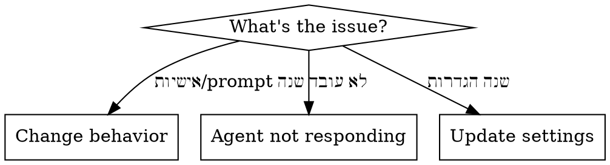

# Maintain WhatsApp AI Agent

Handle ongoing maintenance of a deployed WhatsApp agent - change behavior, fix issues, update settings, redeploy.

## Interaction Style

Simple Hebrew. Diagnose before acting. Always explain what you're doing and why.

## Diagnostic Flow



## Scenario: Change Prompt / Personality

1. Find the project directory (ask student or search for the agent code)
2. Read current `config.py` to see the SYSTEM_PROMPT
3. Show it to the student: **"הנה הפרומפט הנוכחי של הסוכן: [prompt]. מה אתה רוצה לשנות?"**
4. Have a conversation about the changes
5. Update the prompt in:
   - `config.py` (in the code)
   - **OR** update SYSTEM_PROMPT env var on Render (faster, no redeploy needed)
6. If changed in code: push to GitHub → Render auto-redeploys
7. If changed in env var: update on Render dashboard → service restarts
8. Test: send a message and verify new behavior

## Scenario: Agent Not Responding

Diagnostic checklist (check in order):

### 1. Is Render service running?
- Open Render dashboard or check: `curl https://[render-url]/health`
- If down: check Render logs for crash reason, restart service

### 2. Is Green API instance active?
- Check Green API dashboard - instance status should be "authorized"
- If expired: student needs to renew subscription
- If disconnected: re-scan QR code

### 3. Is webhook configured?
- Check Green API webhook settings
- URL should be `https://[render-url]/webhook/green-api`
- `incomingWebhook` should be enabled

### 4. Is the LLM API key valid?
- Check Render logs for API errors
- If key expired/invalid: get new key, update env var on Render
- If out of credits: student needs to add funds

### 5. Check Render logs
- Open Render dashboard → Logs
- Look for Python errors, timeouts, connection issues
- Common errors:
  - `ModuleNotFoundError` → missing dependency in requirements.txt
  - `openai.AuthenticationError` → bad API key
  - `httpx.ConnectError` → Green API connection issue

## Scenario: Update Settings

| Setting | How to Change |
|---------|--------------|
| LLM model | Update LLM_MODEL env var on Render |
| Memory length | Update MAX_HISTORY env var on Render |
| System prompt | Update SYSTEM_PROMPT env var on Render |
| Switch LLM provider | Change code (agent.py), push to GitHub |
| Add features | Modify code, push to GitHub |

### Updating env vars on Render
1. Open Render dashboard → service → Environment
2. Edit the value
3. Save → service auto-restarts (no redeploy needed)

### Pushing code changes
```bash
cd [project-directory]
git add .
git commit -m "Updated agent"
git push
```
Render auto-deploys from GitHub.

## Common Issues

| Problem | Solution |
|---------|----------|
| "הסוכן לא עונה" | Follow diagnostic checklist above |
| "הסוכן עונה באנגלית" | Add "always respond in Hebrew" to system prompt |
| "הסוכן שוכח שיחות" | Check DATABASE_PATH env var, check disk is attached on Render |
| "תשובות איטיות" | Render free tier cold start (~30s). Upgrade to paid, or switch to lighter model |
| "הסוכן עונה לא נכון" | Adjust system prompt - be more specific about behavior |
| "הסוכן עונה בקבוצות" | Check that group message filtering works in main.py (@g.us check) |
| "Green API נגמר" | Renew subscription, re-scan QR if needed |
| "נגמר קרדיט של OpenAI" | Add funds at platform.openai.com/billing |

## Redeploy Checklist

After any code change:
1. Test locally first (if possible)
2. Push to GitHub
3. Check Render deploy logs - wait for "Live"
4. Test: send a WhatsApp message
5. Confirm agent responds correctly

## Tips for Students

**"כמה טיפים לתחזוקה של הסוכן:"**
- If you only need to change the prompt → update env var (no code change needed)
- Check Render logs when something breaks - they usually show the exact error
- Green API subscription needs to be renewed monthly
- LLM API credits need to be topped up periodically
- Render free tier sleeps after 15 min - first message after sleep is slow
