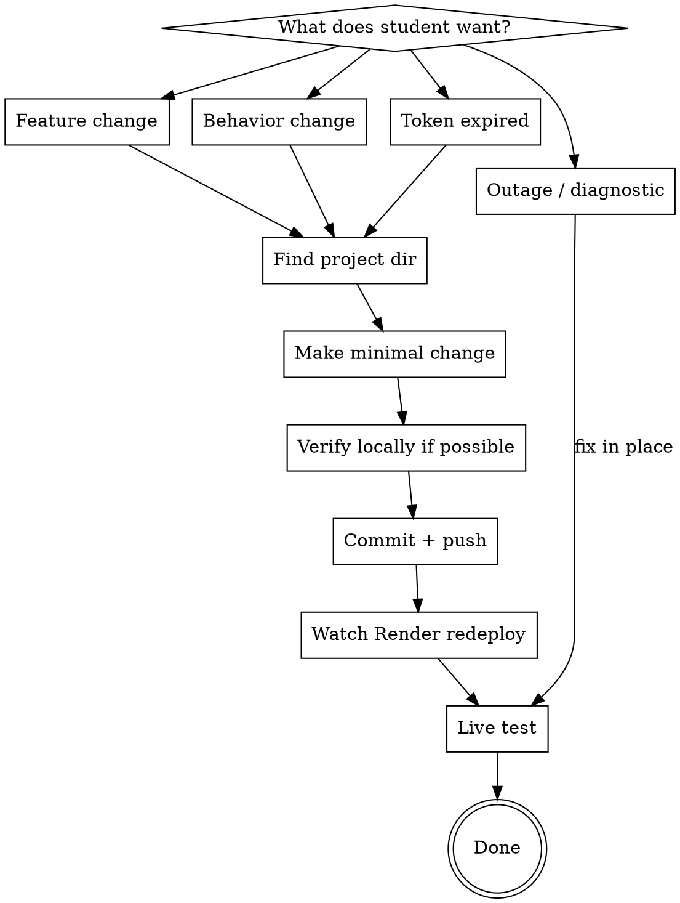

# Maintain the Deployed WhatsApp Agent

Keep the bot working and evolving after deployment. This skill diagnoses issues and routes to the smallest effective change.

**This skill is a router**. It asks what the student wants to change or fix, then guides the specific path. Most changes don't require redeploying the whole bot.

**Prerequisites:** `wa-deploy` completed (bot is running on Render).

## Interaction Style

Simple Hebrew. Always diagnose before changing. Ask: "מה התסמין הספציפי?" not "מה הבעיה?". Read logs before guessing.

## The Change Matrix

Different changes need different paths. Claude Code needs to route correctly or waste the student's time.

| Student's request | Path | Involves redeploy? |
|---|---|---|
| "שנה את מה שהבוט אומר" (tone, reply style) | Edit `spec.json` → regenerate prompt → push | Yes (auto) |
| "הבוט ענה לא נכון לשאלה הזו" (specific content) | Add to spec `knowledge.static_knowledge` or `kb_sections` | Yes (auto) |
| "תוסיף את X לרשימת מי שעונה" | Edit `spec.json` → `audience.authorized_contacts` → push | Yes (auto) |
| "תוסיף כלי חדש" (calendar, email, etc.) | Run `wa-connect` for that tool | Yes (after connect) |
| "הסר כלי" | Remove from `tools/` and `TOOL_REGISTRY`, update spec | Yes (auto) |
| "הסוכן לא עונה בכלל" | **Diagnostic flow** (below) | Depends on root cause |
| "הסוכן איטי" | Usually cold start (free tier) - upgrade or accept | No |
| "הסוכן שכח שיחה" | Check disk mount / DB reset | No if disk OK, else redeploy |
| "טוקן של גוגל / מיקרוסופט פג" | Re-run OAuth (`wa-connect` sub-flow) | Yes |
| "Green API אמר שהחבילה נגמרה" | Renew subscription, re-scan QR if needed | No unless re-scan changes credentials |

## Flow


```dot
digraph wa_maintain {
    rankdir=TB;
    "What does student want?" [shape=diamond];
    "Behavior change" [shape=box];
    "Feature change" [shape=box];
    "Outage / diagnostic" [shape=box];
    "Token expired" [shape=box];
    "Find project dir" [shape=box];
    "Make minimal change" [shape=box];
    "Verify locally if possible" [shape=box];
    "Commit + push" [shape=box];
    "Watch Render redeploy" [shape=box];
    "Live test" [shape=box];
    "Done" [shape=doublecircle];

    "What does student want?" -> "Behavior change";
    "What does student want?" -> "Feature change";
    "What does student want?" -> "Outage / diagnostic";
    "What does student want?" -> "Token expired";
    "Behavior change" -> "Find project dir";
    "Feature change" -> "Find project dir";
    "Token expired" -> "Find project dir";
    "Find project dir" -> "Make minimal change";
    "Make minimal change" -> "Verify locally if possible";
    "Verify locally if possible" -> "Commit + push";
    "Commit + push" -> "Watch Render redeploy";
    "Watch Render redeploy" -> "Live test";
    "Live test" -> "Done";
    "Outage / diagnostic" -> "Live test" [label="fix in place"];
}
```

## Step 0: Find the Project

Ask: **"איפה התיקייה של הבוט? אם לא זוכר - איך הבוט נקרא?"**

Common locations:
- `~/whatsapp-agent/` (default from `wa-build`)
- `~/projects/[bot-name]-whatsapp/`

Once found, read `spec.json` - it's the source of truth for what the bot does. Read it before making any changes.

---

## Path: Behavior Change (Tone, Scope, Knowledge)

### The Rule
**Edit `spec.json`, not the generated files directly.** The generated files (`prompt.py`, etc.) are regenerated from spec. Direct edits get clobbered.

### Procedure

1. Read current spec: **"הנה מה שהסוכן יודע היום: [summarize Hebrew]."**
2. Understand the delta: **"מה את רוצה שיהיה שונה?"**
3. Edit `spec.json` - the specific field:
   - Tone: `identity.tone_description`, `identity.greeting_example`
   - Who it answers: `audience.authorized_contacts`
   - What topics: `scope.in_scope`, `scope.out_of_scope`
   - Knowledge base (customer service): `knowledge.kb_sections.*`
4. Regenerate prompt: re-run `prompt.py`'s build function and update `SYSTEM_PROMPT` env var on Render **OR** write the output to a code constant (pick one pattern for the project and stick with it)
5. Commit: `git add spec.json && git commit -m "Update tone" && git push`
6. Render auto-deploys in ~2 min
7. Test with a live message

### Shortcut for Prompt-Only Changes
If the only change is the system prompt text and `SYSTEM_PROMPT` is stored as a Render env var (not code):
- Render dashboard → service → Environment → edit `SYSTEM_PROMPT` → Save
- Service restarts in ~30s, no git push needed
- Useful for quick iterations

**Warning**: this bypasses `spec.json`. Next time spec is regenerated, the manual change disappears. Always fold Render env var changes back into `spec.json` afterwards.

---

## Path: Feature Change (Add/Remove Tool)

### Add a Tool
- Add the tool name to `spec.tools` array
- Run `wa-connect` - the skill routes to the right sub-flow for the new tool
- After `wa-connect` verifies locally, commit and push

### Remove a Tool
- Remove from `spec.tools`
- Delete `tools/<tool>.py` file
- Remove the `TOOL_REGISTRY[...]` entry in `tools/__init__.py`
- Remove the tool's env vars from Render
- Regenerate prompt so the LLM stops hallucinating the tool exists
- Commit, push

### Change Tool Config (e.g., add a calendar, different Gmail scope)
- Update `spec.tools_config.<tool>`
- Re-run relevant part of `wa-connect` if auth scope changed
- Otherwise just regenerate prompt and push

---

## Path: Outage / Diagnostic

**Always diagnose in this exact order.** Jumping ahead wastes time.

### D1. Is the Render service alive?
```
curl https://[render-url]/health
```
- `{"status":"ok"}` → service is alive. Go to D2.
- Timeout / 502 / 503 → service is down. Go to Render dashboard → Logs. Most common:
  - Env var missing → add it, redeploy
  - Crash on startup (Python error) → read traceback, fix, push
  - Free tier sleeping → this is fine, wake it up with a test message
  - Out of memory → upgrade to Starter

### D2. Is Green API instance authorized?
Green API dashboard → instance status:
- **authorized** → go to D3
- **not authorized** → the bot's phone lost its WhatsApp Web session. Re-scan QR (student does this physically).
- **expired** → subscription lapsed. Renew in dashboard.

### D3. Is the webhook delivering?
Green API dashboard → instance → Webhook → Test:
- 200 back → delivery works. Go to D4.
- 404 → webhook URL is wrong (service renamed? URL pasted wrong?). Fix in Green API.
- Timeout → Render service isn't responding fast enough. Check D1 again.

### D4. Is the LLM provider happy?
Render logs → filter for `anthropic` / `openai`:
- `AuthenticationError` → API key invalid. Get a new one from the provider console, update env var on Render.
- `RateLimitError` → out of funds. Add billing credit at `platform.openai.com/billing` or `console.anthropic.com/settings/billing`.
- `APITimeoutError` → provider outage. Check their status page. Usually resolves in minutes.

### D5. Is a specific tool failing?
Render logs → search for the tool name:
- `httpx.HTTPStatusError: 401` from Google → refresh token invalid. Re-run Google OAuth (Sub-flow A of `wa-connect`).
- `httpx.HTTPStatusError: 401` from Microsoft → refresh token rotated and wasn't saved, or lay dormant >14 days. Re-run Microsoft OAuth (Sub-flow E of `wa-connect`).
- `psycopg.OperationalError` (Microsoft only) → Postgres down or connection URL changed. Check Render Postgres status.
- `sqlite3.OperationalError: database is locked` → rare, fix by restarting service (Render → Manual Deploy).

### D6. Memory issue?
Logs show "disk full" or SQLite errors on write:
- Render dashboard → service → Disks → check usage
- Free disk is 1GB. If full after months, prune old conversations (keep last 30 days).
- Rarely needed for low-volume bots.

### D7. Nothing in logs, nothing works
Rare. Order:
1. Green API dashboard → recent notifications. Is the webhook firing at all?
2. Try the Green API "Test" button with a fake payload. Does Render log anything?
3. If yes: application bug. Reproduce locally with the same payload.
4. If no: networking issue between Green API and Render. Contact Green API support.

---

## Path: Token Expired / Refresh

### Google Token
Symptoms: bot replies for calendar/email stop working, logs show `invalid_grant`.

Cause: student revoked access in Google account settings, or token not used for >6 months.

Fix: re-run `wa-connect` → Sub-flow A3 (OAuth flow). Update `GOOGLE_REFRESH_TOKEN` env var on Render with the new value.

### Microsoft Token
Symptoms: same as above but for Outlook tools.

Cause: bot was dormant >14 days, rotating refresh token expired silently.

Fix:
- Re-run `wa-connect` → Sub-flow E4 (OAuth flow)
- The new refresh token is stored in Postgres `user_tokens` — no env var change needed
- If the student runs Microsoft tools, strongly recommend enabling the daily token-keeper job from `wa-connect` E9 if it wasn't set up originally

### Green API Re-Scan
Symptoms: `instance not authorized` in Green API dashboard.

Cause: WhatsApp on the bot's phone was reinstalled, or the Linked Device was removed.

Fix: student scans new QR code on the bot's phone. No credential changes — existing `GREEN_API_URL/INSTANCE/TOKEN` still work.

---

## Common Issues (Quick Reference)

| Symptom | Most common cause | Where to look |
|---|---|---|
| "הסוכן לא עונה" | Free tier asleep | Send 2 messages 30s apart; second should work |
| "הסוכן עונה באנגלית" | Prompt missing Hebrew instruction | `spec.identity.tone_description`, regenerate |
| "הסוכן לא מכיר את היומן שלי" | Token expired | Re-run OAuth |
| "הסוכן ענה למי שלא צריך" | Whitelist bypass or misspelled phone | Check `spec.audience.authorized_contacts` format (country code, no `+`, no `0`) |
| "תשובות לא עקביות" | LLM temperature too high or prompt too vague | Tighten `out_of_scope_response`, narrow `in_scope` |
| "תזכורות לא מגיעות" | APScheduler job fired with bogus `chat_id` (LLM guessed) OR Render restart wiped jobs | Check `agent.py` has `FRAMEWORK_INJECTED_CHAT_ID` set and `chat_id` is overridden. If jobstore is ephemeral — route to `wa-persistence` Sub-flow A or B. |
| "הבוט שוכח שיחות אחרי כל deploy" | SQLite at ephemeral path on Render Free | Route to `wa-persistence` — choose sub-flow based on budget. Most students pick Supabase (free). |
| "הבוט קרא לכלי עם ארגומנט מוזר" (name as chat_id, etc.) | LLM picked a framework-owned parameter | Add tool name to `FRAMEWORK_INJECTED_CHAT_ID` in `agent.py`; framework will override whatever the LLM picks. |
| "לקוח בקש נציג אנושי, לא קיבלתי התראה" | `HANDOFF_MANAGER_PHONE` wrong or Sub-flow D not wired | Test with `tools/human_handoff.py` directly |
| "הבוט עונה בקבוצות" | `answer_groups: false` not enforced in `main.py` | Add `if chat_id.endswith("@g.us"): return` early in webhook handler |
| "דיברתי עם לקוח מהמספר של הבוט, והבוט ענה במקומי" | Known loop bug | Re-read `wa-characterize` Q6, switch handoff to `phone_number_relay` mode |

## Rolling Back a Bad Deploy

Any deploy that broke the bot can be rolled back to the previous working revision. Two paths:

**Via Render dashboard** (easiest):
- Open the service at `$RENDER_DASHBOARD_URL` (in `.wa-state.json`)
- Deploys tab → find the last deploy marked `live` before the broken one → "Rollback"
- Takes ~30s to swing back

**Via API** (for the CLI-inclined):
```bash
# List recent deploys
curl -fsS "https://api.render.com/v1/services/$RENDER_SERVICE_ID/deploys?limit=10" \
  -H "Authorization: Bearer $RENDER_API_KEY" | jq '.[] | {id, status, createdAt, commit}'

# Pick the commit SHA of the last known good deploy, then:
curl -fsS -X POST "https://api.render.com/v1/services/$RENDER_SERVICE_ID/deploys" \
  -H "Authorization: Bearer $RENDER_API_KEY" \
  -H "Content-Type: application/json" \
  -d '{"commitId": "<sha>", "clearCache": "do_not_clear"}'
```

After rollback: investigate what broke locally. Fix, push a new commit, redeploy. Don't force-push over the broken commit — git history is useful evidence when the bug reappears.

## Local Dev Alongside Production

Students often want to iterate locally after the bot is live. Done right, local and prod share nothing that matters:

1. **Same `.env`** file - `python-dotenv` loads it in both places. Render injects its own copies of the keys; local reads from `.env`.
2. **Different DB in local**: set `DATABASE_URL=postgresql://localhost/wa_dev` locally, or keep using `DATABASE_PATH=./dev.db` for a quick SQLite. Production's URL stays on Render env vars. Never hit production DB from local by accident.
3. **Skip webhook-to-public**: don't expose local with ngrok. Instead, test with the fake-webhook curl from `wa-build` step 6.
4. **Branch for experiments**: work on `feature-X` branch. Only push to `main` when verified. Render deploys from `main` by default.
5. **Log aggregation**: nothing magical — watch Render logs separately (`render logs --resources $RENDER_SERVICE_ID --tail`) when diagnosing prod.

## Redeploy Checklist

Every code change follows this:

1. Change locally
2. If touching `spec.json`: regenerate `prompt.py` (or just the env var)
3. Run the smoke test from `wa-build` step 6 locally — confirm no crash
4. `git add . && git commit -m "<short description>" && git push`
5. Watch Render dashboard - status goes Building → Deploying → Live (~2 min)
6. Send a live message, verify behavior

If step 5 shows a build failure: read the log, fix, push again. Don't let failed deploys pile up.

## State Update (After Each Maintenance Session)

`wa-maintain` does not transition the `current_stage` — once a bot is deployed, it stays at `current_stage: "maintain"` for its lifetime. But track what happened:

Update `.wa-state.json`:
- `last_touched_iso` → now
- If a tool was added/removed: update `connected_tools` array
- If the bot was redeployed with a new URL: update `render_url`

Optionally log the change to a `maintenance_log` array in the state file for future reference:

```json
"maintenance_log": [
  {"ts": "2026-04-16T12:34:56Z", "change": "Added reminders tool"},
  {"ts": "2026-04-20T09:00:00Z", "change": "Refreshed Microsoft token (expired after vacation)"}
]
```

Keep the log short — prune entries older than 90 days.

## Hand-off (Back to Ready)

After any maintenance task is done, don't chain to another skill. Just confirm:

**"סיימנו. הסוכן שוב חי ועובד. אם צריך עוד משהו - `/wa` ואני אחזור."**

## Architectural Notes (for Claude Code's reference)

- **Why diagnose before changing**: students routinely ask "add feature X" when the bot is actually offline. Fixing the outage first is always faster than layering changes on a broken system.
- **Why `spec.json` is source of truth for behavior**: regeneration from spec is deterministic. Direct edits to generated files are not. If the student has diverged, offer to rebase their changes back into spec.
- **Why env var SYSTEM_PROMPT bypass exists**: fastest iteration loop. But document that it's volatile.
- **Why Google token lives forever-ish and Microsoft doesn't**: different OAuth implementations. Teach the student this difference — they'll blame themselves otherwise when Outlook stops working after vacation.
- **Why we don't automate all token refresh**: tokens expire rarely enough that automation would be lazy-coded and break silently. Manual re-OAuth forces the student to verify the bot works afterwards.
- **Why we don't do canary deploys / staging env for a personal assistant**: overkill. Render has 1-click rollback in dashboard if a push breaks prod.
- **Why the diagnostic order is D1 → D7**: reflects actual failure frequency from real bots in the course. Render outages > auth expiry > webhook misconfig > tool issues > everything else.
