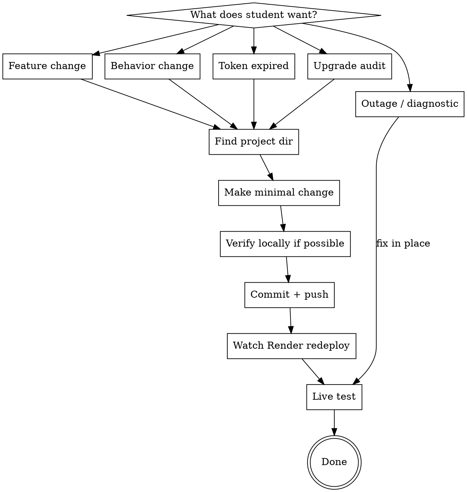

# Maintain the Deployed WhatsApp Agent

Keep the bot working and evolving after deployment. This skill diagnoses issues and routes to the smallest effective change.

**This skill is a router**. It asks what the student wants to change or fix, then guides the specific path. Most changes don't require redeploying the whole bot.

**Prerequisites:** `wa-deploy` completed (bot is running on Render).

## Plugin files (read once per session)

- `PLUGIN_ROOT` = `${CLAUDE_SKILL_DIR}/../..` · helper `WA_OPS` = `PLUGIN_ROOT/scripts/wa_ops.py` (`python3` on macOS/Linux, `py -3` on Windows; run from the bot's project directory). Every check below has a `WA_OPS` command — prefer it over dashboards.
- `PLUGIN_ROOT/knowledge/facts.md` — current truth about every provider (cite IDs, check `verified` dates per `freshness-protocol.md`).
- `PLUGIN_ROOT/knowledge/upgrades.md` — fixes for bots built with older plugin versions (Upgrade audit path).

## Interaction Style

Simple Hebrew. Always diagnose before changing. Ask: "מה התסמין הספציפי?" not "מה הבעיה?". Read logs before guessing.

## The Change Matrix

Different changes need different paths. Claude Code needs to route correctly or waste the student's time.

| Student's request | Path | Involves redeploy? |
|---|---|---|
| "שנה את מה שהבוט אומר" (tone, reply style) | Edit `spec.json` → push | Yes (auto) |
| "הבוט ענה לא נכון לשאלה הזו" (specific content) | Add to spec `knowledge.static_knowledge` or `kb_sections` | Yes (auto) |
| "תוסיף את X לרשימת מי שעונה" | Edit `spec.json` → `audience.authorized_contacts` → push (mind F-GREENAPI-PLANS chat limit) | Yes (auto) |
| "תוסיף כלי חדש" (calendar, email, etc.) | Run `wa-connect` for that tool | Yes (after connect) |
| "הסר כלי" | Remove from `tools/` and `TOOL_REGISTRY`, update spec | Yes (auto) |
| "הסוכן לא עונה בכלל" | **Diagnostic flow** (below) | Depends on root cause |
| "הסוכן איטי" | Usually cold start on free tier (~1 min, F-RENDER-COLD-START) - upgrade or keep-awake | No |
| "הסוכן שכח שיחה" | Free tier wipes files on sleep → `wa-persistence`; else check disk/DB | Usually yes |
| "הבוט הפסיק לקרוא את היומן / המייל" (often: after a week) | Google token path below — usually the app is still in Testing | Yes |
| "טוקן של מיקרוסופט פג" | Re-run Outlook consent (`wa-connect` → `references/outlook.md` E4) | No (cache in DB) |
| "Green API אמר שהחבילה נגמרה" / sends fail with 466 | Plan limit or expired subscription (F-GREENAPI-PLANS) | No unless re-scan changes credentials |
| "תבדוק שהבוט מעודכן" / `/wa` offered an upgrade | **Upgrade audit** (below) | One batched redeploy |

## Flow


```dot
digraph wa_maintain {
    rankdir=TB;
    "What does student want?" [shape=diamond];
    "Behavior change" [shape=box];
    "Feature change" [shape=box];
    "Outage / diagnostic" [shape=box];
    "Token expired" [shape=box];
    "Upgrade audit" [shape=box];
    "Find project dir" [shape=box];
    "Make minimal change" [shape=box];
    "Verify locally if possible" [shape=box];
    "Commit + push" [shape=box];
    "Watch Render redeploy" [shape=box];
    "Live test" [shape=box];
    "Done" [shape=doublecircle];

    "What does student want?" -> "Behavior change";
    "What does student want?" -> "Feature change";
    "What does student want?" -> "Outage / diagnostic";
    "What does student want?" -> "Token expired";
    "What does student want?" -> "Upgrade audit";
    "Behavior change" -> "Find project dir";
    "Feature change" -> "Find project dir";
    "Token expired" -> "Find project dir";
    "Upgrade audit" -> "Find project dir";
    "Find project dir" -> "Make minimal change";
    "Make minimal change" -> "Verify locally if possible";
    "Verify locally if possible" -> "Commit + push";
    "Commit + push" -> "Watch Render redeploy";
    "Watch Render redeploy" -> "Live test";
    "Live test" -> "Done";
    "Outage / diagnostic" -> "Live test" [label="fix in place"];
}
```

## Step 0: Find the Project

Ask: **"איפה התיקייה של הבוט? אם לא זוכר - איך הבוט נקרא?"**

Common locations:
- `~/whatsapp-agent/` (default from `wa-setup`; on Windows `C:\Users\<name>\whatsapp-agent`)
- `~/projects/[bot-name]-whatsapp/`

Once found:
1. `WA_OPS state migrate` — upgrades a state file written by an older plugin, losslessly
2. Read `spec.json` - it's the source of truth for what the bot does. Read it before making any changes.
3. If `.wa-state.json` has no `plugin_version`, or an older one than `WA_OPS plugin version`, mention the Upgrade audit once (don't force it).

---

## Path: Behavior Change (Tone, Scope, Knowledge)

### The Rule
**Edit `spec.json`, not the generated files directly.** `prompt.py` builds the system prompt from `spec.json` when the bot starts, so a spec change is the whole change. Direct edits to generated text get clobbered.

### Procedure

1. Read current spec: **"הנה מה שהסוכן יודע היום: [summarize Hebrew]."**
2. Understand the delta: **"מה את רוצה שיהיה שונה?"**
3. Edit `spec.json` - the specific field:
   - Tone: `identity.tone_description`, `identity.greeting_example`
   - Who it answers: `audience.authorized_contacts` (`phone_e164`: 972…, no `+`, no leading 0)
   - What topics: `scope.in_scope`, `scope.out_of_scope`
   - Knowledge base (customer service): `knowledge.kb_sections.*`
4. Quick local check: start the server locally and `WA_OPS smoke --from <student phone> --text "<a question that exercises the change>"`
5. Commit and push — three commands, one per line (Windows PowerShell 5.1 has no `&&`): `git add spec.json`, `git commit -m "Update tone"`, `git push`
6. `WA_OPS render wait` — Render auto-deploys in ~2 min
7. Test with a live message

(Older bots sometimes kept the prompt in a `SYSTEM_PROMPT` env var on Render. If this project does, fold that text back into `spec.json`, `WA_OPS render env-del SYSTEM_PROMPT`, and stop using it — two sources of truth always drift.)

---

## Path: Feature Change (Add/Remove Tool)

### Add a Tool
- Add the tool name to `spec.tools` array
- Run `wa-connect` - the skill routes to the right sub-flow, deploys and verifies live

### Remove a Tool
- Remove from `spec.tools`
- Delete `tools/<tool>.py` file
- Remove the `TOOL_REGISTRY[...]` entries in `tools/__init__.py` (and its name from `FRAMEWORK_INJECTED_CHAT_ID` in `agent.py`, if there)
- Remove the tool's env vars from Render: `WA_OPS render env-del <KEY>` for each
- The prompt's tool section is dynamic — it stops mentioning the tool automatically
- Commit, push, `WA_OPS render wait`; `WA_OPS state` — remove it from `connected_tools` (edit the list)

### Change Tool Config (e.g., add a calendar, different Gmail scope)
- Update `spec.tools_config.<tool>`
- Scope changed (e.g., Gmail read → mark-as-read/send) → re-run the relevant part of `wa-connect` (A2.11 + A3)
- Otherwise just push

---

## Path: Upgrade Audit (bots built with an older plugin version)

The student's bot code lives in their repo — plugin updates don't change it. `knowledge/upgrades.md` lists every fix that matters for existing bots, each with a read-only **detect** step.

1. `WA_OPS state migrate`; read `upgrades_applied` and `plugin_version`.
2. For each upgrade in `upgrades.md` whose `applies-to` matches this bot and isn't in `upgrades_applied`: run its **detect** step (read files, `WA_OPS green settings`, `WA_OPS render env-keys`, `WA_OPS llm check`). Detection changes nothing.
3. Show the student a short Hebrew list — one line per finding, saying what goes wrong if we don't fix it, e.g.:
   - **"החיבור לגוגל במצב 'בדיקה' - הוא יתנתק כל 7 ימים."**
   - **"כל מי שיודע את כתובת השרת יכול להתחזות אליך - נוסיף סיסמה בין Green API לבוט."**
   - **"הבוט מתעלם מהודעות שעונות עם ציטוט."**
4. Ask which to fix (default: all). Apply only approved ones, **surgically** — the student may have customised their bot; don't regenerate files wholesale.
5. One commit, one push, `WA_OPS render wait`, then the live test for each fix (the upgrade's own verification, plus a normal "היי").
6. For each applied ID: `WA_OPS state append upgrades_applied <ID>`; then `WA_OPS state set plugin_version="<current>"`; `WA_OPS state log "Upgrade audit: <IDs>"`.

If nothing applies: `WA_OPS state set plugin_version="<current>"` and say **"בדקתי - הבוט שלך מעודכן. אין מה לתקן."**

---

## Path: Outage / Diagnostic

**Always diagnose in this exact order.** Jumping ahead wastes time.

### D1. Is the Render service alive?
```
WA_OPS health
WA_OPS render status
```
- `ok: true` → service is alive. Go to D2.
- No answer after ~2.5 minutes, or 5xx → service is down. `WA_OPS render logs --minutes 60` (and `--type build` if the latest deploy failed). Most common:
  - Env var missing → `WA_OPS render env-keys` vs `WA_OPS env keys`; add with `render env-set`, `render deploy --wait`
  - Crash on startup (Python error) → read traceback, fix, push
  - Free tier sleeping → `WA_OPS health` waits for the ~1-minute wake (F-RENDER-COLD-START); fine
  - Suspended service / out of free hours (750/month per workspace, F-RENDER-FREE-LIMITS) → `render status` shows `suspended`
  - Out of memory → upgrade to Starter

### D2. Is Green API instance authorized?
```
WA_OPS green state
```
(F-GREENAPI-STATES)
- **authorized** → go to D3
- **notAuthorized** → the bot's phone lost its WhatsApp Web session. Re-scan QR (student does this physically).
- **blocked / suspended** → WhatsApp restricted the number; wait out `suspendedUntil`, reduce volume
- **sleepMode / starting** → wait a minute, check again
- Subscription expired → renew in the console

### D3. Is the webhook delivering — and authenticated?
```
WA_OPS green settings
WA_OPS smoke --url <render.url> --from <student phone> --async
```
- Settings: `webhookUrl` = `<render.url>/webhook/green-api`, `incomingWebhook: yes`, `webhookUrlToken: [set]`. Wrong URL (service renamed/recreated) → `WA_OPS green configure --webhook-url … --webhook-token-from-env WEBHOOK_TOKEN`.
- Smoke → `200`: the server accepts webhooks with the right token; the reply should reach the student's phone.
- Smoke → `401`: `WEBHOOK_TOKEN` on Render differs from `.env` → `render env-set WEBHOOK_TOKEN`, `render deploy --wait`, re-run `green configure`.
- Smoke OK but real messages never arrive → Green API side (state, plan limit, or settings not propagated yet — up to 5 min, F-GREENAPI-SETTINGS-DELAY).

### D4. Is the LLM provider happy?
```
WA_OPS llm check --ping
WA_OPS render logs --text anthropic
```
(F-ANTHROPIC-ERRORS)
- `401` → key invalid, revoked or **expired** (keys with an expiration die silently). New key with Expiration = Never → `WA_OPS env set ANTHROPIC_API_KEY …`, `render env-set ANTHROPIC_API_KEY`, `render deploy --wait`.
- `400 … anthropic-workspace-id` → key spans several workspaces → new key on the Default workspace.
- `402 billing_error` → out of credit. https://platform.claude.com/settings/billing (OpenAI: platform.openai.com billing).
- `404` model → the model was retired. `WA_OPS llm models` → pick the current replacement (F-LLM-MODELS), `env set LLM_MODEL`, `render env-set LLM_MODEL`, deploy.
- `400 … temperature / tool_choice` → old request shape on a newer model → Upgrade audit (U300-LLM-REQUEST).
- `APITimeoutError` / 5xx → provider outage. Check their status page. Usually resolves in minutes.

### D5. Is a specific tool failing?
`WA_OPS render logs --text <tool name>`:
- Google `invalid_grant` / `RefreshError` → Token path below.
- Microsoft "authorization expired" → Outlook E4.
- `psycopg.OperationalError` → database unreachable: Supabase paused (**Resume project**) or URL changed (F-SUPABASE-FREE-PAUSE, F-SUPABASE-POOLER-HOST).
- Green API `466` from a tool → plan limit (F-GREENAPI-PLANS).
- `sqlite3.OperationalError: database is locked` → rare, `WA_OPS render restart`.

### D6. Memory issue?
- Free plan without Supabase/disk → expected: files are wiped on every sleep (F-RENDER-FREE-LIMITS) → `wa-persistence`.
- Disk: Render dashboard → service → Disks → usage. 1GB lasts a long time; if full, prune conversations older than 30 days.
- Supabase: dashboard → Database → usage (500 MB free).

### D7. Nothing in logs, nothing works
Rare. Order:
1. `WA_OPS green settings` + `WA_OPS green state` — is Green API even trying?
2. `WA_OPS smoke --url <render.url> --from <student phone> --async` — does Render log anything?
3. If yes: application bug. Reproduce locally with the same smoke command against `localhost`.
4. If no: networking issue between Green API and Render, or a wrong URL. Contact Green API support with the instance ID.

---

## Path: Token Expired / Refresh

### Google Token
Symptoms: calendar/email replies stop working; logs show `invalid_grant`.

**First question: is the Google app published?** If it was left in Testing, tokens die 7 days after consent — the #1 cause (F-GOOGLE-TESTING-EXPIRY). Check `.wa-state.json` → `google.publishing_status`, or Google Auth Platform → Audience.

Fix:
1. If Testing → **Audience → Publish app** (F-GOOGLE-PUBLISH) — say: **"החיבור לגוגל היה במצב 'בדיקה' שמתנתק כל שבוע. עכשיו נעביר אותו למצב קבוע."**
2. Re-run `wa-connect` → Sub-flow A3 (consent script — writes the new token into `.env`)
3. `WA_OPS render env-set GOOGLE_REFRESH_TOKEN` → `WA_OPS render deploy --wait`
4. `WA_OPS state set google.publishing_status=in_production`

If it was already published, other causes (revoked, password change, unused 6 months, too many tokens issued) are in F-GOOGLE-INVALID-GRANT — same fix, steps 2-3.

### Microsoft Token
Symptoms: same as above but for Outlook tools.

Cause: Outlook wasn't used for 90 days (F-MS-REFRESH-LIFETIME), the password/permissions changed, or the token cache wasn't saved after a rotation.

Fix:
- Re-run `wa-connect` → `references/outlook.md` E4 (consent script)
- The new token cache is saved in the bot's database — no env var change, no redeploy
- If the student rarely uses Outlook, enable the weekly keep-alive job (E9)

### Green API Re-Scan
Symptoms: `WA_OPS green state` → `notAuthorized`.

Cause: WhatsApp on the bot's phone was reinstalled, or the Linked Device was removed.

Fix: student scans new QR code on the bot's phone. No credential changes — existing `GREEN_API_URL/INSTANCE/TOKEN` still work. Then `WA_OPS green settings` to confirm the webhook settings survived.

---

## Common Issues (Quick Reference)

| Symptom | Most common cause | Where to look |
|---|---|---|
| "הסוכן לא עונה" | Free tier asleep | Wait ~1 minute — Green API retries every 60s (F-GREENAPI-WEBHOOK-DELIVERY); `WA_OPS health` |
| "הסוכן לא עונה לי" (the owner) | Whitelist rejected the sender | `WA_OPS render logs --text rejected` shows the reason; check `phone_e164`; LID mode (F-GREENAPI-LID) |
| "הסוכן לא עונה כשאני עונה עם ציטוט" | Old bot reads only `textMessage` | Upgrade audit U300-MESSAGE-TYPES |
| "הסוכן עונה באנגלית" | Prompt missing Hebrew instruction | `spec.identity.tone_description`, push |
| "הסוכן לא מכיר את היומן שלי" | Token expired (Testing mode) | Token path above |
| "הסוכן ענה למי שלא צריך" | Whitelist bypass or misspelled phone | `spec.audience.authorized_contacts` format (country code, no `+`, no `0`); webhook token set? |
| "תשובות לא עקביות" | Prompt too vague | Tighten `out_of_scope_response`, narrow `in_scope`. (Don't add `temperature` — current models reject it, F-LLM-REQUEST-RULES) |
| "תזכורות לא מגיעות" | Server asleep at the reminder time; jobstore wiped (free, no DB); or `FRAMEWORK_INJECTED_CHAT_ID` names don't match the tools | wa-deploy "Sleep, memory & reminders"; `wa-persistence`; Upgrade audit U300-REMINDERS |
| "תזכורות מגיעות באיחור עם הערה" | Free server woke up after the due time — by design | Starter or keep-awake ping |
| "הבוט שוכח שיחות" | SQLite on an ephemeral path on Render | Route to `wa-persistence` — most students pick Supabase (free) |
| "הבוט קרא לכלי עם ארגומנט מוזר" (name as chat_id, etc.) | LLM picked a framework-owned parameter | Add tool name to `FRAMEWORK_INJECTED_CHAT_ID` in `agent.py` |
| "לקוח בקש נציג אנושי, לא קיבלתי התראה" | `HANDOFF_MANAGER_PHONE` missing on Render, or tool not named `request_human_handoff` | `WA_OPS render env-keys`; `tools/human_handoff.py` |
| "הבוט עונה בקבוצות" | `answer_groups: false` not enforced in `main.py` | Add `if chat_id.endswith("@g.us"): return` early in webhook handler |
| "דיברתי עם לקוח מהמספר של הבוט, והבוט ענה במקומי" | Known loop bug | Re-read `wa-characterize` Q6, switch handoff to `phone_number_relay` mode |
| "Supabase שלח מייל שהפרויקט יושהה" | 7 quiet days (F-SUPABASE-FREE-PAUSE) | Use the bot, or keep-awake ping on `/health`; **Resume project** if already paused |

## Rolling Back a Bad Deploy

Any deploy that broke the bot can be rolled back to the previous working revision:

```
WA_OPS render rollback                 # to the previous successful deploy
WA_OPS render rollback --deploy dep-…  # to a specific one
WA_OPS render wait
```

Or via the dashboard: open `render.dashboard_url` (in `.wa-state.json`) → Deploys → the last good one → "Rollback".

**Auto-deploy stays on** after a rollback: the next `git push` deploys again. So after rollback, fix the bug locally (or `git revert` the bad commit), then push. Don't force-push over the broken commit — git history is useful evidence when the bug reappears.

## Local Dev Alongside Production

Students often want to iterate locally after the bot is live. Done right, local and prod share nothing that matters:

1. **Same `.env`** file — `python-dotenv` loads it locally; Render has its own copies of the keys. `APP_ENV=local` is in `.env` only (never on Render) and enables the synchronous smoke mode.
2. **Database**: local runs (`APP_ENV=local`) use local SQLite under `./data/` even though `.env` holds the production `DATABASE_URL`, and they don't start the reminders scheduler against production (wa-build § config.py / main.py). Only a deliberate one-off with `USE_REMOTE_DB_LOCALLY=1` touches production — never for experiments. (Bots built before 3.0.0: Upgrade audit U300-LOCAL-ISOLATION.)
3. **Skip webhook-to-public**: don't expose local with ngrok. Test with `WA_OPS smoke --from <student phone>` against `localhost`.
4. **Branch for experiments**: work on `feature-X` branch. Only push to `main` when verified. Render deploys from `main` by default.
5. **Logs**: `WA_OPS render logs --minutes 15` when diagnosing prod.

## Redeploy Checklist

Every code change follows this:

1. Change locally
2. If touching `spec.json`: nothing to regenerate — the prompt is built from it at startup
3. Run the smoke test locally (`WA_OPS smoke --from <student phone>`) — confirm no crash
4. `git add .`, then `git commit -m "<short description>"`, then `git push` (separate commands)
5. `WA_OPS render wait` — Building → Live (~2 min); on failure it prints the build/app logs
6. Send a live message, verify behavior

If step 5 shows a build failure: read the log, fix, push again. Don't let failed deploys pile up.

## State Update (After Each Maintenance Session)

`wa-maintain` does not transition `current_stage` — once a bot is deployed it stays at `maintain` for its lifetime (or `connect` while tools remain). But track what happened:

```
WA_OPS state log "<what changed>"
```
- Tool added/removed → keep `connected_tools` accurate
- New service URL → `render.url` (and re-run `green configure`)

The log keeps the last 50 entries / 180 days automatically.

If something in a provider's screens or APIs didn't match `facts.md`, record it (`WA_OPS state drift …`) and offer the upstream report once (freshness protocol §5). This is how the next student gets the fix.

## Hand-off (Back to Ready)

After any maintenance task is done, don't chain to another skill. Just confirm:

**"סיימנו. הסוכן שוב חי ועובד. אם צריך עוד משהו - `/wa` ואני אחזור."**

## Architectural Notes (for Claude Code's reference)

- **Why diagnose before changing**: students routinely ask "add feature X" when the bot is actually offline. Fixing the outage first is always faster than layering changes on a broken system.
- **Why `spec.json` is source of truth for behavior**: the prompt is generated from it deterministically. Direct edits to generated text are not. If the student has diverged, offer to fold their changes back into the spec.
- **Why the Upgrade audit is detect-first and surgical**: students customise their bots. A blanket regeneration would erase their work; a read-only detection plus approved, minimal edits keeps trust.
- **Why Google's token is long-lived and Microsoft's isn't**: a *published* Google app's refresh token lives until revoked or unused for 6 months; a Testing app's dies in 7 days. Microsoft's rotates on every use and expires after 90 idle days. Teach the student this difference — they'll blame themselves otherwise.
- **Why we don't automate all token refresh**: tokens expire rarely enough that automation would be lazy-coded and break silently. Manual re-consent forces the student to verify the bot works afterwards.
- **Why we don't do canary deploys / staging env for a personal assistant**: overkill. `WA_OPS render rollback` is one command if a push breaks prod.
- **Why the diagnostic order is D1 → D7**: reflects actual failure frequency from real bots in the course. Render outages > auth expiry > webhook misconfig > tool issues > everything else.
