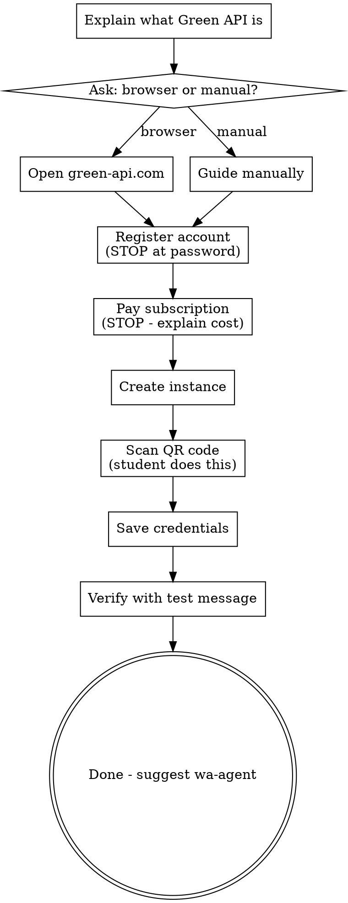

# Set Up Green API for WhatsApp

Guide a non-technical student through connecting their WhatsApp number to Green API, so an AI agent can send and receive messages through it.

## Interaction Style

Simple Hebrew. Zero jargon. Principle: **"I do, you decide"** - Claude does technical work via computer-use, stops for payments/passwords/personal actions.

## Flow



## Step-by-Step

### 1. Explain
**"כדי שהסוכן שלך יוכל לשלוח ולקבל הודעות ב-WhatsApp, אנחנו צריכים שירות שמחבר בין הסוכן ל-WhatsApp. השירות הזה נקרא Green API."**

### 2. Ask: computer-use or manual?
**"אני יכול לפתוח את הדפדפן ולעשות את זה בשבילך, או שאתה מעדיף לעשות לבד ואני רק אדריך. מה מתאים לך?"**

### 3. Register
- Navigate to https://green-api.com
- Click Sign Up / Register
- **STOP**: "צריך ליצור חשבון. תכניס מייל וסיסמה - אני לא מקליד סיסמאות בשבילך"
- Wait for student to complete

### 4. Pay
- **STOP**: "עכשיו צריך לשלם על השירות. זה עולה בערך $15 לחודש (יש תקופת ניסיון חינם ל-3 ימים). זה עבור חיבור ה-WhatsApp. תלך לעמוד התשלום ותגיד לי כשסיימת"
- Wait for student to confirm payment

### 5. Create Instance
- Navigate to the dashboard / instances page
- Create a new instance (WhatsApp type)
- Wait for instance to be created
- Note the Instance ID and API Token from the dashboard

### 6. QR Code
**"עכשיו צריך לחבר את מספר ה-WhatsApp שלך. תפתח WhatsApp בטלפון → הגדרות → מכשירים מקושרים → קישור מכשיר → וסרוק את הקוד שמופיע על המסך"**

- Student must do this physically on their phone
- Wait for confirmation that the instance status shows "authorized"

### 7. Save Credentials
Create a `.env` file in the student's project directory (or a temporary location):

```bash
GREEN_API_URL=https://[INSTANCE_NUMBER].api.greenapi.com
GREEN_API_INSTANCE=[INSTANCE_ID]
GREEN_API_TOKEN=[API_TOKEN]
```

Read the Instance ID and API Token from the Green API dashboard.

### 8. Verify
Send a test message using the existing WhatsApp skill scripts:

```bash
cd ~/.claude/skills/whatsapp/scripts
npx ts-node send-message.ts --phone "[STUDENT_PHONE]" --message "בדיקה! אם אתה רואה את ההודעה הזו, החיבור עובד 🎉"
```

Or use curl directly:
```bash
curl -X POST "https://[INSTANCE].api.greenapi.com/waInstance[ID]/sendMessage/[TOKEN]" \
  -H "Content-Type: application/json" \
  -d '{"chatId": "[PHONE]@c.us", "message": "בדיקה! החיבור עובד 🎉"}'
```

**"קיבלת הודעה בטלפון? מצוין! החיבור עובד!"**

### 9. Done
**"חיבור ה-WhatsApp מוכן! עכשיו אפשר לבנות את הסוכן עצמו. תגיד 'בנה סוכן' או 'wa-agent' כשתהיה מוכן."**

## Error Handling

| Problem | Solution |
|---------|----------|
| QR code won't scan | Refresh the page, try again. Make sure phone camera is focused |
| Instance stuck on "not authorized" | Disconnect and reconnect: WhatsApp → Linked Devices → remove, then scan again |
| Payment failed | Try different card, check with bank, contact Green API support |
| Test message not received | Check phone number format (972...), check instance is "authorized" |
| "Account already exists" | Try logging in instead of registering |
| Free trial expired | Need to pay for subscription to continue |

## Output
- `.env` file with GREEN_API_URL, GREEN_API_INSTANCE, GREEN_API_TOKEN
- Verified working connection (test message received)
