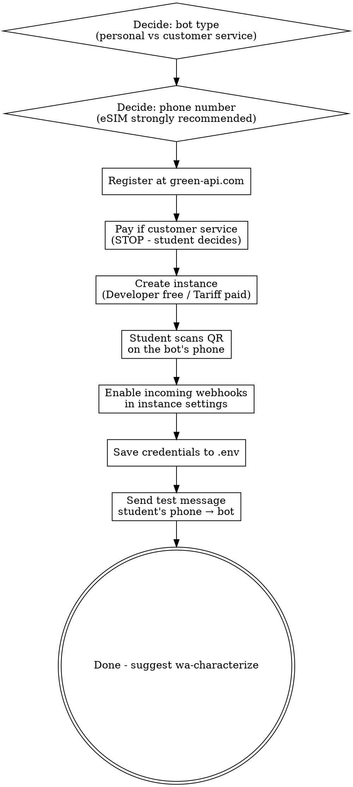

# Set Up Green API for WhatsApp

Guide a non-technical student through connecting a WhatsApp number to Green API.

**This skill does not write code.** It guides the student through decisions and actions. At the end, the student has: a working Green API instance, credentials saved to `.env`, incoming messages enabled, and a verified two-way connection.

## Interaction Style

Simple Hebrew. Zero jargon. Principle: **"I do, you decide"** - Claude drives the browser and the terminal, stops for passwords, payments, and anything the student must physically do on their phone.

## Decisions Made in This Skill

Before starting, be explicit with the student about the choices ahead. They are not cosmetic - each one costs money or time:

1. **Which bot type are we setting up?**
   - **Personal assistant** → Free Green API tier is enough (limited messages but fine for personal use)
   - **Customer service bot** → Paid Green API tier (~$15/month, no message limit)

2. **Which phone number for the bot?**
   - **Recommended: new eSIM** (~₪15/month from the student's cellular provider) - keeps bot and personal WhatsApp separate. Prevents bot from replying in place of the user.
   - Existing unused number (landline/second line the student owns)
   - **Not recommended**: the student's main WhatsApp number - causes "bot answers for me" loops and they lose WhatsApp on their phone

Say this explicitly: **"לפני שמתחילים, חשוב להבין: הבוט צריך מספר טלפון משלו. אם תשים אותו על המספר האישי שלך, תאבד את הוואטסאפ שלך. ההמלצה שלי היא eSIM נוסף - תתקשר לגולן טלקום / פרטנר / אורנג' מובייל, תבקש eSIM, זה בערך ₪15 לחודש."**

## Flow


```dot
digraph wa_setup {
    rankdir=TB;
    "Decide: bot type\n(personal vs customer service)" [shape=diamond];
    "Decide: phone number\n(eSIM strongly recommended)" [shape=diamond];
    "Register at green-api.com" [shape=box];
    "Pay if customer service\n(STOP - student decides)" [shape=box];
    "Create instance\n(Developer free / Tariff paid)" [shape=box];
    "Student scans QR\non the bot's phone" [shape=box];
    "Enable incoming webhooks\nin instance settings" [shape=box];
    "Save credentials to .env" [shape=box];
    "Send test message\nstudent's phone → bot" [shape=box];
    "Done - suggest wa-characterize" [shape=doublecircle];

    "Decide: bot type\n(personal vs customer service)" -> "Decide: phone number\n(eSIM strongly recommended)";
    "Decide: phone number\n(eSIM strongly recommended)" -> "Register at green-api.com";
    "Register at green-api.com" -> "Pay if customer service\n(STOP - student decides)";
    "Pay if customer service\n(STOP - student decides)" -> "Create instance\n(Developer free / Tariff paid)";
    "Create instance\n(Developer free / Tariff paid)" -> "Student scans QR\non the bot's phone";
    "Student scans QR\non the bot's phone" -> "Enable incoming webhooks\nin instance settings";
    "Enable incoming webhooks\nin instance settings" -> "Save credentials to .env";
    "Save credentials to .env" -> "Send test message\nstudent's phone → bot";
    "Send test message\nstudent's phone → bot" -> "Done - suggest wa-characterize";
}
```

## Step-by-Step

### 1. Explain the destination
**"כדי שהסוכן שלך יוכל לשלוח ולקבל הודעות ב-WhatsApp, אנחנו צריכים שירות שמחבר בין הקוד של הסוכן ל-WhatsApp של גוגל/מטא. השירות הזה נקרא Green API. כשנסיים את השלב הזה, יהיו לך מפתחות גישה לוואטסאפ שהסוכן ישתמש בהם."**

### 2. Decide bot type
Ask explicitly and wait for an answer:
**"איזה סוכן אנחנו בונים - עוזר אישי לעצמך, או בוט שירות לקוחות לעסק?"**

Record the answer - it determines whether step 4 is a paid step or not.

### 3. Decide phone number
See "Decisions" section above. Get the student to commit to one of the three options. If they choose eSIM and don't have one yet, pause the skill: **"בוא ת-לך לקנות eSIM, זה לוקח חצי שעה. כשיש לך אותו, נחזור הנה."**

### 4. Register / log in at green-api.com
- Open https://green-api.com in the browser
- Click Sign Up / Register
- **STOP**: "תכניס מייל וסיסמה - אני לא מקליד סיסמאות בשבילך. תגיד לי כשסיימת."
- Wait for the student to verify their email and log in

### 5. Create the instance
Green API has two instance types. The right one depends on step 2:

- **Personal assistant** → Create a **Developer** instance (free, limited volume)
- **Customer service** → Create a paid instance. **STOP**: "זה השלב שעולה כסף - ~$15 לחודש. תבחר את החבילה המתאימה ותמלא פרטי אשראי. תגיד לי כשהחבילה פעילה."

After the instance is created, copy three values from the dashboard:
- **Instance ID** (e.g. `7105222798`)
- **API Token** (long string)
- **API URL** (e.g. `https://7105.api.greenapi.com`)

### 6. Connect the bot's phone (QR scan)
This step happens on the phone that will own the bot's WhatsApp number.

**"עכשיו, בטלפון שאתה רוצה שהבוט ישב בו - לא בטלפון האישי אם בחרנו בנפרד - תפתח WhatsApp → הגדרות → מכשירים מקושרים → קישור מכשיר. ואז סרוק את הקוד שמופיע במסך."**

- Open the instance's QR code page in the browser
- Student scans with the bot's phone
- Wait for the dashboard status to change to **authorized**
- The QR refreshes every ~60 seconds - if it expires, refresh the page

### 7. Enable incoming webhooks
**This is critical and easy to miss.** Without it, the bot can send but cannot receive.

In the instance settings page:
- Find the **Settings** or **Webhooks** section
- Set `incomingWebhook` = **yes** / enabled
- Keep `outgoingMessageWebhook` and `outgoingAPIMessageWebhook` = **no** (avoids double-handling the bot's own messages)
- Leave the webhook URL blank for now - it gets set to the Render URL later in `wa-deploy`
- Save

Or via API (if the student prefers):
```
POST https://[API_URL]/waInstance[ID]/setSettings/[TOKEN]
Content-Type: application/json

{
    "incomingWebhook": "yes",
    "outgoingMessageWebhook": "no",
    "outgoingAPIMessageWebhook": "no"
}
```

### 8. Save credentials
Create a `.env` file in a new project directory. Ask the student where - default to `~/whatsapp-agent/`:

```
GREEN_API_URL=https://[INSTANCE_NUMBER].api.greenapi.com
GREEN_API_INSTANCE=[INSTANCE_ID]
GREEN_API_TOKEN=[API_TOKEN]
```

Tell the student: **"שמרתי את פרטי הגישה בקובץ .env. אל תשתף את הקובץ הזה עם אף אחד - זה כמו סיסמה של הוואטסאפ של הבוט."**

### 9. Verify (two-way)
**Outbound test** - bot → student's phone:

```
curl -X POST "https://[API_URL]/waInstance[ID]/sendMessage/[TOKEN]" \
  -H "Content-Type: application/json" \
  -d '{"chatId": "972501234567@c.us", "message": "בדיקה - אם קיבלת את זה, החיבור היוצא עובד"}'
```

Phone format: country code + number (no `+`, no `0`), `@c.us` suffix. Israeli `0501234567` → `972501234567@c.us`.

**Inbound test** - student → bot:
Tell the student to send a message from their personal phone to the bot's number. Then fetch the last notification:

```
curl "https://[API_URL]/waInstance[ID]/receiveNotification/[TOKEN]"
```

If a notification with `typeWebhook: "incomingMessageReceived"` comes back - incoming is working. Delete it so the queue is clean:

```
curl -X DELETE "https://[API_URL]/waInstance[ID]/deleteNotification/[TOKEN]/[RECEIPT_ID]"
```

**"שתי כיוונים עובדים. החיבור מוכן."**

### 10. Update state & hand off

Write or update `.wa-state.json` in the project directory:

```json
{
  "version": 1,
  "project_dir": "<absolute path to project dir>",
  "bot_name": null,
  "archetype": "<personal_assistant | customer_service — from step 2>",
  "current_stage": "characterize",
  "completed_stages": ["setup"],
  "connected_tools": [],
  "render_url": null,
  "last_touched_iso": "<now as ISO 8601 UTC>"
}
```

If the file already existed (resumed session), merge: append `"setup"` to `completed_stages` (dedupe), set `current_stage: "characterize"`, update `last_touched_iso`.

Then say:

**"מצוין. ה-WhatsApp מחובר. השלב הבא: לאפיין את הסוכן - מה הוא יודע לעשות, למי הוא עונה. רוצה שנמשיך עכשיו?"**

- **If yes** → invoke `wa-characterize` via Skill tool
- **If "תן לי רגע"** → **"סגור. כשתחזור, פשוט תגיד `/wa` ואני אמשיך מאיפה שעצרנו."**

## Error Handling

| Problem | Cause | Solution |
|---------|-------|----------|
| QR code won't scan | Camera autofocus / expired code | Refresh page, make phone camera ~20cm from screen |
| Instance stuck "not authorized" | Phone has another WhatsApp Web session | On bot's phone: WhatsApp → Linked Devices → remove all → rescan |
| Payment failed | Card rejected / region restriction | Try different card, contact Green API support |
| Outbound test returns 466 | `incomingWebhook` not enabled yet | Revisit step 7 |
| Outbound test returns 401 | Wrong API Token | Copy token again from dashboard |
| Outbound returns 400 "chatId" | Wrong phone format | Use country code + number + `@c.us`, no plus, no leading zero |
| `receiveNotification` returns empty | No new messages, or incoming webhook disabled | Re-send from personal phone; if still empty, revisit step 7 |
| "Account already exists" on register | Existing Green API account | Log in instead of registering |
| Free trial expired mid-build | 3-day trial ran out | Upgrade to paid (customer service path) or create new account with different email |

## Output of This Skill

A non-technical student ends step 10 with:
- `.env` file in a new project directory with `GREEN_API_URL`, `GREEN_API_INSTANCE`, `GREEN_API_TOKEN`
- Green API instance with status `authorized` and `incomingWebhook` enabled
- A verified round-trip (bot sent a message out AND received one in)
- Understanding that the `.env` is a secret

If any of those are missing, the skill is not done.

## Architectural Notes (for Claude Code's reference, not for the student)

- **Why `outgoingMessageWebhook: no`**: when the bot later sends a reply, Green API would otherwise webhook the bot about its own message. Filtering by `senderData.senderId` in the bot works too but is brittle - disabling here is cleaner.
- **Why we don't set the webhook URL now**: the Render URL doesn't exist yet. `wa-deploy` sets it.
- **Why eSIM**: a bot on the student's main number responds to messages they sent to themselves/contacts, triggering loops. Separation at the phone-number level eliminates this class of bug.
- **Free (Developer) instance volume limit**: sufficient for a personal assistant's typical load. Customer service traffic exceeds it quickly - switch to paid at the first sign of throttling rather than debugging silent message drops.
