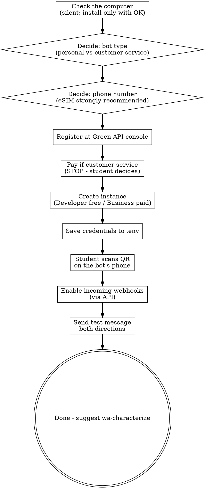

# Set Up Green API for WhatsApp

Guide a non-technical student through connecting a WhatsApp number to Green API.

**This skill does not write code.** It guides the student through decisions and actions. At the end, the student has: a working Green API instance, credentials saved to `.env`, incoming messages enabled, and a verified two-way connection.

## Plugin files (read once per session)

- `PLUGIN_ROOT` = `${CLAUDE_SKILL_DIR}/../..` · helper `WA_OPS` = `PLUGIN_ROOT/scripts/wa_ops.py` — run as `python3 "<full path>/wa_ops.py" …` on macOS/Linux, `py -3 "<full path>\wa_ops.py" …` on Windows (always the full quoted path), from the bot's project directory. It needs no extra installs, never prints secrets, and answers in JSON with a `hint` when something fails.
- Facts this skill relies on (prices, plan limits, screens): `PLUGIN_ROOT/knowledge/facts.md` — IDs `F-GREENAPI-*`. Before sending the student to a Green API screen, follow `PLUGIN_ROOT/knowledge/freshness-protocol.md` §3; if the screen differs, follow the screen and record drift (§4).
- Platform specifics (Windows/PowerShell, installing Python): `PLUGIN_ROOT/knowledge/platform.md`.

## Interaction Style

Simple Hebrew. Zero jargon. Principle: **"I do, you decide"** - Claude drives the browser and the terminal, stops for passwords, payments, and anything the student must physically do on their phone.

## Decisions Made in This Skill

Before starting, be explicit with the student about the choices ahead. They are not cosmetic - each one costs money or time:

1. **Which bot type are we setting up?**
   - **Personal assistant** → Free Green API **Developer** plan is enough — it talks to up to 3 chats a month (you + up to two more people). See F-GREENAPI-PLANS.
   - **Customer service bot** → Paid **Business** plan (about $12/month per F-GREENAPI-PLANS, no chat limit)

2. **Which phone number for the bot?**
   - **Recommended: new eSIM** (~₪15/month from the student's cellular provider) - keeps bot and personal WhatsApp separate. Prevents bot from replying in place of the user.
   - Existing unused number (landline/second line the student owns)
   - **Not recommended**: the student's main WhatsApp number - causes "bot answers for me" loops: the bot replies to everyone who writes to the student. (Technically Green API links as an extra device, so the phone keeps working — the danger is the bot speaking as the student, plus the free plan's chat limit filling up with personal chats.)

Say this explicitly: **"לפני שמתחילים, חשוב להבין: הבוט צריך מספר טלפון משלו. אם תשים אותו על המספר האישי שלך, תאבד את הוואטסאפ שלך. ההמלצה שלי היא eSIM נוסף - תתקשר לגולן טלקום / פרטנר / אורנג' מובייל, תבקש eSIM, זה בערך ₪15 לחודש."**

## Flow


```dot
digraph wa_setup {
    rankdir=TB;
    "Check the computer\n(silent; install only with OK)" [shape=box];
    "Decide: bot type\n(personal vs customer service)" [shape=diamond];
    "Decide: phone number\n(eSIM strongly recommended)" [shape=diamond];
    "Register at Green API console" [shape=box];
    "Pay if customer service\n(STOP - student decides)" [shape=box];
    "Create instance\n(Developer free / Business paid)" [shape=box];
    "Save credentials to .env" [shape=box];
    "Student scans QR\non the bot's phone" [shape=box];
    "Enable incoming webhooks\n(via API)" [shape=box];
    "Send test message\nboth directions" [shape=box];
    "Done - suggest wa-characterize" [shape=doublecircle];

    "Check the computer\n(silent; install only with OK)" -> "Decide: bot type\n(personal vs customer service)";
    "Decide: bot type\n(personal vs customer service)" -> "Decide: phone number\n(eSIM strongly recommended)";
    "Decide: phone number\n(eSIM strongly recommended)" -> "Register at Green API console";
    "Register at Green API console" -> "Pay if customer service\n(STOP - student decides)";
    "Pay if customer service\n(STOP - student decides)" -> "Create instance\n(Developer free / Business paid)";
    "Create instance\n(Developer free / Business paid)" -> "Save credentials to .env";
    "Save credentials to .env" -> "Student scans QR\non the bot's phone";
    "Student scans QR\non the bot's phone" -> "Enable incoming webhooks\n(via API)";
    "Enable incoming webhooks\n(via API)" -> "Send test message\nboth directions";
    "Send test message\nboth directions" -> "Done - suggest wa-characterize";
}
```

## Step-by-Step

### 0. Check the computer (silent unless something is missing)

The helper and the bot both need Python, so check it first — this is the only step that can't use `WA_OPS` yet:

- macOS / Linux: `python3 --version`
- Windows: `py -3 --version` (if that fails, `python --version`)

Need **3.10 or newer** (the bot itself will run on 3.12). If missing or older, say in one line what you'll install and why, and install only after the student agrees (commands in `knowledge/platform.md`; on Windows: `winget install -e --id Python.Python.3.12`). On Windows, after any winget install the app must be restarted before it can see the new tool: **"סגור את האפליקציה ופתח מחדש, ואז תכתוב `/wa` — נמשיך בדיוק מאיפה שעצרנו."**

Then run `WA_OPS doctor` and keep the JSON in mind (OS, git, gh). Git and `gh` are needed only at deploy — don't install them now unless the student is on Windows and you're already installing Python (then add Git in the same round: `winget install -e --id Git.Git`, one restart for both).

Don't narrate any of this when everything is already installed.

### 1. Explain the destination
**"כדי שהסוכן שלך יוכל לשלוח ולקבל הודעות ב-WhatsApp, אנחנו צריכים שירות שמחבר בין הקוד של הסוכן ל-WhatsApp של גוגל/מטא. השירות הזה נקרא Green API. כשנסיים את השלב הזה, יהיו לך מפתחות גישה לוואטסאפ שהסוכן ישתמש בהם."**

### 2. Decide bot type
Ask explicitly and wait for an answer:
**"איזה סוכן אנחנו בונים - עוזר אישי לעצמך, או בוט שירות לקוחות לעסק?"**

Record the answer - it determines whether step 5 is a paid step or not.

If personal assistant: mention the Developer plan's chat limit once, plainly — **"התוכנית החינמית מאפשרת לבוט לדבר עם עד 3 צ'אטים בחודש. לעוזר אישי שעונה לך ולעוד אחד-שניים זה מספיק."** (F-GREENAPI-PLANS).

### 3. Decide phone number
See "Decisions" section above. Get the student to commit to one of the three options. If they choose eSIM and don't have one yet, pause the skill: **"בוא ת-לך לקנות eSIM, זה לוקח חצי שעה. כשיש לך אותו, נחזור הנה."**

### 4. Register / log in to Green API
- Open the Green API console in the browser (F-GREENAPI-CONSOLE — currently https://console.green-api.com)
- Click Sign Up / Register
- **STOP**: "תכניס מייל וסיסמה - אני לא מקליד סיסמאות בשבילך. תגיד לי כשסיימת."
- Wait for the student to verify their email and log in

### 5. Create the instance
Green API's plans are listed in F-GREENAPI-PLANS. The right one depends on step 2:

- **Personal assistant** → Create a **Developer** instance (free, limited to a few chats)
- **Customer service** → Create a **Business** instance. **STOP**: "זה השלב שעולה כסף - בערך $12 לחודש. תבחר את החבילה ותמלא פרטי אשראי. תגיד לי כשהחבילה פעילה."

After the instance is created, ask the student for three values from the instance page:
- **idInstance** (e.g. `7105222798`)
- **apiTokenInstance** (long string)
- **apiUrl** (e.g. `https://7105.api.greenapi.com`)

**"קופי-פייסט לכאן את שלושת הערכים האלה מהדשבורד. אני אעשה מהם את כל שאר העבודה הטכנית בשבילך."**

### 6. Save credentials immediately
As soon as the student pastes the three values, create the project directory (ask where; default `~/whatsapp-agent/` — the same path works in PowerShell and Git Bash, and on Windows it means `C:\Users\<name>\whatsapp-agent`) and, from inside it:

```
WA_OPS state init                      # skip if .wa-state.json already exists (resumed session)
WA_OPS env set GREEN_API_URL <apiUrl>
WA_OPS env set GREEN_API_INSTANCE <idInstance>
WA_OPS env set GREEN_API_TOKEN <apiTokenInstance>
```

`env set` writes `.env` (and adds it to `.gitignore`), never echoes the value back. Also record the non-secret parts in state: `WA_OPS state set archetype=<personal_assistant|customer_service> green_api.instance_id=<id> green_api.api_url=<url> green_api.plan=<developer|business>`.

**Why save before scanning/configuring**: the next two steps (QR scan + webhook enablement) both need these credentials. Having them in `.env` means Claude Code can drive the rest automatically.

### 7. Connect the bot's phone (QR scan)
This step happens on the phone that will own the bot's WhatsApp number. Only the human can do this - it's a physical action.

**"עכשיו, בטלפון שאתה רוצה שהבוט ישב בו - לא בטלפון האישי אם בחרנו בנפרד - תפתח WhatsApp → הגדרות → מכשירים מקושרים → קישור מכשיר. ואז סרוק את הקוד שמופיע במסך."**

- Open the instance's QR code page in the browser (Claude Code can navigate there)
- Student scans with the bot's phone
- Run `WA_OPS green wait-authorized` — it polls `getStateInstance` every 5s for up to 3 minutes and returns when the state is `authorized`
- The QR refreshes about every minute - if it expires, refresh the page

### 8. Enable incoming webhooks (Claude Code does this - no UI)
**This is critical and easy to miss.** Without it, the bot can send but cannot receive. **The student does not touch the Green API UI for this step** - Claude Code calls the API directly:

```
WA_OPS green configure
```

It sends our standard settings (F-GREENAPI-SETTINGS-FIELDS): incoming messages **on**; outgoing/state/call webhooks **off**; and `enableLidMode: "no"` so senders keep arriving as phone numbers (F-GREENAPI-LID). Then it re-reads `getSettings` until the change is visible.

`setSettings` restarts the instance and changes can take a few minutes to appear (F-GREENAPI-SETTINGS-DELAY). If the helper reports `verified: false`, wait a minute and run `WA_OPS green settings` — don't re-send the settings in a loop.

**Why this works**: Green API's REST API is the source of truth. The dashboard UI is just a wrapper over this same API. Whatever buttons/checkboxes the UI currently calls these settings, the JSON field names stay stable. This is future-proof against UI changes.

**Why the student doesn't need to click anything**: they already gave us the credentials in step 5. Anything we can do via API, we do via API. The student's job is decisions and phone-scanning; our job is the technical glue.

Say to the student:
**"הפעלתי את ההגדרות - עכשיו ה-instance יודע לקבל הודעות נכנסות. לא צריך להיכנס לדשבורד."**

### 9. Verify (two-way)
Claude Code runs both tests using credentials from `.env`. The student only needs to send one message from their phone.

**Outbound test** - bot → student's phone. Ask the student for their personal phone number (the one they use normally), then:

```
WA_OPS green send <personal phone> "בדיקה - אם קיבלת את זה, החיבור היוצא עובד"
```

The helper converts any format (`050-123-4567`, `+972…`) to the `972501234567@c.us` chat ID.

**Student confirms they received the message** on their personal phone.

**Inbound test** - student → bot:

**Critical**: the student needs to know the bot's actual phone number (its WID), not their own. Fetch it and display:

```
WA_OPS green wid
```

It returns `bot_phone` (e.g. `972501234567`) and saves it to `.wa-state.json`. Then tell the student:

**"עכשיו מהטלפון האישי שלך, שלח לבוט הודעה. המספר של הבוט הוא: [BOT_PHONE]. תוסיף אותו לאנשי קשר (או פשוט תשלח לו דרך WhatsApp Web / אפליקציה), ותכתוב 'היי'."**

Without this, students often send the test message to their own number by mistake and then debug an inbound test that never happened.

Then wait for it:
```
WA_OPS green wait-incoming --timeout 180
```

It reads Green API's notification queue (works only while no webhook URL is set — true until `wa-deploy`, F-GREENAPI-HTTP-QUEUE), deletes what it reads so the queue stays clean, and returns `received: true` with the sender.

**"שני הכיוונים עובדים. החיבור מוכן."**

### 10. Update state & hand off

```
WA_OPS state stage-done setup characterize
```

That appends `setup` to `completed_stages`, sets `current_stage: "characterize"` and stamps the plugin version. (Archetype and Green API details were saved in step 6.)

If something on a Green API screen didn't match these instructions, it's now in `drift_log` (freshness protocol §4) — offer the upstream report per §5 once, here.

Then say:

**"מצוין. ה-WhatsApp מחובר. השלב הבא: לאפיין את הסוכן - מה הוא יודע לעשות, למי הוא עונה. רוצה שנמשיך עכשיו?"**

- **If yes** → invoke `wa-characterize` via Skill tool
- **If "תן לי רגע"** → **"סגור. כשתחזור, פשוט תגיד `/wa` ואני אמשיך מאיפה שעצרנו."**

## Error Handling

| Problem | Cause | Solution |
|---------|-------|----------|
| `python3` / `py` not found | Python not installed | Step 0 — install with the student's OK (platform.md); on Windows restart the app afterwards |
| `SSL certificate check failed` from WA_OPS | python.org Python on macOS without certificates | The helper falls back to system certificates automatically; if it still fails, run `Install Certificates.command` in `/Applications/Python 3.x/` |
| QR code won't scan | Camera autofocus / expired code | Refresh page, make phone camera ~20cm from screen |
| Instance stuck `notAuthorized` | Phone has another WhatsApp Web session | On bot's phone: WhatsApp → Linked Devices → remove all → rescan |
| State `blocked` / `suspended` | WhatsApp restricted the number (common for brand-new numbers that send a lot) | Wait the period shown (`suspendedUntil` in `getWaSettings`); keep test volume low. F-GREENAPI-STATES |
| Payment failed | Card rejected / region restriction | Try different card, contact Green API support |
| HTTP 466 from `green send` | Plan limit reached (Developer: chat quota) | F-GREENAPI-PLANS — the student is over the free chat limit; upgrade to Business or wait for the monthly reset |
| HTTP 401 / 403 | Wrong `apiTokenInstance` / instance not active | Copy the token again from the console; check the plan is active |
| HTTP 404 | Wrong `apiUrl` or instance ID | Copy `apiUrl` from the instance page (it differs per instance) |
| `green send` says it doesn't look like a phone number | Wrong phone format | Use country code + number (972…), the helper adds `@c.us` |
| `wait-incoming` returns `received: false` | No new messages, sent to the wrong number, or incoming webhook not yet active | Re-send from personal phone to `bot_phone`; run `WA_OPS green settings` and confirm `incomingWebhook` = `yes` (it can take a few minutes after `configure`) |
| `wait-incoming` says a webhook URL is set | The bot was already deployed | This check is for before deploy; after deploy watch `WA_OPS render logs` |
| "Account already exists" on register | Existing Green API account | Log in instead of registering |
| The console screens look different from the instructions | Green API changed its UI | Follow the screen; record drift (freshness protocol §4) |

## Output of This Skill

A non-technical student ends step 10 with:
- `.env` file in a new project directory with `GREEN_API_URL`, `GREEN_API_INSTANCE`, `GREEN_API_TOKEN`
- `.wa-state.json` (schema v2) with archetype, Green API instance info, and `current_stage: "characterize"`
- Green API instance with status `authorized`, `incomingWebhook` enabled and `enableLidMode` off
- A verified round-trip (bot sent a message out AND received one in)
- Understanding that the `.env` is a secret

If any of those are missing, the skill is not done.

## Architectural Notes (for Claude Code's reference, not for the student)

- **Why outgoing webhooks are off**: when the bot later sends a reply, Green API would otherwise webhook the bot about its own message. Filtering in the bot works too but is brittle - disabling here is cleaner.
- **Why `enableLidMode: "no"`**: with LID mode on, senders arrive as opaque `…@lid` ids instead of phone numbers, and a phone-number whitelist silently drops the owner (F-GREENAPI-LID). The bot still handles `@lid` defensively (wa-build), but phone numbers are the default we can reason about.
- **Why we don't set the webhook URL now**: the Render URL doesn't exist yet. `wa-deploy` sets it — together with a webhook token so only Green API can call the bot.
- **Why eSIM**: a bot on the student's main number responds to messages they sent to themselves/contacts, triggering loops. Separation at the phone-number level eliminates this class of bug.
- **Free (Developer) plan limit**: counted in chats per month (F-GREENAPI-PLANS). Fine for a personal assistant; customer-service traffic exceeds it immediately - use Business from the start rather than debugging rejected sends.
- **Why `WA_OPS` instead of curl**: one command works the same on macOS, Windows PowerShell and Git Bash, needs no `jq`, and keeps tokens out of the transcript. The raw REST calls it makes are documented in `knowledge/facts.md` (F-GREENAPI-METHODS) if you ever need to fall back.
